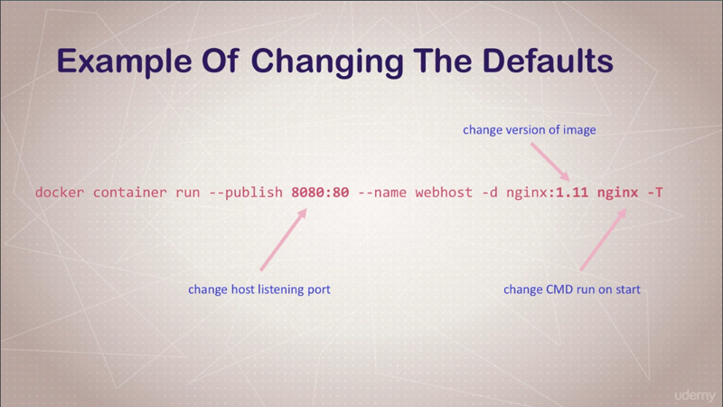

# Creating and Using Containers Like a Boss


## Table of Contents
1. [Module introduction](#module-introduction)
2. [Starting a Nginx Web Server](#starting-a-nginx-web-server)
3. [Debrief What Happens When We Run a Container](#debrief-what-happens-when-we-run-a-container)
4. [What is Going On In Containers CLI Process Monitoring](#what-is-going-on-in-containers-cli-process-monitoring)
5. [Getting a Shell Inside Container](#getting-a-shell-inside-container)

<br/>

## Module Introduction
<br/>


<br/>

### Image vs Containers
<br/>


<br/>

**[⬆ back to top](#table-of-contents)**
<br/>
<br/>

## Starting a Nginx Web Server


<br/>

If you get an error with your `iptables` like below at first attempt

```bash
$ docker container run --publish 80:80 nginx

$: docker: Error response from daemon: driver failed programming external
connectivity on endpoint crazy_albattani (3960f55d04c8252c8611e549a88f079efbdf8e21c1c079bd5ce0700b34849ed7):
(iptables failed: iptables --wait -t nat -A DOCKER -p tcp -d 0/0 --dport 80 -j DNAT
--to-destination 172.17.0.2:80 ! -i docker0: iptables v1.8.5 (legacy): unknown
option "--dport".)
```
you should setup your `iptables` and `iptables-ntf`, [arch-wiki](https://bbs.archlinux.org/viewtopic.php?id=245053)

```bash
$ sudo ln -s /usr/bin/iptables-nft /usr/local/bin/iptables

reboot
```

### Docker --detach

```bash
$: docker container run --publish 80:80 --detach nginx
```
`--detach` is to run docker in background

### Docker stop container

```bash
Usage:  docker container ls [OPTIONS]
List containers
Aliases: ls, ps, list

// @NOTE: docker with name "update-nginx" is running
$: docker container ls -a
CONTAINER ID        IMAGE               COMMAND                  CREATED             STATUS              PORTS                NAMES
1bdd5223febc        nginx               "/docker-entrypoint.…"   About an hour ago   Up About an hour    0.0.0.0:80->80/tcp   update-nginx
f152412e6ea2        nginx               "/docker-entrypoint.…"   2 hours ago         Created                                  last-nginx
86734c1b6d7c        nginx               "/docker-entrypoint.…"   2 hours ago         Created                                  some-nginx
703dbac10404        nginx               "/docker-entrypoint.…"   2 hours ago         Created                                  keen_noyce


Usage:  docker container stop [OPTIONS] CONTAINER [CONTAINER...]

$: docker container stop 1bdd5223febc
1bdd5223febc

// @NOTE: docker with name "update-nginx" was stopped
$: docker container ls -a
CONTAINER ID        IMAGE               COMMAND                  CREATED             STATUS                     PORTS               NAMES
1bdd5223febc        nginx               "/docker-entrypoint.…"   About an hour ago   Exited (0) 2 minutes ago                       update-nginx
f152412e6ea2        nginx               "/docker-entrypoint.…"   2 hours ago         Created                                        last-nginx
86734c1b6d7c        nginx               "/docker-entrypoint.…"   2 hours ago         Created                                        some-nginx
703dbac10404        nginx               "/docker-entrypoint.…"   2 hours ago         Created                                        keen_noyce

// @NOTE: docker container ls command is only show by defauly running containers
$: docker container ls
CONTAINER ID        IMAGE               COMMAND                  CREATED             STATUS                     PORTS               NAMES
```

### Use existing container | run vs start

When we ran each time `docker container run` command, it started a new container
from that nginx image with **random unique** container **names**. If we don't
specify containers names, it will be created for us.

Use `docker container start` command to start an existing stopped container.

```bash
Usage:  docker container start [OPTIONS] CONTAINER [CONTAINER...]

$: docker container start last-nginx
last-nginx

$: docker container ls
CONTAINER ID        IMAGE               COMMAND                  CREATED             STATUS              PORTS                NAMES
f152412e6ea2        nginx               "/docker-entrypoint.…"   2 hours ago         Up 47 seconds       0.0.0.0:80->80/tcp   last-nginx
```

### The convenient way create container

```bash
$: docker container run [OPTIONS] IMAGE [COMMAND] [ARG...]

--publish , -p      Publish a container’s port(s) to the host           | have an arguments
--detach            Run container in background and print container ID  | didnt have any arguments
--name string       Assign a name to the container                      | have an arguments

$: docker container run --publish 90:80 --detach --name webengine nginx
8826d95b2e78eac12fdd2c79c4c0c50b744612cc90b3476f3c1dc7c5ce1ad00b

$: docker container ls
CONTAINER ID        IMAGE               COMMAND                  CREATED             STATUS              PORTS                NAMES
8826d95b2e78        nginx               "/docker-entrypoint.…"   49 seconds ago      Up 46 seconds       0.0.0.0:90->80/tcp   webengine
f152412e6ea2        nginx               "/docker-entrypoint.…"   2 hours ago         Up 15 minutes       0.0.0.0:80->80/tcp   last-nginx
```

### Containers logs

```bash
Usage:  docker container logs [OPTIONS] CONTAINER

$: docker container logs -t webengine
2020-09-13T10:26:13.496050271Z /docker-entrypoint.sh: /docker-entrypoint.d/ is not empty, will attempt to perform configuration
2020-09-13T10:26:13.496118163Z /docker-entrypoint.sh: Looking for shell scripts in /docker-entrypoint.d/
2020-09-13T10:26:13.496123414Z /docker-entrypoint.sh: Launching /docker-entrypoint.d/10-listen-on-ipv6-by-default.sh
2020-09-13T10:26:13.614655382Z 10-listen-on-ipv6-by-default.sh: Getting the checksum of /etc/nginx/conf.d/default.conf
2020-09-13T10:26:13.645962599Z 10-listen-on-ipv6-by-default.sh: Enabled listen on IPv6 in /etc/nginx/conf.d/default.conf
2020-09-13T10:26:13.646426133Z /docker-entrypoint.sh: Launching /docker-entrypoint.d/20-envsubst-on-templates.sh
2020-09-13T10:26:13.655755695Z /docker-entrypoint.sh: Configuration complete; ready for start up
2020-09-13T11:13:47.401738723Z 172.17.0.1 - - [13/Sep/2020:11:13:47 +0000] "GET / HTTP/1.1" 200 612 "-" "Mozilla/5.0 (X11; Linux x86_64; rv:81.0) Gecko/20100101 Firefox/81.0" "-"
2020-09-13T11:13:47.493910932Z 2020/09/13 11:13:47 [error] 29#29: *1 open() "/usr/share/nginx/html/favicon.ico" failed (2: No such file or directory), client: 172.17.0.1, server: localhost, request: "GET /favicon.ico HTTP/1.1", host: "localhost:90", referrer: "http://localhost:90/"
2020-09-13T11:13:47.494100910Z 172.17.0.1 - - [13/Sep/2020:11:13:47 +0000] "GET /favicon.ico HTTP/1.1" 404 153 "http://localhost:90/" "Mozilla/5.0 (X11; Linux x86_64; rv:81.0) Gecko/20100101 Firefox/81.0" "-"
```

### Containers top

```bash
Usage:  docker container top CONTAINER [ps OPTIONS]

$: docker container top webegine
UID                 PID                 PPID                C                   STIME               TTY                 TIME                CMD
root                57326               57309               0                   17:26               ?                   00:00:00            nginx: master process nginx -g daemon off;
101                 57373               57326               0                   17:26               ?                   00:00:00            nginx: worker process
```
### Containers remove

```bash
Usage:  docker container rm [OPTIONS] CONTAINER [CONTAINER...]

// Remove running container
$: docker container rm -f webegine last-nginx
```

**[⬆ back to top](#table-of-contents)**
<br/>
<br/>

## Debrief What Happens When We Run a Container
<br/>


<br/>

Let's have a quick discussion about what actually happens in the background when
we run the Docker. There's a misconception that Docker is really just running
containers and that's its. But there actually so much that's happening in the
background that it does in additions to those containers.

When we type `docker container run`, in the background it's actually going to
look for the `image` that specified at the end of that command. So you remember
when you type `nginx` at the end, that was the name of the `image` we wanted to
to run as a **new** container. It's going to look for that locally in the `image
cache`.

If it doesn't exists, it's going to hop (jump) over to hub.docker.com, which
is its default remote image repository.

By default, it'll look it in hub.docker.com and download it and store it in the
image cache `/var/lib/docker`

```bash
$: sudo ls -la /var/lib/docker/containers/
total 12
drwx------  3 root root 4096 Sep 13 20:46 .
drwx--x--x 15 root root 4096 Sep 13 15:20 ..
drwx------  4 root root 4096 Sep 13 20:47
152cfe030a5f75f42c646872452ff5ed7c97dbf038fbaed1ec53c96b3913b6e3

// @NOTE container ID
$: docker container ls -la
CONTAINER ID        IMAGE               COMMAND                  CREATED             STATUS              PORTS                NAMES
152cfe030a5f        nginx               "/docker-entrypoint.…"   4 hours ago         Up 29 minutes       0.0.0.0:80->80/tcp   webgate
```

So, if we didn't specify a `version` and we didn't, we just typed `nginx`, you
can type `nginx:version`, it'll just choose the latest. Once it's got the image
and ready to go. It's going to start up (create) a new container based on that
image.

It's not going to make a copy of the image. It's actually going just to start
a **new layer** of changes, right on top of where the image left of
`/var/lib/docker/`, and it's going to customize the networking.

It's going to give a specific `virtual ip address` that's inside a _docker
virtual network_.

It's actually going to open up the port that we specified. If we didn't
specify the `--publish` command, it's **not** going to open any ports at all.
Since we did with `80:80`, that's telling it to take the **port 80** on the host
and forward all that traffic to the **port 80** in the container. Then container
finally will actually start using a command specified in the DockerFile, which
will also talk about that in next chapter.

### Example of changing the default images version
<br/>


<br>

So you can actually change a majority of above command from CLI. Above command
is a convention command (defaults). We can specify the **version** of image
`nginx:1.11` specify different port `8080:80`,  or the default command to run when it
starts `nginx -T`.

Since we had a very simple command, it just used a lot of defaults coming out of
the box.

**[⬆ back to top](#table-of-contents)**
<br/>
<br/>

## What is Going On In Containers CLI Process Monitoring
<br/>


<br/>

### Docker top
<br/>


<br/>

### Docker inspect
<br/>


<br/>

### Docker stats
<br/>


<br/>

### Docker logs
<br/>


<br/>

We have create container named `mysql-dev` with parameter `--env
MYSQL_RANDOM_ROOT_PASWORD=true` for access MySQL database in next future.

**[⬆ back to top](#table-of-contents)**
<br/>
<br/>

## Getting a Shell Inside Container
<br/>


<br/>

### How `-it` works in Docker

Looking the container from the outside is very handy (easy) at times; But how we
can get **into** the container, to look up what is the files or folders inside the
container?, the most often question to ask is **how do I get into a container?**
and do things in it live from the command line.

Sometimes people confuse this with wanting an **SSH server** inside their
container so the can `ssh` into it. In Docker we don't actually need to do that
because we have several commands at our disposal, that let us get a shell inside
the container itself while it's running.

Docker itself have `docker cli` substitute for adding ssh for adding SSH to
containers.

```bash
Usage:  docker run [OPTIONS] IMAGE [COMMAND] [ARG...]

-t, --tty                            Allocate a pseudo-TTY
-i, --interactive                    Keep STDIN open even if not attached

// @NOTE: [COMMAND] after image
$: docker container run -it --name nginx-bash nginx bash
```


<br/>

When we exit the shell, the container stopped. Because containers only run as
long as the command that it ran on startup runs. Since we changed it to `bash`
simply exiting `bash` quit the container.

### How to run existing container interactively

```bash
Usage:  docker container start [OPTIONS] CONTAINER [CONTAINER...]
Start one or more stopped containers

-i, --interactive             Attach container's STDIN

$: docker container start -i nginx-bash
```


<br/>

### Using full distribution Linux OS
<br/>


<br/>

### How `exec` works in Docker

`docker container exec` run a command in a **running (existing) container** as
a second process.

```bash
Usage:  docker container exec [OPTIONS] CONTAINER COMMAND [ARG...]
Run a command in a running container

Options:
  -i, --interactive          Keep STDIN open even if not attached
      --privileged           Give extended privileges to the command
  -t, --tty                  Allocate a pseudo-TTY

// @NOTE: [COMMAND] after image
$: docker container exec --it mysql-dev bash
```
The `exec` command is very useful for jumping into container when you need to
troubleshoot or when you need to change slightly on a running system, as well as
using container of different distribution to give you the environment you would
have, if you had a full machine (OS image) like `arch` or an `alpine`.


<br/>

### Different Linux distro in containers

#### What is 'alpine'

`alpine` is another distribution of Linux, but Alpine is designed to be very
small. [alpine](https://www.alpinelinux.org/)

The neat thing about Alpine it also come with **own package manager**
named **apk**. Alpine it doesn't come with `bash` if you run a command

```bash
$: docker container run -it alpine bash
docker: Error response from daemon: OCI runtime create failed: container_linux.go:370:
starting container process caused: exec: "bash": executable file not found in $PATH: unknown.
ERRO[0004] error waiting for container: context canceled
```

You can replace a command with `sh`

```bash
$: docker container run -it alpine sh
```


<br/>

### What is TTY

`tty` is a small program written **C** simulates a real terminal, like what `SSH`
does; and the real definition in Unix system is `tty` - print the file name of
the terminal connected to standard input


**[⬆ back to top](#table-of-contents)**
<br/>
<br/>
