# Container Images, Where to find and How to build

## Table of Contents

1. [Module Introduction](#module-introduction)
2. [What is in An Image](#what-is-in-an-image)
3. [The Mighty Hub Using Docker Hub Registry Image](#the-mighty-hub-using-docker-hub-registry-image)
4. [Images and Their Layers](#images-and-their-layers)
5. [Image Tagging and Pushing to Docker hub](#image-tagging-and-pushing-to-docker-hub)
6. [Building Images The Dockerfile Basic](#building-images-the-dockerfile-basic)

<br/>

## Module Introduction
<br/>


<br/>

First we're going to discuss the basic of images and the concepts that you're
going to need.

What is actually in an image and, just as _importantly_, **what isn't in an image**.

We're going to talk a little bit about how to find images on the internet and
we'll actually go and look at some, dive into that whole process to finding good
images and how to manage those image once we've downloaded them or created them
on our won machines.

We'll jump into the fun part of making our own images.

**[⬆ back to top](#table-of-contents)**
<br/>
<br/>

## What is in An Image
<br/>


<br/>

So before we start playing with images and learning how to use them for
containers, we probably want to step into **what exactly is in an image** and
**what isn't**. The way I like to explain is very simple.

Images is the application binaries and dependencies for your app and the
metadata on how to run it.

The official definition, "image is an ordered collection of root filesystem
changes and the corresponding execution parameters for use within a container
runtime", [image definition](https://github.com/moby/moby/blob/master/image/spec/v1.md)

Inside an image is not actually a complete OS, there's no Kernel, there's no
Kernel modules like drivers. It's really just the binaries that your application
needs because the _host_ (server) provides the kernel. That one of distinct
characteristics around containers that make it different form a _virtual
machine_ (hypervisor); It's not booting up a full Operation System. It's really
just starting an application.

An image can be really small. It can be a single file. If you for instance,
using _GO_, one of _GO's_ features is that it can build a static binary and have
a single file as your application.

Or you could have a very big image that's actually using some distribution like
Ubuntu with its own Package Manager built in, and where you've installed Apache,
and PHP, and your source code, and all the added modules you need, you can have
multiple gigabytes.

**[⬆ back to top](#table-of-contents)**
<br/>
<br/>

## The Mighty Hub Using Docker Hub Registry Image
<br/>


<br/>

We going to take tour around [docker hub](https://hub.docker.com), and get to
know a few of it's basic features.

We'll kind of discuss the difference between an official image other just as
good images, and how to tell the difference between a good image and a bad
image.

Showing bit around downloading images and how you can see the different tags
that they'll use and difference between an Alpine image and other image options

### The right Images

There's several characteristics to figuring out what's the right image. Like
convention you just gonna start using images for your workflow that are related
to what you do and you're going to get used to specific ones. You're going
_like_ specific ones. Typically we always start with the **official** tags.

The official tags, it will also be the only one where is name doesn't have
a forward slash `/` in it. When you and I create images on Docker Hub, we have
to create them with our account name in front an image we create.

So when you look at all the other images, with account name like
[tuanany73/multi-nginx](https://hub.docker.com/repository/docker/tuanany73/multi-server)
it might be actually an organization or individual repo.  But the only ones that
get to have just a name of the repo are considered official.

Official images are one that Docker.inc, actually has a team of people that help
take care of them, ensure that they have quality documentation, that they're
well tested and that they're put together properly with _Dockerfiles_ that are
obeying best practice rules.

Official images usually work with the official team of that software who
actually makes it to ensure that it's doing all the things that it should be
doing.

### Tag list `latest`, `mainline`, `stable` and `number`
<br/>

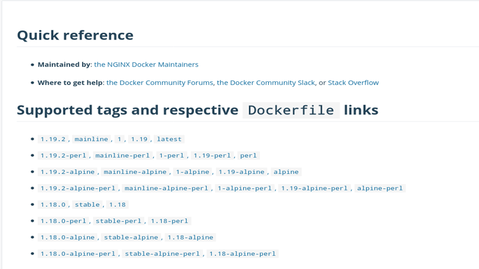
<br/>

like I said before you want to start be using with the official to start with
and then you eventually you may find that you want to change it slightly or add
a few thing to it and you'll make your own images.

One of the best things about official images is their documentation. They're
always really great at documenting how to make the images work, what _options_
there might be, what _environment variables_, what's the _default port_ and so
on.

Versions are a common feature of official repositories. You don't have to have
versions in every image but official ones do. Because most open-source software
there's always at least a few official versions out in the wild that are
officially maintained and supported.

That's what we have here, `1.19.2` for Ngnix and then we have what's considered
the stable branch of Nginx, which is `1.18`. We can see the little name here
says `stable`. So let's break this down.

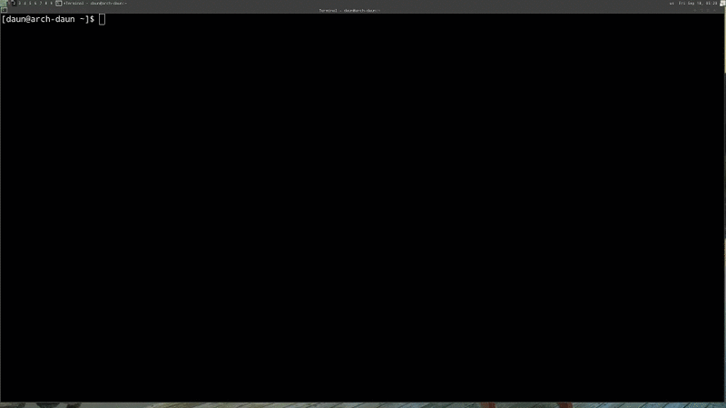

When we start talking about images, images aren't necessarily named. Images are
tagged. A version of an image can actually have one more than on tag. We're
going to dive into this a little bit later when we start making our own images
and we can play around with tagging.

`latest` is a special tags, it doesn't necessarily guarantee it's always the
latest commit in the repositories. What it usually means is you're getting the
latest version of this products. In the official it's very well-defined and
consistent, so that if you didn't care right now exactly what version you
wanted, you just wanted the most current, then you could just say `docker pull
nginx`, It would download the latest.

A best practice in your software is when you've going to production and you're
actually testing software that you're going to be using for others, **it's rare
that you really want your software update automatically**. You usually want to
control that process with some other DevOps tools.

But when you're developing or just testing something locally, it's super easy
with official images to just type in the name and just assume you're going to
get the latest.

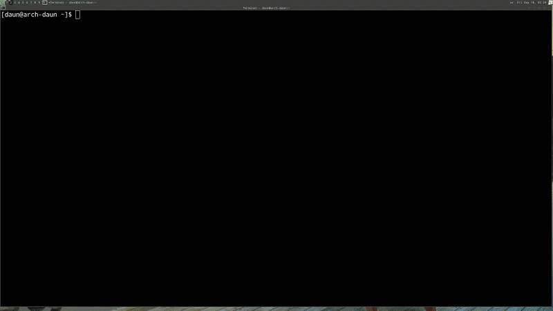

You will notice the other one, `1.19.2-alpine`, these all have very similar
names to the first one, but they all have the world `alpine` in them. We're
going to get into base images and distribution later, but just for now, `alpine`
is actually a distribution of Linux that's very very small. It's actually less
than `5MB` in size. This version will actually mean that it comes form a base
image of `alpine`, keeping it very small and light, whereas the default one or
the latest image actually comes from Debian distribution, It;s a little larger
in size probably a little bit over `100MB`.

You'll also notice that the three version that I've downloaded `1.19.` all have
the same `IMAGE ID` because the `IMAGE ID` is based upon the cryptographic SHA
of each image in Docker Hub.

### Unofficial images

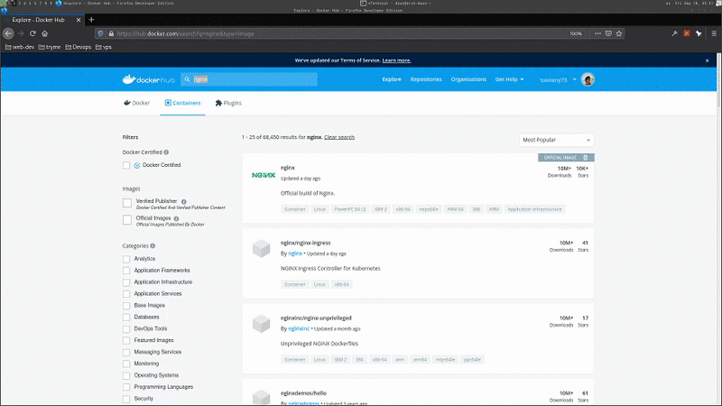
<br/>

If you ever want to consider not using an official repository, what I usually
look for is a _number of stars_ and _number of pull_, because a popular
repository, to me, tends to establish trust.

I always recommend you download and _inspect_ the software before you use it,
and look in the _Dockerfile_ and hopefully they'll have an open source
repository that you can go look at exactly how they made that image.

### Lecture review


<br/>

### Miscellaneous

#### List of Official Docker Images

[source](https://github.com/docker-library/official-images/tree/master/library)

**[⬆ back to top](#table-of-contents)**
<br/>
<br/>

## Images and Their Layers
<br/>


<br/>

This is a **fundamental** concepts of how Docker works. It uses something called
the **union file system**. To present a series of _file system_ changes as an
actual _file system_. We're going to dive into the **history** and **inspect**
commands and see how we can use them to understand what an image is actually
made of. We're going to learn a little bit about **copy** and **write** concept
of how a container run as an additional layer on top of an image.

### Image Layers

What do mean by **Image layer**? It's actually transparent completely you when
you're using Docker, but when you start digging into certain commands, like the
`history`, `inspect`, and `commit` command, you start to get a sense that an
image isn't big blob of data that comes and goes in one huge chunk (pieces).

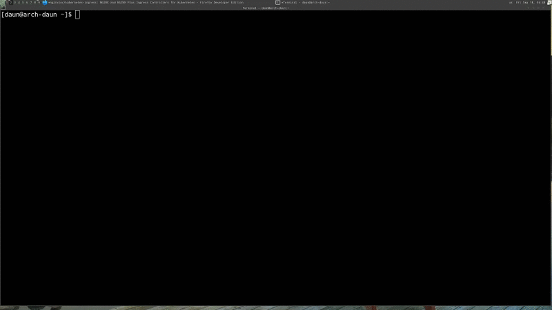

> **NOTE**: `docker image history`
>
> Show layers of changes made in image

If you notice when we actually did `doker pull`, certain times you might see
words that indicate that there's something that you already have, like you've
_cached some part_ of it already, and that all comes down to the fact that
images are designed using the _union file system concept_ of making layers about
the changes. If we quickly just look at what we have in Docker images

The list on the Docker image history is not a list of things that have actually
happened in the container because this is about an image. This is actually
a history of the _image layers_. Every image starts from the very beginning with
a blank layer known as a _scracth_.

Then every set of changes that happens after that on the file system, in the
image, is another layers. You might have one layer, you might have dozens of
layers and some layers maybe no change in terms of the file size. You'll notice
on above _gif_ that we actually have a change that was a simply a metadata
change..

```bash
IMAGE               CREATED             CREATED BY                                      SIZE                COMMENT
7e4d58f0e5f3        7 days ago          /bin/sh -c #(nop)  CMD ["nginx" "-g" "daemon…   0B
<missing>           7 days ago          /bin/sh -c #(nop)  STOPSIGNAL SIGTERM           0B
<missing>           7 days ago          /bin/sh -c #(nop)  EXPOSE 80                    0B
<missing>           7 days ago          /bin/sh -c #(nop)  ENTRYPOINT ["/docker-entr…   0B
<missing>           7 days ago          /bin/sh -c #(nop) COPY file:0fd5fca330dcd6a7…   1.04kB
<missing>           7 days ago          /bin/sh -c #(nop) COPY file:1d0a4127e78a26c1…   1.96kB
<missing>           7 days ago          /bin/sh -c #(nop) COPY file:e7e183879c35719c…   1.2kB
<missing>           7 days ago          /bin/sh -c set -x     && addgroup --system -…   63.4MB
<missing>           7 days ago          /bin/sh -c #(nop)  ENV PKG_RELEASE=1~buster     0B
<missing>           7 days ago          /bin/sh -c #(nop)  ENV NJS_VERSION=0.4.3        0B
<missing>           7 days ago          /bin/sh -c #(nop)  ENV NGINX_VERSION=1.19.2     0B
<missing>           7 days ago          /bin/sh -c #(nop)  LABEL maintainer=NGINX Do…   0B
<missing>           7 days ago          /bin/sh -c #(nop)  CMD ["bash"]                 0B
<missing>           7 days ago          /bin/sh -c #(nop) ADD file:e7407f2294ad23634…   69.2MB
```

Which command we're actually going to run. We'll cover that in a little bit when
we ho over the _Dockerfile_. But for now you can actually see that this one
added a huge amount of files that was `69.2MB`. As you go up (from bottom), we
have some more data changes.

### Visualizing Layers

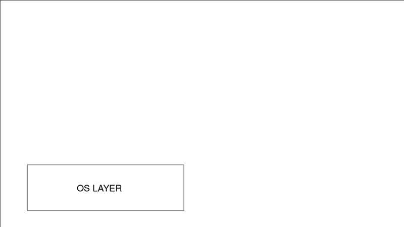
<br/>

When we start an image, when we create a new image, we starting with one layer.
Every layer get its own unique `SHA` that helps the system identify if that
layers is indeed the same as another layers.

Let sat that at the beginning of one of yours, you might have a OS at the very
bottom. Then you create a _Dockerfile_, which adds some more files and that's
another layers on top of image, maybe we use `apt-get` for that; Then in
_Dockerfile_, you make an `env` variable change. **That together is your
image**.
<br/>

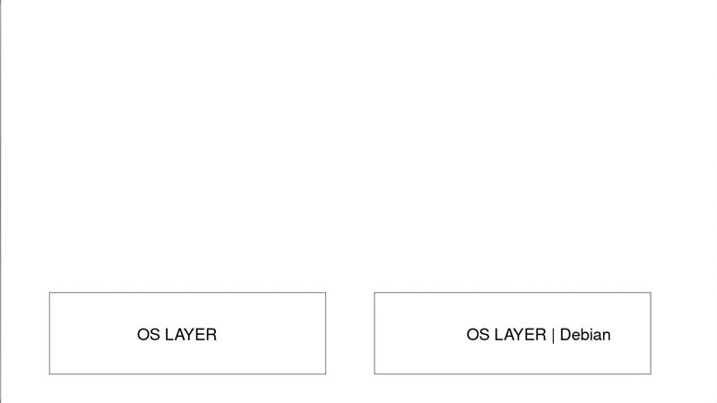
<br/>

You might have a different image that starts form `DEBIAN`, and then on that
image you may also use `apt-get` to install some stuff, and on top of that you
create your own `env`, you might open a `port`. Each one of these changes that
you usually make in the _Dockerfile_, but you can also make with the `commit
docker` command that we'll check out in a minute. This also another image and
those all are bundled together.

But what happen if I have another image that's also using the same version of
Debian OS?
<br/>

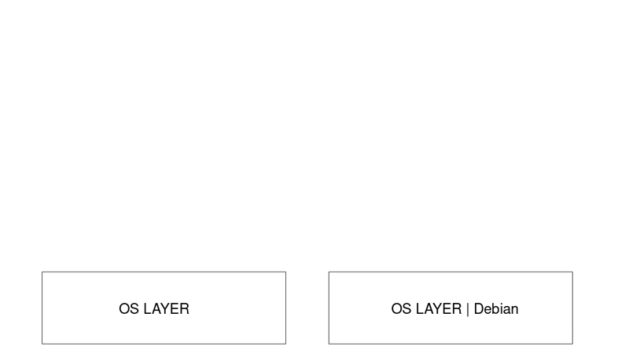
<br/>

Well, that image can have its own changes on top of the same layer that I have
in my **cache**. **This is where the fundamental concept of the cache** of image
layers save us a whole bunch of time and space. Because we don't need to
download layers we already have, and remember it uses a unique `SHA` for each
layers so it's guaranteed to be the exact layers it needs.

It knows how to match them between _Docker Hub_ and our _local cache_. As we
make changes to our images, they create more layers, if we decide that we want
to have the same image be the base image for more layers, then **it's only ever
storing one copy of each layer**.

With this system, really, one of the _biggest benefits_ is that we're never
storing the same image data more the once on our file system. It also mean that
when we're uploading and downloading we don't need to upload and download the
**same layers** that we already have on the other side.

### Custom Image
<br/>

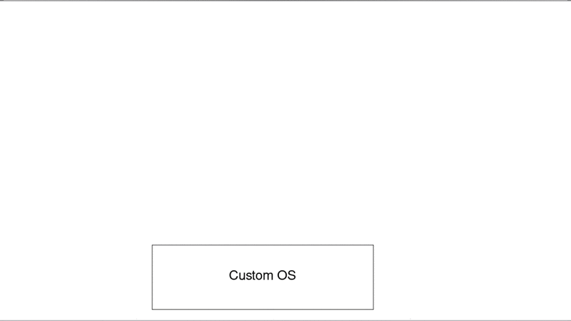
<br/>

If you have your own image and its was custom that you made yourself, and then
you added, let's say, an `Apache` server on top of that as another layers in
your _Dockerfile_, and then you were to open up `port:80`, and then at very end,
you actually told it to **copy** the source code but actually ended up having
two different _Dockerfiles_ for two **different website**, and every line in the
_Dockerfiles_ were the same except for that last little bit where you copied
_Website A_ into the image _Website B_, **you would end up with two images**.
We'll show that in a minute.

The only files that are actually stored is with the arrow sign. So we're never
storing the entire stack of image layers more than once if it's really the same
layers.

How it's work with containers?

### Container Layer
<br/>

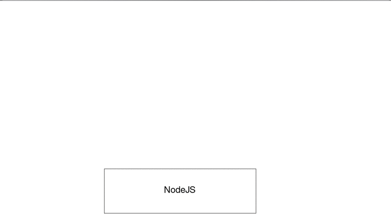
<br/>

Let's say we have `NodeJS` image, and we decide to run a container off of it,
all Docker does is creates a new **`read/write` layer** for that container on
top of that `NodeJS` image. When we're perusing (read carefully) the file system
and these things, **all the containers and the images all just look like
a regular file system**, but underneath the _storage driver_ that's used by
Docker is **actually layering**, like a stack of pancakes, all these changes on
top of each other.

So if I run two containers at the same time off of the same `NodeJS` image,
`container A`, and `container B` would only be showing, in terms of the **file
space**, they would only be differencing between what's on that live container
running and what is happening in the base image, which is `read-only`.

When you're running Containers and you're changing files that were coming
through the image, let's say I started `container C`, and I actually went in and
changed a file that was in this image in the running this is known as
`copy-on-write`.

What `copy-on-write` do is the file system will take that file out of the image
and copy it into `differencing` and store a copy of that file in the container
layer. So now the container is really only just running process and those files
that are different than they were in the `NodeJS` image.

### What is `<missing>` mean in the `docker history`

```bash
$: docker image history nginx:alpine

IMAGE               CREATED             CREATED BY                                      SIZE                COMMENT
6f715d38cfe0        4 weeks ago         /bin/sh -c #(nop)  CMD ["nginx" "-g" "daemon…   0B
<missing>           4 weeks ago         /bin/sh -c #(nop)  STOPSIGNAL SIGTERM           0B
<missing>           4 weeks ago         /bin/sh -c #(nop)  EXPOSE 80                    0B
<missing>           4 weeks ago         /bin/sh -c #(nop)  ENTRYPOINT ["/docker-entr…   0B
<missing>           4 weeks ago         /bin/sh -c #(nop) COPY file:0fd5fca330dcd6a7…   1.04kB
<missing>           4 weeks ago         /bin/sh -c #(nop) COPY file:1d0a4127e78a26c1…   1.96kB
<missing>           4 weeks ago         /bin/sh -c #(nop) COPY file:e7e183879c35719c…   1.2kB
<missing>           4 weeks ago         /bin/sh -c set -x     && addgroup -g 101 -S …   16.5MB
<missing>           4 weeks ago         /bin/sh -c #(nop)  ENV PKG_RELEASE=1            0B
<missing>           4 weeks ago         /bin/sh -c #(nop)  ENV NJS_VERSION=0.4.3        0B
<missing>           4 weeks ago         /bin/sh -c #(nop)  ENV NGINX_VERSION=1.19.2     0B
<missing>           4 weeks ago         /bin/sh -c #(nop)  LABEL maintainer=NGINX Do…   0B
<missing>           3 months ago        /bin/sh -c #(nop)  CMD ["/bin/sh"]              0B
<missing>           3 months ago        /bin/sh -c #(nop) ADD file:c92c248239f8c7b9b…   5.57MB
```

`<missing>` in `docker history` is actually just a misnomer inside the Docker
interface. It doesn't mean that something wrong or it's misconfigured. What it
means is that really, this `nginx:alpine` image with _IMAGE ID_ `6f715d38cfe0`,
and the other layers in the image aren't actually images themselves. They're
just layer inside `nginx:alpine` image, and so they wouldn't necessarily get
their own _IMAGE ID_ there.

Personally I think it's a little misleading in the interface to say that, but
that's how they wrote it.

### Inspect command
<br/>

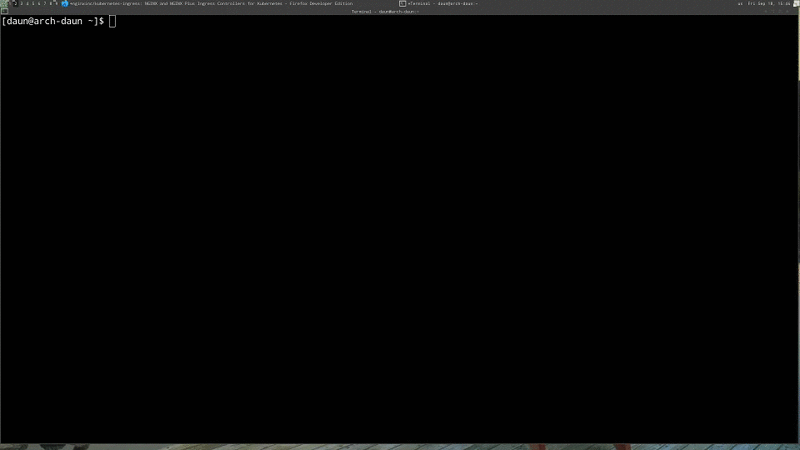
<br/>

> **NOTE**: `docker image inspect`
>
> returns JSON metadata about the image

What `inspect` command gives us all the details about the image. This is
basically the metadata. Remember when we talked about that an image is made up
of two parts, the **binaries** and the **dependencies**, and then the metadata
about that image? Well, `inspect` gives you back the metadata.

Besides just the basic info, like the _IMAGE ID_ and its tags, you get all sorts
of details around how this image expect to be run. It actually has the option to
`ExposePorts`..

```json
[
    {
    ....
    ....

        "ContainerConfig": {
            "Hostname": "f19c7895338a",
            "Domainname": "",
            "User": "",
            "AttachStdin": false,
            "AttachStdout": false,
            "AttachStderr": false,
            "ExposedPorts": {                               << Port was open
                "80/tcp": {}
            },
            "Tty": false,
            "OpenStdin": false,
            "StdinOnce": false,
            "Env": [                                        << Environment
                "PATH=/usr/local/sbin:/usr/local/bin:/usr/sbin:/usr/bin:/sbin:/bin",
                "NGINX_VERSION=1.19.2",
                "NJS_VERSION=0.4.3",
                "PKG_RELEASE=1"
            ],
            "Cmd": [
                "/bin/sh",
                "-c",
                "#(nop) ",
                "CMD [\"nginx\" \"-g\" \"daemon off;\"]"    << command run by default
            ],
            "ArgsEscaped": true,
            "Image": "sha256:582c1b5eecdbda3ea7e434da6906b2cc1e0eaea81dca2f493dbb2467704ec650",
            "Volumes": null,
            "WorkingDir": "",
            "Entrypoint": [
                "/docker-entrypoint.sh"
            ],
            "OnBuild": null,
            "Labels": {
                "maintainer": "NGINX Docker Maintainers <docker-maint@nginx.com>"
            },
            "StopSignal": "SIGTERM"
        }
    }
    ...
    ...
]
```
You know when you want to start it, which ports you need to open inside your
Docker host if you want it to accept connections.

You can see that `Env` variables were passed in, including the version of Ngnix
that it's running and the path.

You can actually see the command `Cmd` (command) it will run when you start up
the image by default.

Again, a lot of these things can actually be changed like we did earlier with
the `docker container run` command; But these are showing us all the defaults
and some other interesting information like `author`, `Architecture` of `AMD64`,
which pretty much what all normal PC's and Macs run nowadays. We don't really
have too many `32 bits` around, so this is just a standard `64 bits` intel
architecture, and design to run on the Linux OS.

### Lecture Review
<br/>


<br/>

**[⬆ back to top](#table-of-contents)**
<br/>
<br/>

## Image Tagging and Pushing to Docker hub

### Lecture Requirement
<br/>


<br/>

### Lecture Inside
<br/>


<br/>

### Image Tagging

First let's talk about tagging.

```bash
Usage:  docker image tag SOURCE_IMAGE[:TAG] TARGET_IMAGE[:TAG]
Create a tag TARGET_IMAGE that refers to SOURCE_IMAGE

$: docker image tag
```

> **NOTE**: `docker image tag`
>
> Assign one or more tags on an image

Images don't technically have a name even thought we kind of refer to them like
that when we're talking casually if you doing `docker images ls` you notice that
there's no `NAME` column. Besides the `IMAGE ID`, which none of use are going to
remember those right? We have to refer them by three different pieces of
information.

> **NOTE**: `<user>/<repo>:<tag>`
>
> Default tag is latest if not specified

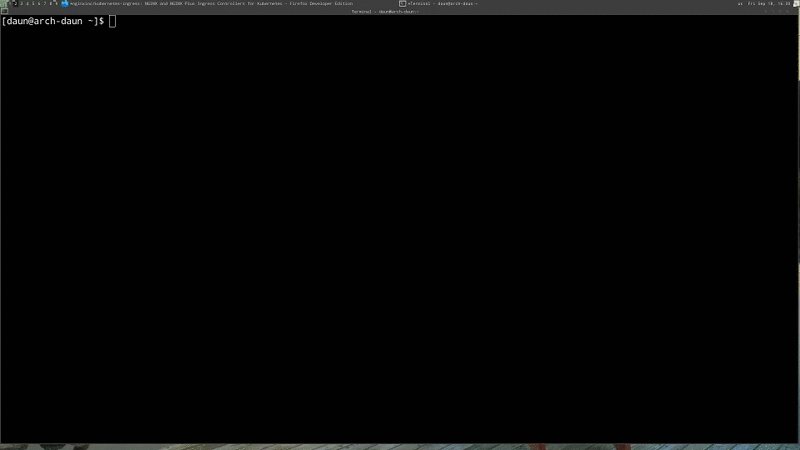
<br/>

On the screen for the image `ls` command, we actually only see two of them. Over
on the left, we're seeing the `REPOSITORY`, and then we seeing the `TAG`. The
`REPOSITORY` is actually made up of either the user name or the organization
slash the repository.

Now here we only dealing with the official repository images, so we're only
gonna see the actual repository name. We mentioned earlier that the special
images that are considered official are the only one that get the right to just
be called their name of the repository, not the actual name of the organization
slash repository.

> **NOTE**: Official Repository
>
> They live at the "root namespace"  of the registry, so they don't need account
> name in front of repo name

But if we go over to [Docker Hub](https://www.hub.docker.com), and I just do
a search on MySQL, we'll find that there's actually an organization not only
just the official MySQL, which is just referred to as MySQL, but there is
`mysql/mysql-server`, which seems to be pretty popular as well.
<br/>

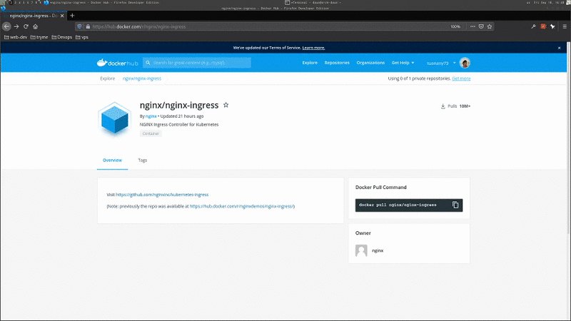
<br/>

It look like what it is here is this is actually the same MySQL server but it't
actually created by MySQL team at Oracle. If I download and do `docker image ls`
again you will notice that the `REPOSITORY NAME` includes the **organization
name**.

What the `tag` for? The `tag` is not quite a version and it's not quite
a branch, but is a lot like **Git** tags. It's really just a _pointer_ to
a specific image commit, and really could be anything, into that repository.

The tags are just a label that point to an actual `IMAGE ID` and we can have
many of them all point to the same one.

```bash
REPOSITORY           TAG                 IMAGE ID            CREATED             SIZE
nginx                1.19                7e4d58f0e5f3        7 days ago          133MB
nginx                1.19.2              7e4d58f0e5f3        7 days ago          133MB
nginx                latest              7e4d58f0e5f3        7 days ago          133MB
```

### Create new labels

Well I could make my own _Dockerfile_ and create my own custom image, but we can
also _re-tag_ existing Docker images so I can just do a `docker image tag nginx`

```bash
Usage:  docker image tag SOURCE_IMAGE[:TAG] TARGET_IMAGE[:TAG]
$: docker image tag nginx tuanany/ngnix
```
<br/>


<br/>

The format of this command is the image that is the image that I'm going to
give a new tag to goes first; and then the new tag that I want to give it. If
you don't specify the tag, it'll always default to latest. Latest doesn't
actually always mean latest because I technically could take some old software
and tag it latest. There is nothing special about it but it is just kind of the
default.

> **NOTE**: `latest` tag
>
> It's just the default tag, but image owners should assign it to the newest
> stable version.

Really, I wish they would just call it **default** and not latest. So it is
a little confusing, but generally on Docker Hub, especially when you're using
official images, you can trust that the _latest_ is generally the **latest
stable version** of the software that you want to use; And now it's labeled with
my _username_ and a new repo that doesn't exist yet on Docker Hub.

### Docker image push

> **NOTE**: `docker image push`
>
> uploads changed layers to a image registry (default is Hub)

You should login first with command `docker login` before you can push your own
images.

> **NOTE**: `docker login <server>`
>
> Default to logging in Hub, but you can override by adding server url.

So when you have your own free Docker Hub account, you can actually login from
the command line `docker login`
<br/>

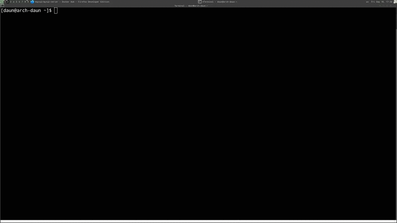
<br/>

In `~/.docker/config.json` it actually stored an `authentication key` that would
allow my local docker CLI to access Docker Hub as me. This is **important
point** that we'll learn about later on in production is that wherever you login
with Docker CLI, by default, it's going to store the _authentication key_ for your
account in the profile of that user. So just be aware of that.

> **NOTE**: `docker logout`
>
> Always logout form **shared machines** or **server** when done, to protect your
> account.

If you're using a machine that you don't trust, when you're done just type
`docker logout`.
<br/>

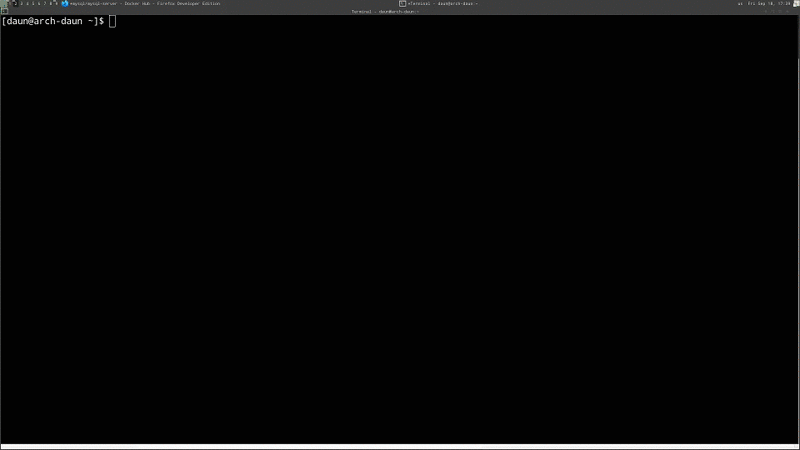
<br/>

Again, I didn't actually have to create this from scratch to upload it, I just
simply gave a new tag to an existing image and when I uploaded it, it
automatically created a new repo based on that tag.

### Lecture Review
<br/>


<br/>

**[⬆ back to top](#table-of-contents)**
<br/>
<br/>

## Building Images The Dockerfile Basic

### Lecture Requirement

Dockerfile seems look like shell script, but it's not, It's not batch file, it's
not a shell script. It's a totally different language of file that's unique to
Docker and the default name is Dockerfile with capital D.

```bash
$: docker build -f some-dockefile
```
But in command line (CLI) when you need to deal with a Dockerfile using docker
command, you can actually use `-f`. Which is actually common amongst a lot of
the tools with Docker, you can use `-f` to specify a different file than
a default.

The
[Dockerfile](https://github.com/BretFisher/udemy-docker-mastery/blob/main/dockerfile-sample-1/Dockerfile)
source code.

### `FROM` command

The `FROM` command is in every Dockerfile. It's required to be there. It's
normally a minimal distribution.

```Dockerfile
FROM debian:stretch-slim
```
And really, the reason you would use these is to save yourself time and pain.
Because these minimal distributions are actually much smaller than the CD's you
would use to install a virtual machine from them. For example, the Ubuntu one
doesn't even have `curl` in it, whereas obviously, if you installed a full
Ubuntu on a VM it would have a `curl` and a lot of other commands already
installed.

Because all of these distributions are official images, it meas that they're
going to be always up to date with the latest security patches and you can
depend and trust on them; And one of the **main benefits** for using them in
containers is to use their package distribution systems.

> **NOTE**: package manager
>
> PM's like `apt`, `yum`, `dnf`, or `pacman` are one of the reason to build
> containers FROM Arch, Debian, Ubuntu, Fedora or CentOS

### `ENV` command

```Dockerfile
ENV NGINX_VERSION 1.13.6-1~stretch
ENV NJS_VERSION   1.13.6.0.1.14-1~stretch
```
>**NOTE**: `env` variable
>
> One reason they were chosen as preferred way to inject key.value is they work
> everywhere, on every OS and config

`ENV` it's a way to set environment variables, which are actually very important
in containers because they're the **main** way we **set keys** and **values**
for container building and for running container.

In this case it's actually setting the version of Nginx it would like to us to
install and this environment variable will be set so that any subsequent lines
will be able to use it.

Now, as a reminder from previous lectures, each one of these stanzas (verse) is
an actual layer in our Docker images. So **the order of them actually matters**,
because it does work **top down**.

### `RUN` command

```Dockerfile
RUN apt-get update \
&& apt-get install --no-install-recommends --no-install-suggests -y gnupg1 \
    && \
    NGINX_GPGKEY=573BFD6B3D8FBC641079A6ABABF5BD827BD9BF62; \
    found=''; \
    for server in \
        ha.pool.sks-keyservers.net \
        hkp://keyserver.ubuntu.com:80 \
        hkp://p80.pool.sks-keyservers.net:80 \
        pgp.mit.edu \
    ; do \
        echo "Fetching GPG key $NGINX_GPGKEY from $server"; \
        apt-key adv --keyserver "$server" --keyserver-options timeout=10 --recv-keys "$NGINX_GPGKEY" && found=yes && break; \
    done; \
    test -z "$found" && echo >&2 "error: failed to fetch GPG key $NGINX_GPGKEY" && exit 1; \
    apt-get remove --purge -y gnupg1 && apt-get -y --purge autoremove && rm -rf /var/lib/apt/lists/* \
    && echo "deb http://nginx.org/packages/mainline/debian/ stretch nginx" >> /etc/apt/sources.list \
    && apt-get update \
    && apt-get install --no-install-recommends --no-install-suggests -y \
                        nginx=${NGINX_VERSION} \
                        nginx-module-xslt=${NGINX_VERSION} \
                        nginx-module-geoip=${NGINX_VERSION} \
                        nginx-module-image-filter=${NGINX_VERSION} \
                        nginx-module-njs=${NJS_VERSION} \
                        gettext-base \
    && rm -rf /var/lib/apt/lists/*
```

You'll usually see `RUN` commands when you need to install software with
a package repository, or you need to do some **unzipping**,  or some **file edits
inside container** itself.

`RUN` command can also run shell scripts that you've copied earlier in the file
or any commands that you can access from inside the container, at that point in
time in the file.

```Dockerfile
RUN
...
...
    && echo "deb http://nginx.org/packages/mainline/debian/ stretch nginx" >> /etc/apt/sources.list \
...
...
```
Since we're coming from Debian, this `RUN` command has access to all commands
and binaries that would have been installed with that release; And this one for
Nginx more or less adding a key to the repository where You can get the package
to install the latest Nginx repository.

There's few things here that are **really key in making good Dockerfile** and
we'll actually talk about more in a later section where we talk about _best
practices_.

But two things to note, the reason that we're adding all these command with
`&&`, so that **they're chained one after the other**, if you remember, each
**stanza is its own layer**. What it does is ensure that all of these commands
are **fit into one single layer**. It saves us space us a little time. It save
us space; And it's so **common** that you'll probably see it in every Dockerfile
on Docker Hub.

```Dockerfile
RUN ln -sf /dev/stdout /var/log/nginx/access.log \
    && ln -sf /dev/stderr /var/log/nginx/error.log
# forward request and error logs to docker log collector
```
Above another `RUN` command is all about pointing our `.log` files to the
`stdout` and `stderr`. We'll see later, the proper way to do logging inside
a container is  **to not log to a log file**; And there's no `syslogd` or any
other _syslog service_ inside a container.

_Docker actually handles all of our logging for us_. All we have to do inside
the container is make sure that everything we want o be captured in the logs is
spit to `stdout` and `stderr` and Docker will handled the rest.

There's actually **logging drivers** that we can use in the _Docker engine_
itself to control all the logs for all containers on our host; And so that's
really what you want to do with them.

It add more complexity to tour app if your app is actually doing the logging
itself; And then, if you have to deal with files in every container, now you've
got a problem of how do you get those files _out_; And _searchable_, and
_accessible_. Here we're taking the default Nginx logs and we're actually
linking them to the `stdout`. So that Docker can capture them.

### `EXPOSE` Command

```Dockerfile
EXPOSE 80 443
# expose these ports on the docker virtual network
# you still need to use -p or -P to open/forward these ports on host
```

We have `EXPOSE` command. By default, **no** **TCP** (Transmission Control Protocol)
or **UDP** (User Datagram Protocol) ports are open inside a container. It
doesn't expose anything form the container to a virtual network unless we list
it with `EXPOSE`; And, of course, because this is a _Web and proxy server_ it's
going to expose `80` and `443`.

Now, this `EXPOSE` command does not mean these ports are going to be opened
automatically on our host. That's what the `-p | --publish` command is whenever
we use `docker run`.

### `CMD` command

The `CMD` is **required parameter** that is the **final** command that will be
run every time you launch a new container from the image, or every time you
restart a stopped container.

There is some really excellent documentation on all of these stanzas, plus
a whole lot more, that we're going to go into later, on the Docker documentation
website at docs.docker.com

### Lecture Review

So these five different stanzas are pretty normal in every single Dockerfile.
Some of them are required, Some of them like `RUN`, `ENV`, and `EXPOSE` are
**optional**, but they're pretty typical for most container that you're going to
create image for.


**[⬆ back to top](#table-of-contents)**
<br/>
<br/>

