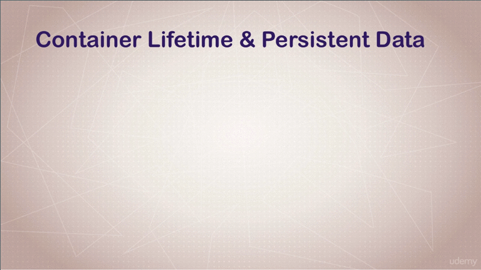
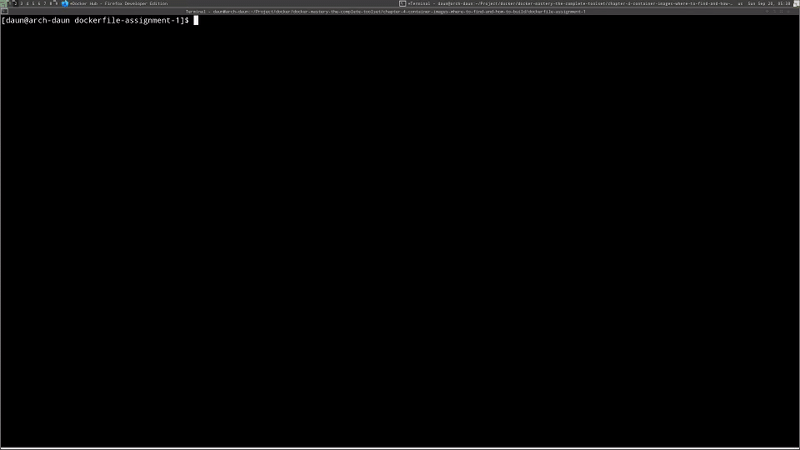
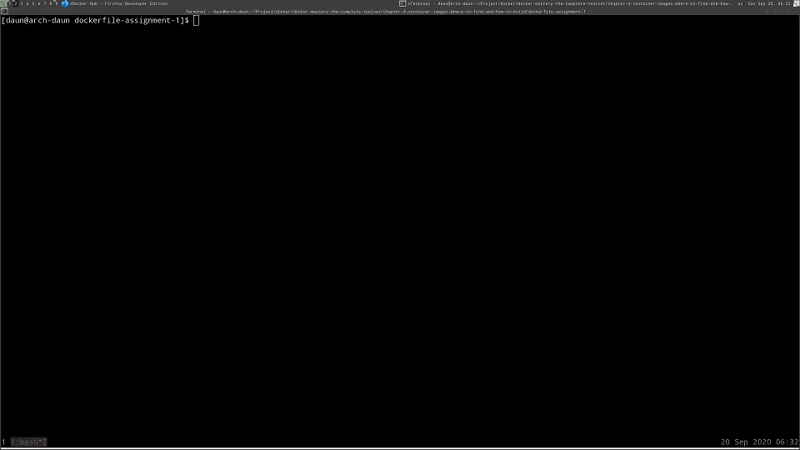
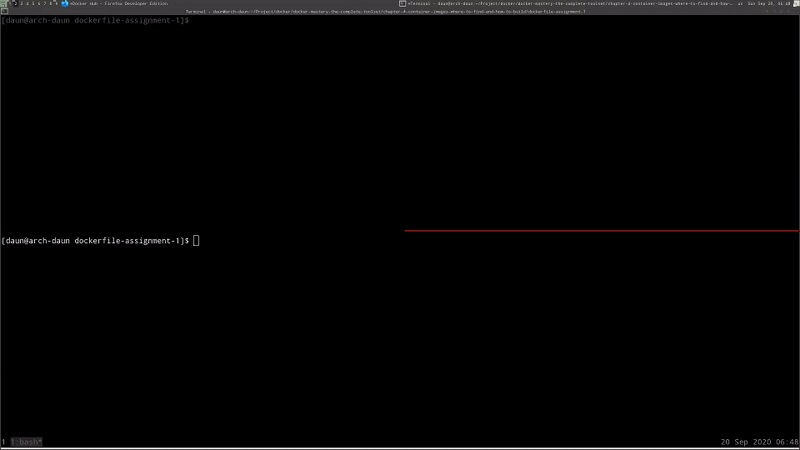
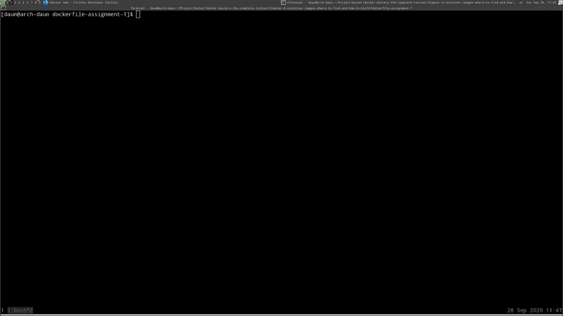
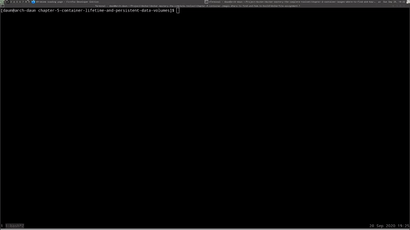
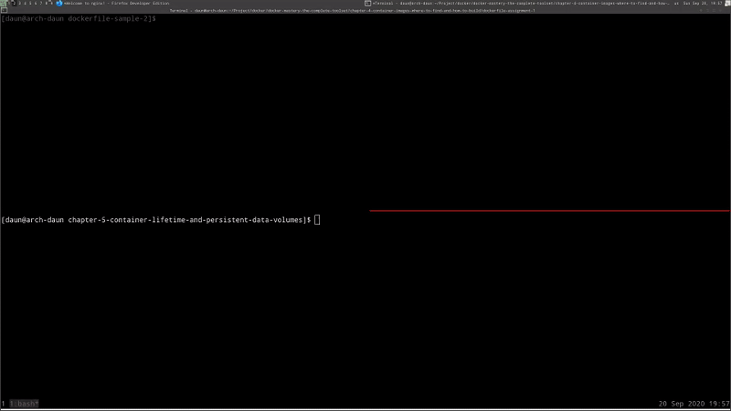

# Container Lifetime and Persistent Data Volumes

## Table of Contents

1. [Module Introduction](#module-introduction)
2. [Container Lifetime and Persistent Data](#container-lifetime-and-persistent-data)
3. [Persistent Data and Data Volumes](#persistent-data-and-data-volumes)
4. [Persistent Data and Bind Mounting](#persistent-data-and-bind-mounting)
5. [Assignment Database Upgrade with Named Volumes](#assignment-database-upgrade-with-named-volumes)

<br/>

## Module Introduction
<br/>


<br/>

In this section is going yo be a **full of lectures** and **assignments** around
**persistent data**.

First we're going to discuss the **problem of persistent data** and how that
even became a problem in the first place.

**Key concepts** there that you need to understand are the **idea of immutable
infrastructure**; And the idea around containers being **naturally ephemeral
(impermanent) in design**. We'll cover those in first lecture.

Then we dive into **data volumes** and how those solve some of our problems
around _persistent data_.

Then we also dig into **bind mounts** and how that solves different problems
with _persistent data_.

Then we'll end up this section with a couple of _assignments_ around how to
_peresever database data_, while replacing containers for databases; And then
also actually **mounting code into a container from the host** while you're
_editing_ it, so that you can run that code inside the container **live**.


**[⬆ back to top](#table-of-contents)**
<br/>
<br/>

## Container Lifetime and Persistent Data
<br/>

Requirement for this first lecture are just understanding how to run containers,
and the containers and image concepts we've discuss so far.


<br/>

Until now, you've only worried about what's needed to run a container, not the
unique data that might be created once container is running. Container are
**meant to be immutable and ephemeral**. Those a fancy **buzzwords** for
_unchanging and temporary_, or disposal.

The idea here is that _we can just throw away a container and create a new one
form image_. Then we're not talking about an actual limitation of containers,
but more of a **design goal**, or a best practice.

This the idea of **[immutable
infrastructure](https://www.oreilly.com/radar/an-introduction-to-immutable-infrastructure/)**
where we don't change things once they're running. If a config change needs to
happen, or maybe the container version upgrade needs to happen, then we redeploy
a whole new container. This gives us huge benefits in **reliability and
consistency** and **making change reproducible**. But there's a tradeoff.

What about he unique data that your app will produce? Those database, or a key
value stores, or anything else that your app spits out into a file? Ideally, the
_containers shouldn't contain your unique data mixed in with the application
binaries_. This known as **separation of concerns**.

Docker actually gives us a big benefits with separation of concerns here. We can
update our application by recreating a new container, with an update version of
our app, and ideally, our unique data is still where it needs to be and was
preserved (maintain) for us while our container was recycled. In case you
haven't notice so farm, the containers that we've been using, by default, were
persistent (maintainable). Any changes in them actually were kept across restart
and reboots until we removed the container.

Just because we stopped the container or restarted the host, doesn't mean the
container's file change go away. It's only when we remove the container that
it's [UFS](#what-is-ufs-layers) layer goes away, but we want to be able to do
that at will.

This problem of unique data know in the industry as **persistent data** and
until containers, we didn't really have a name for that. Because, well, most
things we built were persistent, like you know those old servers that have been
running that old app for 5 or 10 year or longer. Everything was persistent by
default.

Now in the new world of containers and application auto scaling, persistent data
creates a unique problem. Docker has two solution to this problem, know as
**data volumes** and **bind mounts**.

**Docker volumes** are a configuration option for a container that create a special
location outside of that container's  Union File System to store unique data.
This preserves it across container removals and allows us to attach it to
whatever container we want; And the container just sees it like a local file
path.

Then there's **bind mounts**, which are simply us sharing or mounting a host
directory, or file, into a container. Again, it will just look like a local file
path, or directory path, to the container. It won't actually know that's it's
coming from the host.


#### What is UFS layers

UFS stands for Union File System, Docker images consist of multiple read-only
file system layers. For each statement in a Dockerfile, a new read-only layer
residing on top of all former layers will be created. If a container is created
based on an image, an additional read/write layer is created on top, which is
then ...
[source](www.dxc.technology/application_services/insights/146173-how_to_get_the_most_out_of_docker_technology)

#### What is persistent data

Persistent data structure is a data structure that always preserves the
previous version of itself when it is modified...
[wiki](wiki2.org/en/Persistent_data_structure)

**[⬆ back to top](#table-of-contents)**
<br/>
<br/>

## Persistent Data and Data Volumes
<br/>


<br/>

Volumes seem pretty simple up front, but there's actually a lot to it. The first
way you can tell a container that it needs to worry about a volume is in
a Dockerfile.

### Command `VOLUME` in image

If we go to official Docker Hub and search MySQL and search the _latest_ we find
[Dockerfile](https://github.com/docker-library/mysql/blob/285fd39122e4b04fbe18e464deb72977df9c6a45/8.0/Dockerfile)
I bet you because it's database, it's probably got a `VOLUME` command in it.

```Dockerfile
VOLUME /var/lib/mysql
```

The `VOLUME` command is the default location of MySQL databases, this image is
programmed in a way to tell Docker when we start a new container from it to
actually create a new _volume location_ and assign it to this directory in this
container. Which means _any files_ that we put in there, in the container, will
outlive the container until we manually delete the volume.

That's something we should point out here is that volumes need manual deletion.
You can't clean them up just by removing a container. They're are _extra step_.
That's just for _insurance really_, because the whole point of the `VOLUME`
command is to say that this data is **particularly important**, at least much
more important than the container itself.

If we do a `docker image inspect` on MySQL, we don't get to see the Dockerfile
because the Docker file **isn't actually part of the image metadata**, which
you'll notice in this config area, that if specified `Volumes` there.

```json
[
    {
        "ContainerConfig": {
            "Hostname": "4a20d34c487d",
            "Domainname": "",
            "User": "",
            "AttachStdin": false,
            "AttachStdout": false,
            "AttachStderr": false,
            "ExposedPorts": {
                "3306/tcp": {},
                "33060/tcp": {}
            },
            "Tty": false,
            "OpenStdin": false,
            "StdinOnce": false,
            "Env": [
                "PATH=/usr/local/sbin:/usr/local/bin:/usr/sbin:/usr/bin:/sbin:/bin",
                "GOSU_VERSION=1.12",
                "MYSQL_MAJOR=8.0",
                "MYSQL_VERSION=8.0.21-1debian10"
            ],
            "Cmd": [
                "/bin/sh",
                "-c",
                "#(nop) ",
                "CMD [\"mysqld\"]"
            ],
            "ArgsEscaped": true,
            "Image": "sha256:145f837222dc7be65e5db56e4ab4d4bcf62fed0902d522732101b21ea681b8d4",
            "Volumes": {                            << Volumes value
                "/var/lib/mysql": {}
            },
            "WorkingDir": "",
            "Entrypoint": [
                "docker-entrypoint.sh"
            ],
            "OnBuild": null,
            "Labels": {}
        }
    }
]
```

I can always tell that the config, that came from the Dockerfile when it was
built, aassigned a volume to that path.

Let's run a container from it with command
<br/>


<br/>

```bash
$: docker container run -d -e MYSQL_ALLOW_EMPTY_PASSWORD=true --name mysql-inspect mysql
$: docker container inspect mysql-inspect

[
    {
    ...
    ...
        "Mounts": [
            {
                "Type": "volume",
                "Name": "519b150ee8edaec07ca7f5dd2cd7eeffb91c83879ce9c0cb0153f6a5b9175273",
                "Source": "/var/lib/docker/volumes/519b150ee8edaec07ca7f5dd2cd7eeffb91c83879ce9c0cb0153f6a5b9175273/_data",     << data living in host location
                "Destination": "/var/lib/mysql",    << Volumes values
                "Driver": "local",
                "Mode": "",
                "RW": true,
                "Propagation": ""
            }
        ],
        "Config": {
            "Hostname": "7d512d3a9679",
            "Domainname": "",
            "User": "",
            "AttachStdin": false,
            "AttachStdout": false,
            "AttachStderr": false,
            "ExposedPorts": {
                "3306/tcp": {},
                "33060/tcp": {}
            },
            "Tty": false,
            "OpenStdin": false,
            "StdinOnce": false,
            "Env": [
                "MYSQL_ALLOW_EMPTY_PASSWORD=true",
                "PATH=/usr/local/sbin:/usr/local/bin:/usr/sbin:/usr/bin:/sbin:/bin",
                "GOSU_VERSION=1.12",
                "MYSQL_MAJOR=8.0",
                "MYSQL_VERSION=8.0.21-1debian10"
            ],
            "Cmd": [
                "mysqld"
            ],
            "Image": "mysql",
            "Volumes": {                            << Volumes values
                "/var/lib/mysql": {}
            },
            "WorkingDir": "",
            "Entrypoint": [
                "docker-entrypoint.sh"
            ],
            "OnBuild": null,
            "Labels": {}
        },
        ...
        ...
    }
]
```
<br/>


<br/>

We should see in the `inspect` command for container that tell us in the
`Config` that there's `Volumes` values, and under `Mounts`. What this is, is
this is actually the **running container getting its own unique location on the
host**, to store data, and then it's in the background, mapped or mounted, to
that location in the container, so that the location in the container actually
just thinks **it's writing** to `/var/lib/mysql` in `Mounts` values.  In this
case, we can see that the data is actually living in that location on the host.

By looking at this, you notice that it's not very user friendly in terms of
telling us what's in it or what this `volumes` in `Mounts` is assigned to. We
can see from the **container's perspective what volume it's using**, but we
can't see from the **volume perspective what it's connected to**.

There's no easy way here to tell one from the other at
`/var/lib/docker/volumes/`. If we deleted the container the data is still safe
in `/var/lib/docker/volumes`. Let's prove it
<br/>


<br/>

So even the container is deleted, the container `values` are still there and my
data is still safe. So we solved one problem. The databases outlive the
executable. How do we make this a little more user friendly? That's where
**named volumes** come in..

> **NOTE**: named volumes
>
> Friendly way to assign volumes to containers

And the ability for us to specify things on the `docker run` command with `-v`
options for create new container.

```bash
$: docker container run --help
Usage:  docker container run [OPTIONS] IMAGE [COMMAND] [ARG...]

-v, --volume list                    Bind mount a volume
    --volume-driver string           Optional volume driver for the container
    --volumes-from list              Mount volumes from the specified container(s)
```
<br/>


<br/>

A `-v` command allow us to specify either a **new volume we want to create** for
this container that's about to run, or it allow us two other  options **create
a named volume**,

```bash
$: docker container run -v /var/lib/mysql ...
```

This would do the same thing is what our volume command in the Dockerfile did.
We don't really need to do that here. But what we can do we can put a name in
front of it with colon `:`. That know as a **named volume**.

```bash
$: docker container run -v mysql-volumes:/var/lib/mysql ...
```

When I do that, and then do `docker volumes ls`, you'll see that my new
container is using new volumes with friendly name.

### Using existing volume with new container
<br/>


<br/>

A little tips here is that when I am running for days or weeks at a time,
a particular database, in a particular container that I need to keep using over
and over and I don't want a blank database server. I'll end up creating my
_containers this way and naming_ them for the project so that I know what that
_volume's_ for, and that it needs to stick around.

### Docker `volume create` command

Why would you want to do `docker volume create`?

> **NOTE**: `docker volume create`
>
> Required to do this before `docker run` to use customs drivers and labels

If we can create them form a `docker container run` command at runtime, and we
can create them by specifying them in the Dockerfile, there's only a few cases
where you'd want to create it ahead of time; And you can figure that out by
pretty quickly by using `--help` command:

```bash
$: docker volume --help

Usage:  docker volume COMMAND
Manage volumes

Commands:
  create      Create a volume
  inspect     Display detailed information on one or more volumes
  ls          List volumes
  prune       Remove all unused local volumes
  rm          Remove one or more volumes

$: docker volume create --help

Usage:  docker volume create [OPTIONS] [VOLUME]
Create a volume

Options:
  -d, --driver string   Specify volume driver name (default "local")
      --label list      Set metadata for a volume
  -o, --opt map         Set driver specific options (default map[])
```

Because here's the only way that we can actually specify a different driver.
Remember that _plug-in_  stuff I'm going to talk later? Then any _driver
options_  that we want to use the `-o` command options on. Then if we want to
put labels on it, which we'll also talk about later in the _production section_.

Sometimes, in special cases, you do need to create the Docker `volume` ahead of
time, but usually for your _local development_ purposes, just specifying it in
a Dockerfile or at the `run` command is fine.

**[⬆ back to top](#table-of-contents)**
<br/>
<br/>

## Persistent Data and Bind Mounting
<br/>


<br/>

In this Lecture, we're going to talk about **bind mounting** and **persistent
data** in those mounts. The requirements are really that you just know about
container management and how to run containers.

_Bound mounts_ are actually pretty cool. When I first learned about them, it
sort of gave me an _aha_ of how I could use Docker easily for local development.
Really, a _bind mount_ just a **mapping** of the _other host files_, or
_directory_, _into a container file or directory_. You can do just that.  You
can either specify a directory or just a single file.

In the background, it's basically just having the two location point to the same
physical location on disk.

Again, this actually skips of [UFS](#what-is-ufs-layers) like the other volumes
do so that it's not going to wipe out your host location when you delete the
container. If there any files in the container that you map the host files to,
the host files win. It doesn't actually delete the files in the container that
it overwrote because it's not really overwriting anything in that container,
it's just there while the _bind mount exist_. The minute you don't need the bind
mount any more and you re-run the container without it, you would actually see
the underlying data that was there before.

Because _bind mounts_ are usually **host specific**, they need specific data to
be on the hard drive or the host in order to work. You **can't specify them in
Dockerfile**. You have **to use them at runtime** when you use the `docker
container run` command.

You can see the format here, it really the `-v` that we used before, only on he
left-side of the colon `:`, we're actually putting in a full path rather than
just a name.

The way the Docker actually can tell the difference between the _named volumes_,
like we did a while a go, and the _bind mount_, is the bind mount start with
a forward slash `//`.

As long as you have the _left colon_ and _righ sides_, you can really map
anything you want from the host into the container, and you can also specify
things like `read-only`. Where this really comes to shine is with development
and running services inside your container that are accessing files you're using
on your host or changing.

### Bound mounts volume with Nginx

So we have [Dockerfile](./dockerfile-sample-2/Dockerfile). If we take look at
the Dockerfile real quick, it's pretty simple.

```Dockerfile
# this shows how we can extend/change an existing official image from Docker Hub

FROM nginx:latest
# highly recommend you always pin versions for anything beyond dev/learn

WORKDIR /usr/share/nginx/html
# change working directory to root of nginx webhost
# using WORKDIR is preferred to using 'RUN cd /some/path'

COPY index.html index.html

# I don't have to specify EXPOSE or CMD because they're in my FROM
```

It's just specifying a `WORKDIR` directory and then copying an `index.html` into
`/usr/share/nginx/html` directory. **There's no `VOLUMES`** here. A _bind mount_
**doesn't require** a `VOLUME` to work, although one could certainly be there,
but the host always wins, remember?

So, when we're create a new container,

```bash
Usage:  docker container run [OPTIONS] IMAGE [COMMAND] [ARG...]
Run a command in a new container

v,  --volume list                    Bind mount a volume
    --volume-driver string           Optional volume driver for the container
    --volumes-from list              Mount volumes from the specified container(s)

$: docker container run -d --name nginx -p 80:80 -v $(pwd):/usr/share/nginx/html nginx
```
<br>


<br/>

The `-v` tell it my current working directory is going to be actually mounted
into that working directory in container. Because my `index.html` is here in
folder [dockerfile-sample-2](./dockerfile-sample-2/index.html) I want to be in
the container so I can edit it here, and it is seen live in the container.

Here's **quick little tip**, instead of me having to figure out my _whole path_
and type the whole thing in, you can use `$(pwd)` here like so. Which is a shell
shortcut that says, 'print out the working directory and replaces this command
with that path'.

Then we use working directory `:/usr/share/nginx/html` from the Dockerfile
there, and then we're going to specify Nginx image.

Basically, we're just going to edit the file on our host, and then I'm going to
be in the container and see what happening.

In `localhost:80` we use the regular Nginx image. We didn't actually use the
custom `index.html` from host directory. We just used a stock image. To prove
that point, we can actually do that same, exact command again but take out the
`-v` command.

```bash
$: docker container run -d --name nginx2 -p 8080:80  nginx
```
<br>


<br/>

When we open `localhost:8080` we can see we use default `index.html` Nginx file.
The `index.thml` on `localhost:80` is custom one that we have living in the
[dockerfile-sample-2](./dockerfile-sample-2/index.html). So already we can see
that it **mapped** it correctly.

### Edit the Bound Mount file live
<br>


<br/>

You'll notice that we can actually see the Dockerfile because we map the whole
directory. Hopefully you understand what's going on here, that both these
location are the same location. Our Nginx is able to see the changes because
it's just a normal file path in the container, and those file are on the host.
If I was to delete them in the container, they would be deleted on the host
because it is the same file.

### Bound mount quick tips
This is is when I usually get a developer to **get mine thinking** about all
of their development environments that they have are this complicated setup.
Maybe they-re using [Vagrant](#what-is-vagrant), or some other manual method of
setting up their perfect environments, and they can start to see how this could
make that so much simpler. Because I didn't have to do any complicated setup on
workstation (host), I just ran a container. I used `-v` command with the mount,
and now my code, my host, can be edited on my host; And I really never need to
go into the shell if the container.

Usually, you can just run the container and look at its logs to see if there's
any errors while you're coding. Of course this is a simple example with Nginx.
Later on we're actually going to have specific examples of different development
environments for local development and container.

#### What is Vagrant
Vagrant is an open-source software product for building and maintaining
portable virtual software development environments; e.g., for VirtualBox, KVM,
Hyper-V, Docker containers, VMware, and AWS.It tries to simplify the software
configuration management of virtualizations in order to increase development
productivity. Vagrant is written in the Ruby language, but its ecosystem
supports ...  [wiki](en.wikipedia.org/wiki/Vagrant_(software))

**[⬆ back to top](#table-of-contents)**
<br/>
<br/>

## Assignment Database Upgrade with Named Volumes
<br/>


<br/>

All right. Now that you've learned all about volumes and bind mounts, and why we
need to worry about persistent data, let's do something that's a real-world
scenario, which is database upgrades.

Imagine a situation you're running a particular version of database. Let's say
Postgres, and you're needing to update patch version because maybe there's
a security fix, or bug fix, or something. Normally on a system, you would just
update the software. You'd do a package management system update or upgrade, and
it would handle all the updates to the libraries and everything by itself.

How do we do the update system in a container? Because, if we trying to follow
the best practice of not updating application in containers, but rather
replacing the container with a new version how do we do that with the database?

What you're going to do for this assignment is you're going to use Docker Hub to
get you some info around updating the specific version of Postgres. We're going
to start with you specifically creating a container using Postgres version
`9.6.1`, which is an older version; and you need create a _named volume_.

You going to have to lean on Docker Hub's documentation for this, using the
official Postgres repository. You'll need to go to the Dockerfile for that
specific version and learn what the volume path needs to be. Then you can name
your volume whatever you want on the left side.
`<postgres-host-path>:<container-postgres-path>` But remember that colon `:` on
the left right side of it, that has to be the path actual database are going to
be in the container.

Once you've got all that figured out and you started your container, you should
start _checking the logs_ to see when it's finished creating the databases and
all the startup stuff. Because the first time you start a database container,
typically it does a bunch of stuff in the background, like creating the _admin
user_, and a _default database_, and so on.

There will be a point where the _logs will stop_  and then it'll just be running.
If you've done it correctly, you'll be able to do a `docker volume ls` and see
the volume listed there, with the name that you gave it, and you should be able
to stop that container.

Then you're going to create a new container with a new version. It's going to be
very similar command to the first one, only specify a different version, you'll
also make sure you want to specify the same named volumes because it needs to be
using the data that you used in the first one. Of course, **make sure that you
have the first one stopped because both of these can't access the same data at
the same time**.

Once you've started it, then go ahead and _check the logs again_ for that new
container. What you should see is that it only has a couple lines of startup
logs because it doesn't have to do all the work of the initial startup. That's
kind of how you know it's using the same named volume is that the second time it
starts up, it may only have four or five log entries.

So this is the real-world scenario. You'll do this if you ever run production
databases or anything that you need to keep current. **Do note** that most
database system don't do major upgrades automatically. It usually requires
a tool. With Postgres or MySQL, there's a separate tool for each one of them
that you have to run. This is really just about upgrading the patch versions or
that last number which doesn't require schema changes or any major updates to
the data code itself.

Like before, if you get stuck, no worries because this is a new thing and it may
not be that clear in Docker Hub. If you get stuck at some point and Docker Hub
isn't helping you out, just check the next lecture, which is me going through
this same exercise as I would do it.

### Assignment Answer
<br/>


<br/>

**[⬆ back to top](#table-of-contents)**
<br/>
<br/>

