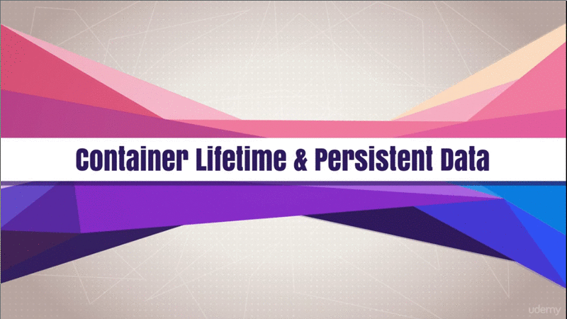

# Container Lifetime and Persistent Data Volumes

## Table of Contents

1. [Module Introduction](#module-introduction)
2. [Container Lifetime and Persistent Data](#container-lifetime-and-persistent-data)

 

## Module Introduction
 

 

In this section is going yo be a **full of lectures** and **assignments** around
**persistent data**.

First we're going to discuss the **problem of persistent data** and how that
even became a problem in the first place.

**Key concepts** there that you need to understand are the **idea of immutable
infrastructure**; And the idea around containers being **naturally ephemeral
(impermanent) in design**. We'll cover those in first lecture.

Then we dive into **data volumes** and how those solve some of our problems
around _persistent data_.

Then we also dig into **bind mounts** and how that solves different problems
with _persistent data_.

Then we'll end up this section with a couple of _assignments_ around how to
_peresever database data_, while replacing containers for databases; And then
also actually **mounting code into a container from the host** while you're
_editing_ it, so that you can run that code inside the container **live**.

**[⬆ back to top](#table-of-contents)**
 
 

## Container Lifetime and Persistent Data
 

Requirement for this first lecture are just understanding how to run containers,
and the containers and image concepts we've discuss so far.

 

Until now, you've only worried about what's needed to run a container, not the
unique data that might be created once container is running. Container are
**meant to be immutable and ephemeral**. Those a fancy **buzzwords** for
_unchanging and temporary_, or disposal.

The idea here is that _we can just throw away a container and create a new one
form image_. Then we're not talking about an actual limitation of containers,
but more of a **design goal**, or a best practice.

This the idea of **[immutable
infrastructure](https://www.oreilly.com/radar/an-introduction-to-immutable-infrastructure/)**
where we don't change things once they're running. If a config change needs to
happen, or maybe the container version upgrade needs to happen, then we redeploy
a whole new container. This gives us huge benefits in **reliability and
consistency** and **making change reproducible**. But there's a tradeoff.

What about he unique data that your app will produce? Those database, or a key
value stores, or anything else that your app spits out into a file? Ideally, the
_containers shouldn't contain your unique data mixed in with the application
binaries_. This known as **separation of concerns**.

Docker actually gives us a big benefits with separation of concerns here. We can
update our application by recreating a new container, with an update version of
our app, and ideally, our unique data is still where it needs to be and was
preserved (maintain) for us while our container was recycled. In case you
haven't notice so farm, the containers that we've been using, by default, were
persistent (maintainable). Any changes in them actually were kept across restart
and reboots until we removed the container.

Just because we stopped the container or restarted the host, doesn't mean the
container's file change go away. It's only when we remove the container that
it's [UFS](#what-is-ufs-layers) layer goes away, but we want to be able to do
that at will.

This problem of unique data know in the industry as **persistent data** and
until containers, we didn't really have a name for that. Because, well, most
things we built were persistent, like you know those old servers that have been
running that old app for 5 or 10 year or longer. Everything was persistent by
default.

Now in the new world of containers and application auto scaling, persistent data
creates a unique problem. Docker has two solution to this problem, know as
**data volumes** and **bind mounts**.

**Docker volumes** are a configuration option for a container that create a special
location outside of that container's  Union File System to store unique data.
This preserves it across container removals and allows us to attach it to
whatever container we want; And the container just sees it like a local file
path.

Then there's **bind mounts**, which are simply us sharing or mounting a host
directory, or file, into a container. Again, it will just look like a local file
path, or directory path, to the container. It won't actually know that's it's
coming from the host.

#### What is UFS layers

UFS stands for Union File System, Docker images consist of multiple read-only
file system layers. For each statement in a Dockerfile, a new read-only layer
residing on top of all former layers will be created. If a container is created
based on an image, an additional read/write layer is created on top, which is
then ...
[source](www.dxc.technology/application_services/insights/146173-how_to_get_the_most_out_of_docker_technology)

#### What is persistent data

Persistent data structure is a data structure that always preserves the
previous version of itself when it is modified...
[wiki](wiki2.org/en/Persistent_data_structure)

**[⬆ back to top](#table-of-contents)**
 
 

