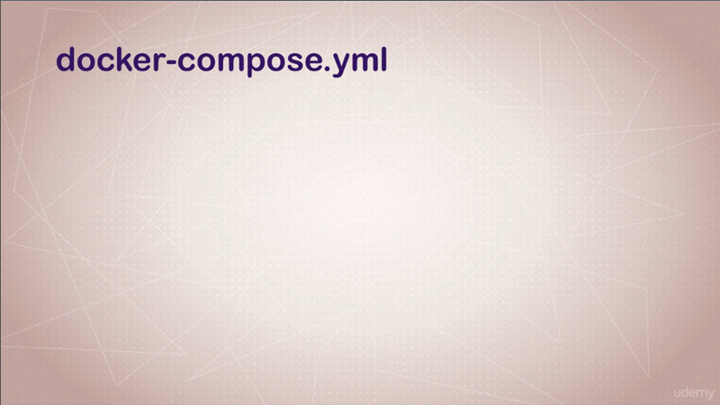
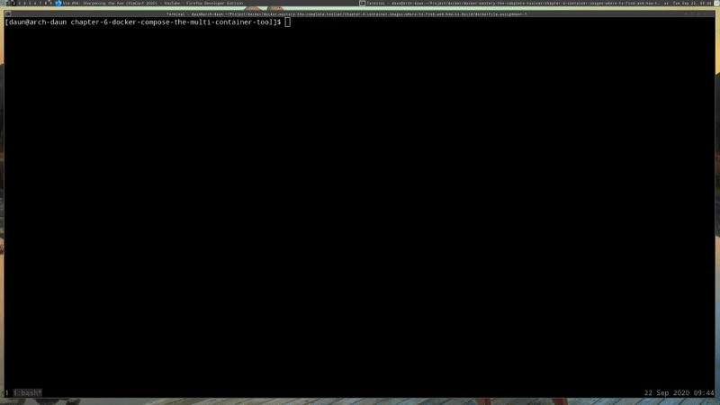

# Docker Compose The Multi-Container Tool

## Table of Contents

1. [Module Introduction](#module-introduction)
2. [Docker Compose and the docker-compose.yml](#docker-compose-and-the-docker-compose.yml)
3. [Trying Out Basic Compose Commands](#trying-out-basic-compose-commands)

<br/>

## Module Introduction

This section is going to focus exclusively on **Docker Compose**, which is
a combination of a _command line tool_ and a _configuration file_. Requirement
for this section are that you really need to **know a lot of the fundamentals**
from the last few section around _images_ and _containers_.

As we're going through this course, you're probably going to start to hear me
get more and more excited because things just getting better.

As you learn one component, you're thinking, 'man, bind **mounts** and
**volumes** are really cool'. That's going to save me some time. I can imagine
how I'm going to use that. Then I'm going to come with the next thing that's
going to be even better that what you just learned. In this case, it couldn't be
more true.

## Docker Compose and the docker-compose.yml

### What is  Docker Compose
<br/>


<br/>

What is Docker Compose? And why do we care? So few software services are truly
standalone. When you think about your containers, they're a single process
solution, and we're _rarely going to use just a single container_ to solve
a problem or provide a service to our customer.  Our containers will often
require other containers such a SQL or a key value; And other applications that
we'll need to run in containers, like _proxies_ or _web frontends_ or _backend
workers_, and so on.

What if we had a way to connect all those pieces of our solution together, where
we didn't need to remember all of our`docker run` options, and then get them
_into discreet_, _virtual networks with relationship between them_, and only _expose
the public ports_ and then spin them all up and tear them down with one command.

Well, that's Docker Compose.

Before we dive in, we need to clear up that there's **two parts to Docker
Compose**.  The first part is the YAML file, and it's super simple to
understand. It's written in YAML, and if you've never dealt with YAML, that is
a very easy _configuration language_. It's almost as easy as an INI file would
be.  I actually think it's easier because it show hierarchy. We'll dive into
that.  That file _is where you would specify all the containers you need yo
run_, the _networks_ you need, any _volumes_ you might need, _environment
variables_, _images_, and all sorts of other configuration options.

Then the second part of Docker Compose is **CLI tool**, which is
`docker-compose`, that we use normally for just local dev and test, using that
YAML file we created to simplify our Docker commands.

### What is docker-compose.yml
<br/>


<br/>

There's actually versions to the things that you can put in the compose file. So
when Docker Compose was created years ago, it was actually called **Fig** and it
was just assumed `version 1`. It didn't actually even list a version in the
file. As it's matured and added new features to what the file can have in it,
such as _networks_ and _volumes_, they have **created the version statement**,
which is actually the first line in the file.

This file can actually be used with a Docker Compose CLI, which we'll talk about
in a minute. This is, again, mainly for local development management and just
making it easier to get around in your environments on you local machine (host).

Now, starting with the beginning 2017, we have `version 1.13` and anything
beyond that, these files can now be used directly with the docker command line
in production with Swarm. Of course, there's great help at the command line with
the `--help`.

As w look at some of the examples, know that the Docker Compose file is
_a default name_, but you can actually use any file name you want, as long as
it's proper YAML and that you use the `-f` to specify which file you're trying
to use.

#### YAML indentation

Synopsis of YAML Basic Elements. The synopsis of YAML basic elements is given
here: Comments in YAML begins with the (#) character. Comments must be
separated from other tokens by whitespaces. Indentation of whitespace is used
to denote structure. Tabs are not included as indentation for YAML files. List
members are denoted by a leading hyphen (-).
[source](http://www.tutorialspoint.com/yaml/yaml_basics.html)

#### YAML: `version`

[template.yml](./compose-sample-1/template.yml)

```yaml

version: '3.1'  # if no version is specified then v1 is assumed. Recommend v2 minimum

services:  # containers. same as docker run
    servicename: # a friendly name. this is also DNS name inside network
    image: # Optional if you use build:
    command: # Optional, replace the default CMD specified by the image
    environment: # Optional, same as -e in docker run
    volumes: # Optional, same as -v in docker run
servicename2:

volumes: # Optional, same as docker volume create

networks: # Optional, same as docker network create
```

We have the `version` value in the beginning. The newest version in first
quarter of 2017 is `3.1` and now in 2020 is `3.8` for Docker Engine `19.03.0+`.
But I always make it at least version 2. If you don;t add that line there, it's
always assumed to be `version 1`. But I don't recommend that because you lose
a lot of features. [source](https://docs.docker.com/compose/compose-file/)

So I typically start with `version 2`. Then if I need specific features out of
`version 3` and `3.1`, I end up typing the version number i there. You'll see
the other three main section are `services`, `volumes` and `networks`.

#### YAML: `services`

YAML is hierarchical. Under `services`, everything can be **two** or **four
spaces**, but it does need to be consistent. If you just look up the YAML on the
internet, you'll find some sites that guide you with the specific of how to
format this file.

If you using a modern editor, it's going to actually speak of YAML language and
know how to deal with these file and their formatting. Usually here, you have,
at minimum, `services`, which is really just **containers**. The reason they
actually call them `services` is because each container that you create in here,
you could actually have multiple ones of those containers for redundancy. So
they needed to come up with a different word. I thinks `services` is great
because that's basically what you're doing. Right?  Each container, or
containers, that are identical, that you're using are usually providing
a service to something.

#### YAML: `servicename`

Underneath the `servicename`, and again you can call it whatever you want. It
doesn't have to be the name of the image or it doesn't have to be anything
related at all. It could be your name for the `servicename`, but it _will be the
DNS name_, that we'll find out later, is used inside of your _Docker networks_.
Similar to when you give the `--name` to a `docker run` command.

At `servicename`, I've shown that we can _optionally_ specify the `image`. We can
specify the _alternate_ `command` to run. If we wanted to overwrite the actual
command that was specified in the image when we run it, we can do that.

Basically, all the things we do from the `docker run` command, we can save them
here. Because that's what really this about, is taking all of the work out of
remembering all the different things in `docker run` command for those things
you're running constantly.

If you have your own development environment, or your own tools, you probably
don't want to type those commands over and over; And shell scripts can only do
so much. Right? So this file would actually replace a shell script that would
automate your `docker run` commands. This is a much better way to do it. It's
easier to read and it's better documented.


#### YAML: spaces
You'll notice that spaces are allowed in YAML. You can have spaces in comments
wherever you want. If you have multiple services, you just need to make sure
they're _unique names_.

#### YAML: `volumes` and `networks`

The other part that we specify are `volumes` and `networks`; And again, these
are _optional_ as well. It's basically same rules as when you're running from he
command line. If you were to ever need to use the `docker volume create` or the
`docker network create` commands, and again, you don't always have to. It just
depends on your situation. You can put them here as well.

### YAML Real World Simple example 1

[docker-compose.yaml](./compose-sample-1/docker-compose.yml)

```yaml
version: '2'

# same as
# docker run -p 80:4000 -v $(pwd):/site bretfisher/jekyll-serve

services:
  jekyll:
    image: bretfisher/jekyll-serve
    volumes:
      - .:/site
    ports:
      - '80:4000'
```

You remember in the last section, we had a lecture we used **Jekyll**  really
quick to just do a _bind mount_ example. So this is what the compose file would
look like for that `docker run` command, and you'll see that i have specified
the `image: bretfisher/jekyll-serve`, I've named it `jekyll`. I've given it
`volumes`. You'll notice instead of using the `pwd`, Compose actually understand
that `.` in `- .:/site`, meaning this is the current working directory I'm in.
Just use this directory that I'm running the compose file from. Then the `ports`
or the `-p` option.

You'll notice some little things about YAML, where when something only has one
option, like if there's only going to be _one_ `image` for each service, it
would usually be a **key** and **value** format. If it's going to be a list of
_items_, like `volumes` and `ports` where you can have multiple ones, you'll
notice that the compose file usually has a _plural_. Instead of `volume`, it's
`volumes`; And instead of `port`, it's `ports`; And then there'll be a list
format with a `-`.

### YAML Real World Simple example 2

[compose-2](./compose-sample-1/compose-2.yml)

```yaml
version: '2'

services:

    wordpress:
        image: wordpress
        ports:
              - 8080:80
        environment:
            WORDPRESS_DB_HOST: mysql
            WORDPRESS_DB_NAME: wordpress
            WORDPRESS_DB_USER: example
            WORDPRESS_DB_PASSWORD: examplePW
    volumes:
      - ./wordpress-data:/var/www/html

  mysql:
    image: mariadb
    environment:
      MYSQL_ROOT_PASSWORD: examplerootPW
      MYSQL_DATABASE: wordpress
      MYSQL_USER: example
      MYSQL_PASSWORD: examplePW
    volumes:
      - mysql-data:/var/lib/mysql

volumes:
  mysql-data:
```
We jump into another example real quick. You'll see that in this one, this is
actually a sample WordPress setup where you hav the _database service_ down here
that's running a database container named `mysql` with image `mariadb` and then
the WordPress _web server_ container up top.

You'll notice a little thing that's different about this one is that we're using
the `environment` variables, which would be the same as a `-e` at the command
line. But instead of a list format where we have a`-`, this is, again, another
key and value statement. In this format we don't use the `-`, we _just list the
key and the value_. If I needed to add another one, I would just add below.

```yaml
version: '2'

services:

    wordpress:
    ...
    ...
    environment:
    ....
    ....
            WORDPRESS_DB_PASSWORD: examplePW
            key: value
```

All of these would be passed into the container, when it runs, using the compose
command line.

### YAML Real World Simple example 3

[compose-3.yml](./compose-sample-1/compose-3.yml)

```yaml
version: '3'

services:
    ghost:
    image: ghost
    ports:
        - "80:2368"
    environment:
        - URL=http://localhost
        - NODE_ENV=production
        - MYSQL_HOST=mysql-primary
        - MYSQL_PASSWORD=mypass
        - MYSQL_DATABASE=ghost
    volumes:
        - ./config.js:/var/lib/ghost/config.js
    depends_on:
        - mysql-primary
        - mysql-secondary
    proxysql:
    image: percona/proxysql
    environment:
        - CLUSTER_NAME=mycluster
        - CLUSTER_JOIN=mysql-primary,mysql-secondary
        - MYSQL_ROOT_PASSWORD=mypass

        - MYSQL_PROXY_USER=proxyuser
        - MYSQL_PROXY_PASSWORD=s3cret
    mysql-primary:
    image: percona/percona-xtradb-cluster:5.7
    environment:
        - CLUSTER_NAME=mycluster
        - MYSQL_ROOT_PASSWORD=mypass
        - MYSQL_DATABASE=ghost
        - MYSQL_PROXY_USER=proxyuser
        - MYSQL_PROXY_PASSWORD=s3cret
    mysql-secondary:
    image: percona/percona-xtradb-cluster:5.7
    environment:
        - CLUSTER_NAME=mycluster
        - MYSQL_ROOT_PASSWORD=mypass

        - CLUSTER_JOIN=mysql-primary
        - MYSQL_PROXY_USER=proxyuser
        - MYSQL_PROXY_PASSWORD=s3cret
    depends_on:
        - mysql-primary
```

The last example. This one is a little more complicated. It's actually one
I was working on recently to set up a three database server cluster behind
a _Ghost web server_. Ghost is actually a blog system similar to WordPress. You'll
actually see that I have multiple `environment` variables for each one of these
containers.

I've got my Ghost container up top. Then I actually have this thing known as
a _SQL proxy_, which it sits in front of _MySQL servers_, and acts as a _load
balancer_ and _failover solution_.

Then I have each of my two, _MySQL servers_. You'll notice another option down
that says `depends_on`, and `depends_on` is a pretty common one. It basically
helps Compose understand the relationship between services. It known that if
I need to start my _Ghost web server_, then I also need to start other ones as
well.

You can see that my _Ghost web server_ actually depends on _mysql-primary_ and
_mysql-secondary_. We'll get into the detail of how this works in later
lectures.


But for now, this is probably a lot of digest, and all these different commands
and whatnot, but trust that Docker has some really great documentation on their
website. If you just look for Docker Compose file on duckduckgo, you'll probably
find under docs.docker.com/compose-file website as usual, and it's going to be
documentation about every single little key and value option you have.

What's great about Docker documentation is it gives you plenty of examples.
**Personally I'm on this site every day**, just like I'm on the `docker run`
command options page or the `compose` command options page, I'm constantly
referencing these because there's just frankly so many features nowadays that
I can't remember them all.

Now that we have a general idea of what the compose file format might look
like, let's jump over to the command line and learn about Docker Compose CLI
tool.

### Miscellaneous

#### What is YAML

YAML (a recursive acronym for "YAML Ain't Markup Language") is a human-readable
data-serialization language.It is commonly used for configuration files and in
applications where data is being stored or transmitted. YAML targets many of
the same communications applications as Extensible Markup Language (XML) but
has a minimal syntax which intentionally differs from SGML.
[wiki](http://en.wikipedia.org/wiki/YAML)

YAML is a data serialisation language designed to be directly writable and
readable by humans. It's a strict superset of JSON, with the addition of
syntactically significant newlines and indentation, like Python. Unlike Python,
however, YAML doesn't allow literal tab characters for indentation.---
[source](http://learnxinyminutes.com/docs/yaml/)

#### What is INI

An INI file is a configuration file for computer software that consists of
a text-based content with a structure and syntax comprising key-value pairs for
properties, and sections that organize the properties. The name of these
configuration files comes from the filename extension INI, for initialization,
used in the MS-DOS operating system which popularized this method of software
configuration.  [wiki](http://en.wikipedia.org/wiki/INI_file)

An INI file is a Windows Initialization file, used most often by software
programs. These are plain text files that contain settings dictating how
programs should operate.
[source](http://www.lifewire.com/how-to-open-edit-ini-files-2622755)

An INI file is a configuration file used by Windows programs to initialize
program settings. It contains sections for settings and preferences (delimited
by a string in square brackets) with each section containing one or more name
and value parameters.  [source](http://fileinfo.com/extension/ini)

**[⬆ back to top](#table-of-contents)**
<br/>
<br/>

# Trying Out Basic Compose Commands
<br/>


<br/>

We previously talked about the Docker Compose YAML file and in this lecture,
we're going to be talking about the _compose command line_. Requirement for this
lecture are like the rest for this section where you really need to know
_images_ and _containers_, and _how to use_ them and the _concepts around_ them from
previous sections, so that you can use all of those inside the `compose` command
and the YAML file.

The Docker Compose command line tool is actually _separate from the Docker
tool_. It's actually a separate binary. If you're on Docker for Windows or
Docker for Mac, it actually comes bundled with that. If you also use the toolbox
on Windows 7, it bundled with that. But if you're on Linux, you have to download
it separately and you can get that on [github](http://github.com/docker/compose),
but you you can aslo just search it on duckduckgo, and there'll be a link in the
reference for this section.

But I should _state really quick_ that it's not designed to be
a _production-grade_ tool. It's super ideal for local and testing things really
quickly that might otherwise be complex to type in a bunch of commands from the
command line.

_Two common command_ that we use will be,

```bash
# Setup Volumes/networks and start all containers
$: docker-compose up

# Stop containers and remove cont/vol/net
docker-compose down
```

Above command is by far probably what you're typing going to be typing 90% of
the time. It's one stop shop. It's basically a single command to do everything
in the compose file, including _creating volumes_, _creating networks_,
_starting all the containers_ with all their configuration options.

Then to clean up when you're done, the `docker compose down`, which a lot of
people actually forget to do, will actually clean up after you. It'll get rid of
the containers, _remove the networks_ and _volumes_ that aren't needed anymore.

It allows you, with these two commands, to quickly jump in and out of different
environments for development. This is where _I really get the attention_ of
developers that are used to using [_vagrant up_](#what-is-vagrant) and other
tool to customize complicated environments locally they need for development.
Once I show them Docker Compose and the compose file and how easy it is to use
along with Dockerfile, it really to start click for them that this could be
a better way and a more reliable way to set up their environment and it doesn't
require the time to set up different VMs or the complexity of managing a virtual
machine environment.

Just to give you a little taste, if you had a project where you had the typical
new developer on-boarding process that was all about learning how to the right
tools for their system, and the right virtual machine downloaded, and the right
add-ons, and all the things that normally they would just have to build
a replicated environment for, with Docker Compose, it's as easy as cloning the
environment that has your compose file from some repo somewhere and then running
the `docker compose up` command. It can really be that easy.

### Jump into Terminal

Just go into [compose-sampe-2](./compose-sample-2/) directory, we got
[docker-compose.yml](./compose-sample-2/docker-compose.yml)

```Dockerfile
version: '3'

services:
    proxy:
        image: nginx:1.13 # this will use the latest version of 1.13.x
        ports:
            - '80:80' # expose 80 on host and sent to 80 in container
        volumes:
            - ./nginx.conf:/etc/nginx/conf.d/default.conf:ro
    web:
        image: httpd  # this will use httpd:latest
```

This docker compose file, has got _two services_ or _two containers_, and the
first one is an Nginx server which is configured as a _proxy_ in this case; And
that's going to be listening on my port `80` my local  machine (host).

You'll notice the `volumes` command there where I've actually _done a bind
mount_ to a file in this directory called `nginx.conf` file, and it's really
a very simple little file. It's not necessarily important that we know how that
file work yet.  It just shows how, in this case, I'm actually taking a file on
my local environment. Let's say that this directory is a Git repository that
stores these config files for me. It allows me to _map that  file in to the
container_ and I actually, at the end, you'll see it say, `:ro`, that means read
only, meaning I can't it in the container. That's not necessarily required here.
I just wanted to show you that, that's how you would do that in this case.

That config file is actually telling Nginx, instead being a _web-server_ I would
like you yo b a _reverse proxy_, and sit in front of another server; which in
this case we're calling our web-server, with its _service name_, and it's
running the _Apache 2 server_, which is the image `httpd` from the official
image repository on the Docker Hub.

You can also see, at the top, I've specified a `version`. That's how I would do
that inside the `image` line. SO, what should happen is when I type this `docker
compose up`, it should start up both containers. It should create a private
network for the two of them, it will _automatically bind mount_ that file, it'll
_open up the port_,  and it will _start dumping logs out_ to my screen.
<br/>


<br/>

You will notice the [docker-compose.yml](./compose-sample-2/docker-compose.yml)
file, I didn't specify `networks` area, or `volumes` area because they're not
actually required. They're only necessary if I need to do some custom in the
network, like maybe change the default _IP addresses_ or change the _network
driver_ that's used. Or in the `volumes` case, I can create _named volumes_, or
use a _different volume driver_ and we'll get into all of that later in advanced
sections.

Just so yo know, that's how simple these file can be. You don't need all that
stuff. Those features are there if you need them, but usually these very simple,
little commands like this will get you going.

What have I done? This is now my _Apache server_ and my _Nginx server_. You'll
notice the logs are actually _colored_. That's a neat feature of Compose that
you don't necessarily get out-of-the-box with Docker, is that it will log all
the containers that it's running on the screen in the foreground. I can always
do the same things as I do with Docker and run `docker compose up -d` command
which will run it in the background. But it's nice to see when I'm developing or
testing things locally, that I've got logs right on the screen.

If I jump over to my browser, and then got to `localhost:80`, you'll see that it
says `it works`. That's actually the _Apache server_ **replying**, **not** the
_Nginx server_. The traffic is actually going through the Nginx reverse proxy.
It;s repeating the traffic over the Apache server. The Apache server is
responding with its default basic `.html` file because we didn't change
anything, Then the Nginx is repeating it back to me.

So, it's _your basic web server, web proxy configuration_. You can tell that
traffic hit both of them. They actually work through the proxy because the proxy
is actually a different color in the logs. The logs are pumping out here with
a random color for each container in my setup so that I can easily see what's
going on.
<br/>


<br/>

If I hit refresh on the browser several times, you'd see the traffic showing up.
Then it's hitting first the proxy and then the backend web server.

If I want to stop this here, I'd hit `contorl-C` to stop the compose in my
terminal screen. I could actually run it again with the `-d` to run in the
background with `docker-compose up -d`; And you can see back in the browser with
refresh it and it's still there.

I can do a `docker-compose logs` to see to see the same output of logs that
I saw I while a go.

A lot of the command that you might be used to in Docker are also in Docker
Compose. Really what Compose is just doing is it talking to the Docker API in
the background on behalf of the Docker CLI. It's kind of like a replacement of
the Docker CLI still talking to the Docker server API in the backend.

Of course, the great help here, `docker-coompose --help` shows me all the
commands I can run. You'll see a lot of these look really familiar because
they're the equivalent of the `docker COMMAND` just using he context of the
configuration of the compose file.

I can do `docker-compose ps` which will show me that both my containers are
running.

I can do `docker-compose top` to actually list all of the `services` running
inside of them in a nice formatted output.

Then finally, I can do `docker-compise down` to stop and clean up my stuff
I just started. You'll see that it's telling me what it's done there. Cleaned it
all up.

This is just a little taste. We're going to be using `docker-compose` a lot
through the rest of this course for the local development and testing stuff.
Then we'll keep using the Docker Compose files as we transition into the
production concerns for how we deploy complex environments with a simple YAML
file.

### Miscellaneous

#### What is Vagrant

Vagrant is a tool for building and managing virtual machine environments in
a single workflow. With an easy-to-use workflow and focus on automation, Vagrant
lowers development environment setup time, increases production parity, and
makes the "works on my machine" excuse a relic of the past.
[source](http://automationrhapsody.com/what-is-vagrant-and-why-to-use-it/)

You can use vagrant up when you're ready to boot it again. The benefit of this
method is that it will cleanly shut down your machine, preserving the contents
of disk, and During vagrant up you can see the check in acton. If for
example there is a newer version of your box, you will get a notification
[source](http://stackoverflow.com/questions/25966283/should-i-use-vagrant-resume-or-vagrant-up)

If you aren't already using Vagrant Up to make your workflow faster and
smoother, here's why you should be! Let's first break down the primary
components and explain what we're doing. Here's how to build a development
environment on UBUNTU 14.04 with a traditional LEMP stack.
[source](http://www.freshconsulting.com/how-vagrant-up-can-make-development-easier/)

Vagrant is an open-source software product for building and maintaining portable
virtual software development environments; e.g., for VirtualBox, KVM, Hyper-V,
Docker containers, VMware, and AWS.
[source](http://en.wikipedia.org/wiki/Vagrant_(software))

Vagrant is a command-line program that's used in combination with
a configuration file to define, configure, and run virtual machines. Vagrant is
compatible with most of the major hypervisors, including VirtualBox, Hyper-V,
and VMware.
[source](http://www.lynda.com/Vagrant-tutorials/What-Vagrant/685028/736508-4.html)


**[⬆ back to top](#table-of-contents)**
<br/>
<br/>
