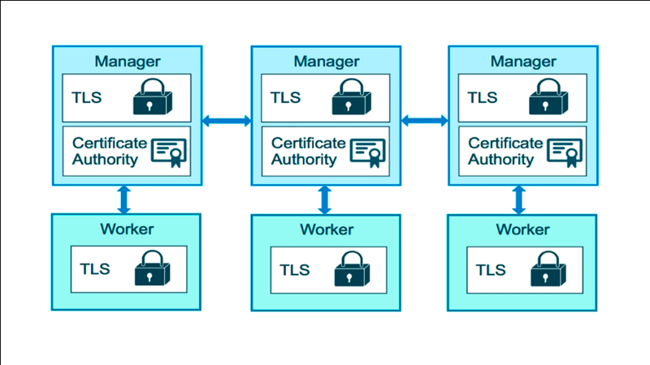
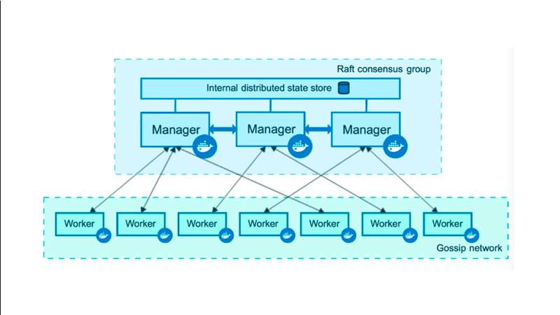
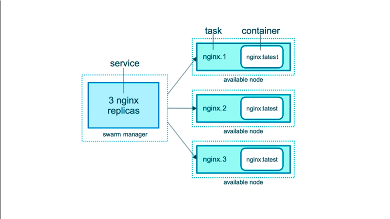
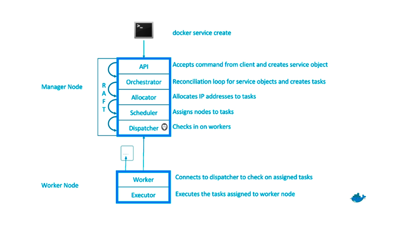
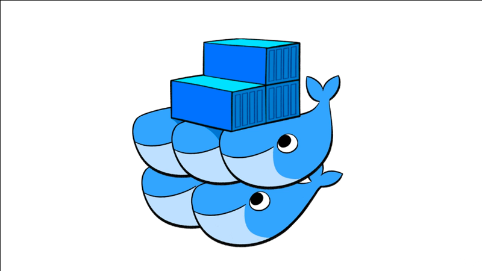
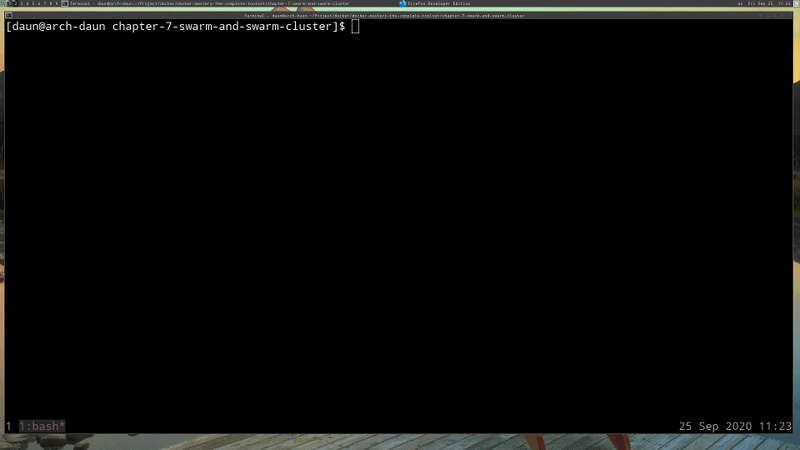
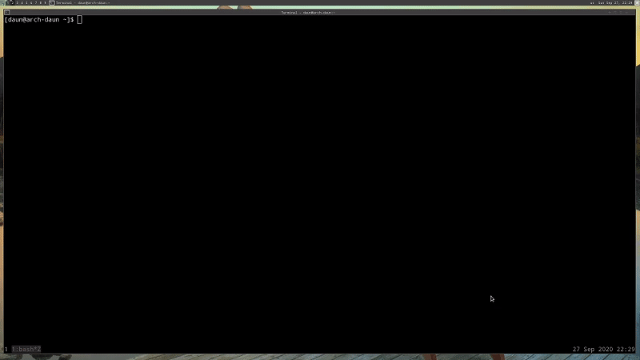
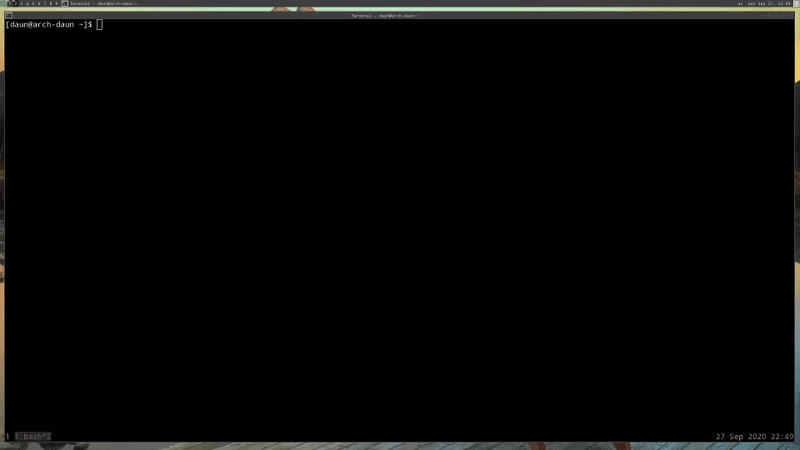
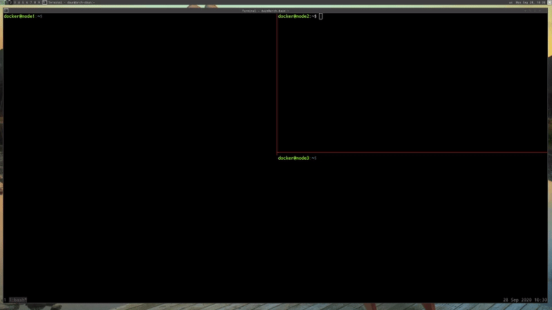
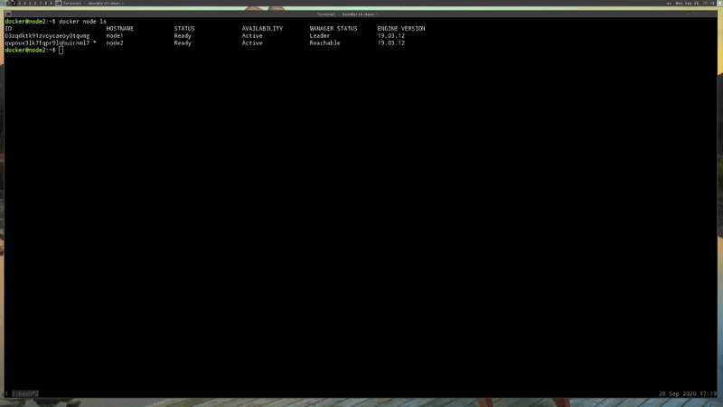

# Swarm and Swarm Cluster

##  Table of Contents

1. [Module Introduction](#module-introduction)
2. [Swarm Mode Built-In Orchestration](#swarm-mode-built-in-orchestration)
3. [Swarm Services](#swarm-services)
4. [Creating Node Swarm Cluster](#creating-node-swarm-cluster)

<br/>

## Module Introduction
<br/>


One if the big promises of containers is that we can easily deploy our apps like
we were a platform service, you know, like Heroku or something. We can do that
on anyone's hardware, whether it's on our hardware, it's a cloud provider,
whether it's virtual or physical.

With Docker, our apps can run the same whether they're an Amazon, Azure,
DigitalOcean, Linode, Rackspace, Google Cloud or whatever. Without all those
platform features, how do we easily deploy and maintain our dozens, or hundreds,
or even thousands of containers across many servers or instances? Or nodes or
[droplets](#what-is-droplet] or whatever.

That bring to bear (cause) some really new problems that weren't previously
problems for small organizations. We all know about Netflix and big
organizations like that, that scale to thousands and thousands of nodes, and
tens of thousands of nodes, and they've got lots of engineers. But if you just
a couple of people on your team, or if you're just a solo developer, how do you
take your containers and scale them and deal with their entire life cycle? From
deploying, to starting, to recreating, to deleting and updating them and all
that.

We start to ask questions around how exactly does Docker do that or does it even
do that at all? Some of the question we ask ourselves are things like, how do we
scale out? How do we scale up? How do we ensure our containers restart if they
fail? How do we replace those containers when we actually have an update fro
them? Which is something called _blue green deploy_ nowadays, which means that
you have zero downtime and you take servers out of the pool in order to bring
new ones in.

You end up with always something available so that you're not never really down
when you update.  How do we know if we've go dozens of nodes or even just three
nodes where we started those containers? Which node is our container on? How do
we talk across those different nodes or servers with our networking inside the
containers?

When it comes to _security_, how do we be sure that our containers are only
running on the machines that we intended for them to run on?

Now that we're moving things around and deploying them dynamically on the fly,
how do we _store the private information_ we need for our containers, like
secret or password?

let see the next chapter for resolve all the questions above.

**[⬆ back to top](#table-of-contents)**
<br/>
<br/>

## Swarm Mode Built-In Orchestration
<br/>


<br/>

So this brings us to a major evolution in the scope of what Docker tries to
solve. When people talk to me and they think that Docker is just a _container
runtime_, that's when I actually just mention **Swarm mode**, which is a brand
new feature in 2016 that brings together years of understanding the needs of
containers and how to actually run them live in production.

So at its core, Swarm is actually a **server clustering solution** that bring
together different OS or hosts, or nodes, or whatever you want to call them,
into a single manageable unit that you can then orchestrate the lifecycle of
your containers in.

Just to be clear, we're not actually talking about Swarm, which I'm going to
call Swarm Classic, which was and add-on component to Docker before `1.12` came
out. It was really a container that would run inside of Docker, that really just
took your `docker run` commands and repeated them out to multiple servers. It
did solves a few problems, but it wasn't really at the scale that we needed to
truly solve 80% of the cases for how you're going to run your containers.

In the summer of 2016, at DockerConf 2016, actually Docker announced Swarm Kit,
which was a set of libraries a tool kit related around a whole bunch of new
Swarm features. Then they stuck that right in the Docker server. All along in
this course, you've actually had the features available to you in the CLI and on
your server. Now we finally get to dive into them.

In January of 2017, `1.13` came out, and of course because Swarm Mode was new in
2016m they're going to continue to make it better in the years to come. So in
January, they added features called _Stacks and Secrets_ as well as other
bonuses we'll talk about later.

It's important to note that Swarm is not actually enabled out of the box, In
fact on your machine, you couldn't use these commands listed here right now.
That would actually give you an error because Swarm has to be enabled.

That was one of the design goals was that none of the Swarm code would affect
the existing Docker daemon, and that all the tools and systems out there that
were already relying on Docker, or maybe they had own orchestration on top of
Docker, would continue to function and not be interfered with by Swarm now being
a part of Docker.

### Swarm basic concept
<br/>



Some really basic concepts before we start diving in, is that these blue boxes
you see over the top are what we call **Manger Nodes** and they actually have
a database locally on them know as the **[Raft](#what-is-raft-database)
database**. It store their configuration and gives them all the information they
need to have to be the authority inside a Swam.

So what we have here is three different managers that have all been added to the
Swarm, and they all keep the copy of that databases and encrypt their traffic in
order to ensure integrity and guarantee the trust that they're able to manage
this Swarm securely.

Below in the green, we actually have **Workers Notes**. Now you can see in the
concept of Swarm, we have now _managers and workers_. Each one of these would be
a _virtual machine_, or a _physical host_, running some distribution of Linux or
Windows server.

#### Raft consensus database group

This is showing how they're actually all communicating over what we call the
**Control Plane**, which is how orders get sent around the Swarm, partaking
actions. In a little bit more complexity view,
<br/>


<br/>

We have this Raft consensus database I mentioned, that is replicated again
amongst all the nodes. They issue _orders_ down to the workers.

_The managers themselves can also be a workers._ Of course, you can _demote_ and
_promote_ workers and managers into the two different roles. When you think of
a manager, typically think of a **worker with permission to control the Swarm**.
Again the _only requirements for each one of these servers_ is that they're
_running same Docker_ that you're already using now.

With this concepts of Swarm, and these manager, we now have a new concepts of
what container look like.
<br/>


<br/>

So, with `docker run` command, we could only really deploy one container. It
would just create a container. It always on whatever machine the Docker CLI was
talking to. That's usually your local machine, or maybe a server they are logged
into. That`docker run` command _didn't have concepts around how to scale out or
scale up_ So we needed new command to deal with that.

That's where the `docker service` command come from. In a Swarm, it replaces the
`docker run` command, and allow us to add extra features to our container when
we run it, such as replicas to tell us how many of those it wants to run. Those
known as `tasks`. _A single service can have multiple tasks_, and each one of
those tasks will launch a container.

In this example, we've created a service using `docker service create` spin up
an Nginx service using the Nginx image like we've done several times before. But
we've told it that we'd like three replicas. So it will use the _manager node_
to decide where in the Swarm to place those. By default, ti tries to spread them
out. Each node would get its own copy of the Nginx container up to the three
replicas that was told it we needed.
<br/>


<br/>

Above diagram is a quick and basic understanding of how the managers work and
what they're doing in the background. All these features are new. It's not
simply just taking your command and running it on API like we would experience
with a `docker run` command.

There actually totally new Swarm API here that has a bunch of background
services, such as the **scheduler**, **dispatcher*, **allocator**, and
**orchestrator**, that help me make decision around what the workers should be
executing at any given moment.

So the workers are constantly reporting in to the managers and asking for new
work. The mangers are constantly doling (distribute) out new work and evaluating
what you've done to do against what they're actually doing. Then if there's any
reconciliation (adaptation) to happen, they will make those changes, such as
maybe you told it to spin up three more replicate tasks in that service. So the
orchestrator will realize that and then issue orders down to the workers and so
on.
<br/>


<br/>

With this Swarm mode, we actually get a features-packed set of capability out of
the box that allow us to already use the existing Docker skills we have in order
to deploy our containers to the internet in a reliable fashion, and solve a lot
of problems that we would have once we go production.

### Miscellaneous

#### What is Nodes

A node is a basic unit of a data structure, such as a linked list or tree data
structure. Nodes contain data and also may link to other nodes. Links between
nodes are often implemented by pointers. Nodes are often arranged into tree
structures.  [wiki](http://en.wikipedia.org/wiki/Node_(computer_science))

Each file is treated as a module. require() is a function used to import modules
from other files or process is an object referencing to the actual computer
process running a Node program and...
[codecademy](http://www.codecademy.com/articles/what-is-node)

Node: Any system or device connected to a network is also called a node. For
example, if a network connects a file server, five computers, and two printers,
there are eight nodes on the network. Each device on the network has a network
address, such as a MAC address , which uniquely identifies each device. This
helps keep track of where data ...
[source](http://techterms.com/definition/node)

#### What is Droplet

Droplets is a programming environment for creating network-based computing
applications. Competing technologies include Abstract Window Toolkit, Java Web
Start and AJAX. Official site.
[wiki](http://en.wikipedia.org/wiki/Droplets_(programming_environment))

#### What is Raft Database

Raft - The Secret Lives of Data [source](http://thesecretlivesofdata.com/raft/)

Raft Consensus Algorithm. The Secret Lives of Data is a different visualization
of Raft. It's more guided and less interactive, so it may be a gentler starting
point. Publications. This is "the Raft paper", which describes Raft in detail:
In Search of an Understandable Consensus Algorithm (Extended Version) by Diego
Ongaro and John Ousterhout.A slightly shorter version of this paper received
a Best Paper Award at the ...  [source](http://raft.github.io)

Algorithms to build an HTAP database. Since the Raft algorithm is designed to be
easy to understand and implement, we focus on our Raft extension on implementing
a production-ready HTAP database. As illustrated in Figure 1, at a high level,
our ideas are as follows: Data is stored in multi-ple Raft groups using row
format to serve transactional ...
[source](http://www.vldb.org/pvldb/vol13/p3072-huang.pdf)

Raft is a consensus algorithm designed as an alternative to the Paxos family of
algorithms. It was meant to be more understandable than Paxos by means of
separation of logic, but it is also formally proven safe and offers some
additional features. Raft offers a generic way to distribute a state machine
across a cluster of computing systems, ensuring that each node in the cluster
agrees upon ...  [wiki](http://en.wikipedia.org/wiki/Raft_(computer_science))

**[⬆ back to top](#table-of-contents)**
<br/>
<br/>

## Swarm services
<br/>


<br/>

Wherever you're running your Docker from, we can actually create a single node
Swarm for our own testing purposes. The way I can tell whether Swarm is or not,
I can just do a `docker info` and you will notice `Swarm: inactive`. So we know
that Swarm hasn't been enabled. Again by default, Docker does not enable any of
the Swarm features.

I can run `docker swarm init` for initialize. That took about a half second and
we're done. What we've now is a _single node Swarm_ with all the features and
functionality that we get out of the box.
<br/>


<br/>

What was just happened is we typed one command and magic. Wasn't actually any
magic. It was a lot of very quick and efficient things in the Go programming of
Docker, but essentially, right out of box it does a bunch of [PKI](#what-is-pki)
and security stuff. It creates a root certificate for the Swarm that it will use
to establish trust and sign certificates for all _nodes_ and all _managers_. It
will create a special certificate for this first manager node because it's
a _manager_ versus a _worker_. Then it creates these _tokens_ that we can
actually use on other to join this Swarm.

Then a bunch of other things in the background where it enables the Swarm API
and creates something called the _[Raft](#what-is-raft-database) Consensus
Database_, which we'll talk about later in a production part of the course. Just
so you know, Raft is a _protocol that actually ensures consistency across
multiple nodes_ and it's ideal for using in the Cloud where we can't guarantee
that any one thing will be available for any moment in time.

It creates that databases on disk. It stores the configuration of the Swarm, and
that first manager, and it actually encrypts it. Assuming you're in Version
`1.13` or newer. Then it will wait for any nodes before it starts actually
replicating the database over to them. Again, all of this traffic that it would
be doing once we create other nodes is all going to be encrypted.

One of the key components of Swarm that differentiated it when it first came out
was that we didn't need an additional _key value_ storage system or some
database architecture to be the backend configuration of our Swarm.

If you've been around the industry for years or decades even, there is this
concept typically of the **configDB**, which is this separate database system
that you usually need to make redundant that will store all the information
about your orchestration and automation system. Swarm has actually built that
straight into Docker right into the daemon and handles it for us. We never
really need to do anything. There's no _password_ to worry about. There's no
_special services_ to start up or anything like that.

### Swarm Command Line

```bash
$: docker swarm init
Swarm initialized: current node (kqixq5e7qij4o046m6jqqol6e) is now a manager.

To add a worker to this swarm, run the following command:
    docker swarm join --token SWMTKN-1-2q0kqw137z2q09aa920v1ezati56yre0m4zc4d27heepy4l8hc-6dmb19gvmf30d43t55892a1mm 192.168.0.102:2377
To add a manager to this swarm, run 'docker swarm join-token manager' and follow the instructions.
```

You'll notice here that it talks about, if I want to add a worker to the swarm,
I just really need to cut and paste this onto the other serves I would add.
Later we're actually  going to build a multiple node swarm, but for now, we're
just to keep this at single node.

#### Swarm `ls`


```bash
$: docker node ls
ID                            HOSTNAME            STATUS              AVAILABILITY        MANAGER STATUS      ENGINE VERSION
kqixq5e7qij4o046m6jqqol6e *   arch-daun           Ready               Active              Leader              19.03.12-ce
```

In this case we just seeing the one _manager node_ that we've created. You'll
notice it's marked as _leader_, and there can only be one leader at a time
amongst all manager. Again, since we only got one, then obviously it's the
leader.

```bash
$: docker node --help
Usage:  docker node COMMAND
Manage Swarm nodes

Commands:
  demote      Demote one or more nodes from manager in the swarm
  inspect     Display detailed information on one or more nodes
  ls          List nodes in the swarm
  promote     Promote one or more nodes to manager in the swarm
  ps          List tasks running on one or more nodes, defaults to current node
  rm          Remove one or more nodes from the swarm
  update      Update a node

Run 'docker node COMMAND --help' for more information on a command.
```

Really, the nodes command used for bringing your servers in and out of the
swarm, or promoting them from workers to managers, or demoting them from
managers back down to workers.

#### Swarm scope command

```bash
$: docker swarm --help
Usage:  docker swarm COMMAND
Manage Swarm

Commands:
  ca          Display and rotate the root CA
  init        Initialize a swarm
  join        Join a swarm as a node and/or manager
  join-token  Manage join tokens
  leave       Leave the swarm
  unlock      Unlock swarm
  unlock-key  Manage the unlock key
  update      Update the swarm

Run 'docker swarm COMMAND --help' for more information on a command.
```

If you go back to the `docker swarm` command for a little bit, we'll notice that
it actually is a very narrow (limit) scope command. It really is just to
_initialize_, either _join_ or _leave_; and the new _unlock_ command, which we
can talk about in a later lecture.

#### Docker `service`

For now, let's focus on the exiting new `docker service` command. Again,
service in a Swarm replaces in `docker run`.

```bash
$: docker service --help
Usage:  docker service COMMAND

Manage services

Commands:
  create      Create a new service
  inspect     Display detailed information on one or more services
  logs        Fetch the logs of a service or task
  ls          List services
  ps          List the tasks of one or more services
  rm          Remove one or more services
  rollback    Revert changes to a service's configuration
  scale       Scale one or multiple replicated services
  update      Update a service

Run 'docker service COMMAND --help' for more information on a command.
```

I don't know for a fact, but I really think that this was centered around the
idea that we didn't want to break existing Docker run functionality, but Docker
run was always built from the ground up as a single host solution. It's whole
idea was to focus on local containers on the system that it's talking to.
Whereas, when we start talking about **_cluster_**, we don't care so much about
individual nodes. We don't actually probably name them. We treat them like
_cattle_ (livestock), if you've ever heard of the pets versus cattle analogy
where they're just a number. We don't really individually go to each node and
start up an individual container. We just throw requirements at the Swarm in the
form of services and then it will orchestrate how it needs to lay all that out,
on which nodes they need to be, and we just know that it's got our back.

#### Docker `service create`

`docker service create` command is how we give it some new orders. Let's do
something really simple.

```bash
$: docker service create --name sad_pare alpine ping 8.8.8.8
nz0qo9gfbp9pr0mcq9dgu16av
overall progress: 1 out of 1 tasks
1/1: running   [==================================================>]
verify: Service converged
```

Let's just actually have it start `alpine` image. Then we're going to have the
Alpine image just use ping to hit `8.8.8.8`, which actually a Google DNS server,
but we really just want to give it something to do while we investigate what
happens. Then you'll see like `docker run`, it spits back an ID, only that's not
the _container ID_. That's actually the **_service ID_**.

#### Docker `service ls`

```bash
$: docker service ls
ID                  NAME                MODE                REPLICAS            IMAGE               PORTS
nz0qo9gfbp9p        sad_pare            replicated          1/1                 alpine:latest
```

You'll see that we now have one service listed. Just like with our `docker run`
command, since we didn't named it, it gave it a random name. We can see that
it's actually already spun up the `1/1`. When you're looking at services, you're
always going to see this number with a `/` in the middle. That represents the
`1` in the left is how many are actually running; And the `1` on the right is
how many you've specified for it to run.  The goal of the orchestrator is _to
make these numbers match_, whatever it takes.

#### Docker `service ps`

But this again doesn't actually show us the real container. This is really just
showing us a list of our services, so we can drill down a little farther. We do
a `docker service ps <name>` and that will actually show us the _task_ or
_containers_ for the service.

```bash
$;docker service ps sad_pare
ID                  NAME                IMAGE               NODE                DESIRED STATE       CURRENT STATE                ERROR               PORTS
d6vum82wmdat        sad_pare.1          alpine:latest       arch-daun           Running             Running about a minute ago
```

You'll see that it's similar to the `docker container ls` command, but actually
has now this `NODE` component because when you're dealing with multi servers
scenarios, we might need to know which server it's actually running on.

You'll notice that it actually gave it a `NAME` of an increment `.1` on the
service name.

If we went back to the `docker container ls command`, that still works

```bash
CONTAINER ID        IMAGE               COMMAND             CREATED             STATUS              PORTS               NAMES
c937c5372253        alpine:latest       "ping 8.8.8.8"      3 minutes ago       Up 3 minutes                            sad_pare.1.d6vum82wmdat8cbs8tzw0b6lq
```

In this case, the orchestration of Swarm is actually adding some information to
the `NAMES` and to the actual images that are running. We'll cover some of those
subtle (smooth) differences later as well.

#### Docker `service update`

For now, let's actually take that service and let's scale it up. For that, we
use the `docker service update <ID> --replicas 3`

```bash
Usage:  docker service update [OPTIONS] SERVICE
Update a service update

--replicas uint                      Number of tasks

$: docker service update sad_pare --replicas 3
sad_pare
overall progress: 3 out of 3 tasks
1/3: running   [==================================================>]
2/3: running   [==================================================>]
3/3: running   [==================================================>]
verify: Service converged
```
So if we do a `dockr service ls` command again, we now see `3/3`.

```bash
$: docker service ls
ID                  NAME                MODE                REPLICAS            IMAGE               PORTS
nz0qo9gfbp9p        sad_pare            replicated          3/3                 alpine:latest
```

If  we do a `docker service ps <service-name or ID>` we actually now see three
tasks. You'll notice that two were just created second ago.

```bash
$: docker service ps sad_pare

ID                  NAME                IMAGE               NODE                DESIRED STATE       CURRENT STATE                ERROR               PORTS
d6vum82wmdat        sad_pare.1          alpine:latest       arch-daun           Running             Running 6 minutes ago
x8eij0an3il8        sad_pare.2          alpine:latest       arch-daun           Running             Running about a minute ago
uv64wdcbgja0        sad_pare.3          alpine:latest       arch-daun           Running             Running about a minute ago
```

If we were fast enough, and if we were deploying something big enough, we could
actually run the `docker service ls`  show use `0/3`, `1/3` etc.. It'll actually
increment as things starts up. It just so happens  that Alpine was already on
this machine, in terms of its image, and it didn't take very long to start up
a ping command. We just couldn't be that fast.

What's interesting about that update command is that you can imagine the
difference between the  Docker run command that you might use on a single dev or
test or on your local machine, and the **production concern of always keeping
something available as much as possible**. That's one of the design goals of
swarm.

#### Docker `update`

```bash
$: docker update --help
Usage:  docker update [OPTIONS] CONTAINER [CONTAINER...]
Update configuration of one or more containers

Options:
      --blkio-weight uint16        Block IO (relative weight), between 10 and 1000, or 0 to disable (default 0)
      --cpu-period int             Limit CPU CFS (Completely Fair Scheduler) period
      --cpu-quota int              Limit CPU CFS (Completely Fair Scheduler) quota
      --cpu-rt-period int          Limit the CPU real-time period in microseconds
      --cpu-rt-runtime int         Limit the CPU real-time runtime in microseconds
  -c, --cpu-shares int             CPU shares (relative weight)
      --cpus decimal               Number of CPUs
      --cpuset-cpus string         CPUs in which to allow execution (0-3, 0,1)
      --cpuset-mems string         MEMs in which to allow execution (0-3, 0,1)
      --kernel-memory bytes        Kernel memory limit
  -m, --memory bytes               Memory limit
      --memory-reservation bytes   Memory soft limit
      --memory-swap bytes          Swap limit equal to memory plus swap: '-1' to enable unlimited swap
      --pids-limit int             Tune container pids limit (set -1 for unlimited)
      --restart string             Restart policy to apply when a container exits
```

That command we actually haven't used yet is the `docker update` command. That
was for the Docker run containers that allowed us to update certain variables on
our running container without having to kill it and restart it. Almost all of
those options are related to limiting and controlling **_resource usage_** for
that container.

Because that's one typical things that you see when you're running a long term
application is that you need to change its resources maybe because the databases
have gotten bigger and need more RAM, or maybe you have an out of control
process that's eating up too much CPU and you need to limit it.

If we do a `--help` on `docker service update` command you'll see that we have
a lot more options.

```bash
Usage:  docker service update [OPTIONS] SERVICE

Update a service

Options:
      --args command                       Service command args
      --config-add config                  Add or update a config file on a service
      --config-rm list                     Remove a configuration file
      --constraint-add list                Add or update a placement constraint
      --constraint-rm list                 Remove a constraint
      --container-label-add list           Add or update a container label
      --container-label-rm list            Remove a container label by its key
      --credential-spec credential-spec    Credential spec for managed service account (Windows only)
  -d, --detach                             Exit immediately instead of waiting for the service to converge
      --dns-add list                       Add or update a custom DNS server
      --dns-option-add list                Add or update a DNS option
      --dns-option-rm list                 Remove a DNS option
      --dns-rm list                        Remove a custom DNS server
      --dns-search-add list                Add or update a custom DNS search domain
      --dns-search-rm list                 Remove a DNS search domain
      --endpoint-mode string               Endpoint mode (vip or dnsrr)
      --entrypoint command                 Overwrite the default ENTRYPOINT of the image
      --env-add list                       Add or update an environment variable
      --env-rm list                        Remove an environment variable
      --force                              Force update even if no changes require it
      --generic-resource-add list          Add a Generic resource
      --generic-resource-rm list           Remove a Generic resource
      --group-add list                     Add an additional supplementary user group to the container
      --group-rm list                      Remove a previously added supplementary user group from the container
      --health-cmd string                  Command to run to check health
      --health-interval duration           Time between running the check (ms|s|m|h)
      --health-retries int                 Consecutive failures needed to report unhealthy
      --health-start-period duration       Start period for the container to initialize before counting retries towards unstable (ms|s|m|h)
      --health-timeout duration            Maximum time to allow one check to run (ms|s|m|h)
      --host-add list                      Add a custom host-to-IP mapping (host:ip)
      --host-rm list                       Remove a custom host-to-IP mapping (host:ip)
      --hostname string                    Container hostname
      --image string                       Service image tag
      --init                               Use an init inside each service container to forward signals and reap processes
      --isolation string                   Service container isolation mode
      --label-add list                     Add or update a service label
      --label-rm list                      Remove a label by its key
      --limit-cpu decimal                  Limit CPUs
      --limit-memory bytes                 Limit Memory
      --log-driver string                  Logging driver for service
      --log-opt list                       Logging driver options
      --mount-add mount                    Add or update a mount on a service
      --mount-rm list                      Remove a mount by its target path
      --network-add network                Add a network
      --network-rm list                    Remove a network
      --no-healthcheck                     Disable any container-specified HEALTHCHECK
      --no-resolve-image                   Do not query the registry to resolve image digest and supported platforms
      --placement-pref-add pref            Add a placement preference
      --placement-pref-rm pref             Remove a placement preference
      --publish-add port                   Add or update a published port
      --publish-rm port                    Remove a published port by its target port
  -q, --quiet                              Suppress progress output
      --read-only                          Mount the container's root filesystem as read only
      --replicas uint                      Number of tasks
      --replicas-max-per-node uint         Maximum number of tasks per node (default 0 = unlimited)
      --reserve-cpu decimal                Reserve CPUs
      --reserve-memory bytes               Reserve Memory
      --restart-condition string           Restart when condition is met ("none"|"on-failure"|"any")
      --restart-delay duration             Delay between restart attempts (ns|us|ms|s|m|h)
      --restart-max-attempts uint          Maximum number of restarts before giving up
      --restart-window duration            Window used to evaluate the restart policy (ns|us|ms|s|m|h)
      --rollback                           Rollback to previous specification
      --rollback-delay duration            Delay between task rollbacks (ns|us|ms|s|m|h)
      --rollback-failure-action string     Action on rollback failure ("pause"|"continue")
      --rollback-max-failure-ratio float   Failure rate to tolerate during a rollback
      --rollback-monitor duration          Duration after each task rollback to monitor for failure (ns|us|ms|s|m|h)
      --rollback-order string              Rollback order ("start-first"|"stop-first")
      --rollback-parallelism uint          Maximum number of tasks rolled back simultaneously (0 to roll back all at once)
      --secret-add secret                  Add or update a secret on a service
      --secret-rm list                     Remove a secret
      --stop-grace-period duration         Time to wait before force killing a container (ns|us|ms|s|m|h)
      --stop-signal string                 Signal to stop the container
      --sysctl-add list                    Add or update a Sysctl option
      --sysctl-rm list                     Remove a Sysctl option
  -t, --tty                                Allocate a pseudo-TTY
      --update-delay duration              Delay between updates (ns|us|ms|s|m|h)
      --update-failure-action string       Action on update failure ("pause"|"continue"|"rollback")
      --update-max-failure-ratio float     Failure rate to tolerate during an update
      --update-monitor duration            Duration after each task update to monitor for failure (ns|us|ms|s|m|h)
      --update-order string                Update order ("start-first"|"stop-first")
      --update-parallelism uint            Maximum number of tasks updated simultaneously (0 to update all at once)
  -u, --user string                        Username or UID (format: <name|uid>[:<group|gid>])
      --with-registry-auth                 Send registry authentication details to swarm agents
  -w, --workdir string                     Working directory inside the container
```

Because the goal of a Swarm `service` is that it's **_able to replace containers and
update changes in the service without taking the entire thing down_**.

If you had a service with three containers in it, you could technically take
down one at a time to make a change and do sort of a `rolling update`, which is
the **_blue green pattern_**  we talked about. That's why we see a lot more
options here is because we can change these options that may require a container
restart, but the Swarm will intelligently make sure that we update them is in
a pattern that ensures consistent availability.

Back to our `docker container ls` real quick,

```bash
$; docker container ls
CONTAINER ID        IMAGE               COMMAND             CREATED             STATUS              PORTS               NAMES
e6a14ff441c0        alpine:latest       "ping 8.8.8.8"      26 minutes ago      Up 26 minutes                           sad_pare.3.uv64wdcbgja0q90oc5azaaw7j
ea669f201a7d        alpine:latest       "ping 8.8.8.8"      26 minutes ago      Up 26 minutes                           sad_pare.2.x8eij0an3il86z2dkhcbcorje
c937c5372253        alpine:latest       "ping 8.8.8.8"      31 minutes ago      Up 31 minutes                           sad_pare.1.d6vum82wmdat8cbs8tzw0b6lq
```
You'll notice that we have these three row now, and what if I went in and, sort
of as a rogue (fool) did a `docker container rm`, and I specified one of these
containers,

```bash
$: docker container rm -f sad_pare.1.d6vum82wmdat8cbs8tzw0b6lq
sad_pare.1.d6vum82wmdat8cbs8tzw0b6lq
```
and  now I just do `docker service ls` and `docker service ps <service-name | ID>`,

```bash
$: docker service ls
ID                  NAME                MODE                REPLICAS            IMAGE               PORTS
nz0qo9gfbp9p        sad_pare            replicated          2/3                 alpine:latest

$: docker service ls
ID                  NAME                MODE                REPLICAS            IMAGE               PORTS
nz0qo9gfbp9p        sad_pare            replicated          3/3                 alpine:latest
```

Now you see how it shows two of three? Because I went behind the back of Swarm
and I actually took away a running container, It's going identify that and it's
going to launch a new one within a seconds to replace the one that went down.

So if I did a `docker servcie ps <service-name | ID`>,

```bash
$: docker service ps sad_pare
ID                  NAME                IMAGE               NODE                DESIRED STATE       CURRENT STATE                ERROR                         PORTS
0h2cqa8wpcgu        sad_pare.1          alpine:latest       arch-daun           Running             Running about a minute ago
d6vum82wmdat         \_ sad_pare.1      alpine:latest       arch-daun           Shutdown            Failed about a minute ago    "task: non-zero exit (137)"
x8eij0an3il8        sad_pare.2          alpine:latest       arch-daun           Running             Running 32 minutes ago
uv64wdcbgja0        sad_pare.3          alpine:latest       arch-daun           Running             Running 32 minutes ago
```

You'll see that it actually shows the history of the first tasks in the list is
that it had one that failed and it started a new one a minute ago.

This is one of the responsibilities of a **_container orchestration system_** is
to make sure that the `services` you specified are always running, and if they
fail, it recovers from that failure, Which way different than Docker run, right?
Docker run would never recreate a container.

So that's why whenever we do any of these Docker service commands, we're not
actually speaking directly an _action_ like create a container. We're actually
telling an orchestration system, 'hey put this job in your queue. When you can
get to it, please perform the actions on the Swarm that I've asked here'.

That's a big difference. It's subtle in the command line but it's a big
difference because it means that there's  rollback possibilities. There's
failure mitigation and a lot of intelligence built into that.

#### Docker `service rm`

In this case, if I actually wanted to remove all these containers, I'd have to
remove the `service`. I'd have to do `docker service remove <service-name
| ID>`.

```bash
$: docker service rm sad_pare
sad_pare
```
 If we do a `docker container ls`

```bash
$: docker container ls
CONTAINER ID        IMAGE               COMMAND             CREATED             STATUS              PORTS               NAMES
e6a14ff441c0        alpine:latest       "ping 8.8.8.8"      26 minutes ago      Up 26 minutes                           sad_pare.3.uv64wdcbgja0q90oc5azaaw7j
ea669f201a7d        alpine:latest       "ping 8.8.8.8"      26 minutes ago      Up 26 minutes                           sad_pare.2.x8eij0an3il86z2dkhcbcorje
c937c5372253        alpine:latest       "ping 8.8.8.8"      31 minutes ago      Up 31 minutes                           sad_pare.1.d6vum82wmdat8cbs8tzw0b6lq

$: docker container ls
CONTAINER ID        IMAGE               COMMAND             CREATED             STATUS              PORTS               NAMES
```
That show right there the _automation_ happening on the backend. We were able to
quickly show that we deleted the service, but the orchestration system hadn't
gone through all of its process of cleaning up the services and the task behind
it. These concepts should b pretty easy to understand because they're just
really expanding on Docker run concepts that we've had earlier in this course.

Next lets actually build a multi node system and start scaling our container
out.

### Miscellaneous

#### What is PKI

A public key infrastructure (PKI) is a set of roles, policies, hardware,
software and procedures needed to create, manage, distribute, use, store and
revoke digital certificates and manage public-key encryption.The purpose of
a PKI is to facilitate the secure electronic transfer of information for a range
of network activities such as e-commerce, internet banking and confidential
email. [wiki](http://en.wikipedia.org/wiki/Public_key_infrastructure)


What is PKI (Public Key Infrastructure)?  PKI - Public Key Infrastructure.
Public Key Infrastructure (PKI) is a technology for authenticating users and
devices in the digital world. The basic idea is to have one or more trusted
parties digitally sign documents certifying that a particular cryptographic key
belongs to a particular user or device. [source](http://www.ssh.com/pki/)

**[⬆ back to top](#table-of-contents)**
<br/>
<br/>

## Creating Node Swarm Cluster

This is going to be the first lecture where we're actually going to use multiple
_hosts_, or _nodes_, or _instances_, or whatever you want to call it (multiple
OS's). We're going to set up a 3-node Swarm across all three of those nodes.

We unfortunately can't do this part with the built-in Docker on you machine
because that's only going to provide us one OS. We need three Linux OS's to play
with this next set of features.
<br/>


<br/>

The first option you're going to have is using
[play-with-docker.com](https://play-with-docker.com). It's absolutely the
easiest way to get started. It comes with Docker pre-installed. It takes you
second to provision three different machines, and it requires no investment on
your end. But it does mean that every four hours it will wipe all the work
you've done. So if you think you're going to do the rest of this section over
the course of days, then this may not bet the best option for you. But if you're
going to focus for a few hours, you can definitely get through most, if not all,
of the multi node swarm stuff using Play With Docker in one sitting.

Another options you have is you can use _docker-machine_, which is not something
we've talked about yet, but it's command line tool that actually gets installed
with Docker. It's basically automation tool for provisioning (providing) virtual
machines locally, and on the Internet, and then automatically setting up Docker
for you. The default way that it works it with VirtualBox, which you an install
free. But it does mean that if you're going to run three virtual machines
locally, each one of them probably need a gig of RAM or so to run through a lot
of these examples. So you'll need a machine with a good amount of RAM in it.

Another options, and the one that I'm going to default to for a lot of these
demos and walks through,m is DigitalOcean. I just recommend DigitalOcean just
because they have the cheapest and easiest service to get started, and they run
everything on SSD so it's nice and fast. You can actually use this in very, very
similar set up to what production would be because you're using three actual
virtual machines, in the cloud, and it takes about a minute to launch each
virtual machine.

Lastly, there are so many ways to get Docker installed, and that's really all
you need is three machines with Docker installed on them. You can use Docker
Machine. It has built in drives that allow you to use it to provision Amazon
instances, or Azure instances, or DigitalOcean Droplets, or Google Compute nodes
or any places you can get a Linux virtual machine. You can actually just install
Docker with an automated script from [get.docker.com](http://get.docker.com).
Frankly I prefer the [get.docker.com](http://get.docker.com) version only
because Docker Machine may save you a few steps, especially for location like
Amazon and Azure that require you to provision a lot of different things before
you can get just provisioning a virtual machines.

But you probably not going yo be using Docker machine in production. It is
a tool to simply automated dev and test environments. It was never really
designed to set up all of the production setting you might need for a multi-node
Swarm. There's nothing inherently wrong with it, but typically
[get.docker.com](http://get.docker.com) works on all the major Linux
distributions and doesn't take any longer that actually Using Docker Machine
itself.

I'm going to give you a really quick example of just getting any of these
scenarios to the point where Docker is installed. Then they all will be very
similar in the way we actually create the Swarm and do our services. So don't
think that you have to do it the way I do it. Really we're just trying to get
Docker info to actually bring back information, and then just make sure that
three nodes have networking access to each other and they're on a well connected
network. So ideally they should be in the same network.

### Setup Swarm with docker-machine

At least to run `docker-machine` you should install at least `version 0.10` if
not newer. You'll know if it's installed because you'll type the
`docker-machine` command from your command line and  it'll either work or it
won't. If you need to download it for your particular Linux OS, then you can hop
over to the [Docker Documentation](https://docs.docker.com/machine/install-machine/)
which actually give you a quick `curl` line to download it.

#### Jump into terminal
<br/>


<br/>

So you have VirtualBox installed for your OS; And you don't even have to do
anything with VirtualBox. It just needs to be installed; And then from your
command line you can just type `docker-machine create node1`, and this actually
run through creating a _virtual machine with [BusyBox](#what-is-busybox)_, which
is a very lightweight Linux distributions.

This actually run through creating a very lightweight Linux machine, and you'll
just repeat those two commands for `node2` and `node3`. If you need more
information on a Docker Machine you can actually look at my reference section
for tutorial links.

Once your machine are created, you really have _two options_ for how you can
access those machine. You can either use,
<br/>


<br/>

```bsah
$: docker-machine ssh

   ( '>')
  /) TC (\   Core is distributed with ABSOLUTELY NO WARRANTY.
 (/-_--_-\)           www.tinycorelinux.net

```

and then the name of the node you created and that'll hop you right into that
machine. Or you can use the `env` command.

```bash
[daun@arch-daun ~]$ docker-machine env node1
export DOCKER_TLS_VERIFY="1"
export DOCKER_HOST="tcp://192.168.99.101:2376"
export DOCKER_CERT_PATH="/home/daun/.docker/machine/machines/node1"
export DOCKER_MACHINE_NAME="node1"
# Run this command to configure your shell:
# eval $(docker-machine env node1)
```

### Run Swarm in 3 servers
<br/>


<br/>

Now all three of my virtual server have the latest version of Docker installed
and we ready to set up our Swarm. Again, all that's required is that these three
nodes have _solid networking to each other and specific ports open._ If you
curious about the ports of swarm, look in the [reference](#reference) of this
section where I actually have a link to my own list of the _firewall ports_
necessary for Swam to work.

If you remember before, we did `docker swarm init`. Now, in this case, which is
pretty common in _cloud servers_, I wants us to specify an IP address to
advertise the Swarm `service` on. You want to use an IP address that is
accessible from the other servers.

In this case, I'm going to use the public IP address for my VirtualBox host by
use the command `docker swarm init --advertise-addr <IP address>` And there we
go. So far, this is just like on our local machine.


```baash
docker@node1$: docker swarm init

Error response from daemon: could not choose an IP address to advertise since
this system has multiple addresses on different interfaces (10.0.2.15 on eth0
and 192.168.99.101 on eth1) - specify one with --advertise-addr

docker@node1$: docker swarm init --advertise-addr 192.168.99.10

To add a worker to this swarm, run the following command:

    docker swarm join --token SWMTKN-1-4ivvjsv6jlz6w775a2rgzl0r08fhdkh3yu94gs4pkollt2fypv-4agn4g30k49ymuof93hqlmutn 192.168.99.101:2377

To add a manager to this swarm, run 'docker swarm join-token manager' and follow the instructions.

docker@node1$: docker node ls
ID                            HOSTNAME            STATUS              AVAILABILITY        MANAGER STATUS      ENGINE VERSION
ve8y2cqdscknpyqnjqtjmyt07 *   node1               Ready               Active              Leader              19.03.12
```

This time, though, I'm going to copy the _Swarm join_ command and go over to
`node2` and add it in; and there we go. The `node2` is part of the Swarm.

So we go back to `node1`, `docker node ls` and we have two.

```bash
docker@node2: docker swarm join --token SWMTKN-1-4ivvjsv6jlz6w775a2rgzl0r08fhdkh3yu94gs4pkollt2fypv-4agn4g30k49ymuof93hqlmutn 192.168.99.101:2377
this node joined a swarm as a worker.

docker@node1: docker node ls
ID                            HOSTNAME            STATUS              AVAILABILITY        MANAGER STATUS      ENGINE VERSION
ve8y2cqdscknpyqnjqtjmyt07 *   node1               Ready               Active              Leader              19.03.12
9aqwqwovij6rn5lfa6i49si3q     node2               Ready               Active                                  19.03.12
```
You'll notice the second node `docker@node2` is only a worker. Because as it
says, if we wanted it to be a manager, we should gotten manager token `docker
swarm join-token manager`.  But no worries. We can actually update this worker
 to promote it to being a manager. But if we over on `docker@node2`, notice that
 I can't use Swarm commands. Because **_workers aren't really privileged_**.

 ```bash
 docker@node2: docker node ls
 Error response from daemon: This node is not a swarm manager. Worker nodes
 can't be used to view or modify cluster state. Please run this command on
 a manager node or promote the current node to a manager.
 ```
Worker don't have access to control Swarm. So they're not going to be able to
use any of the Swarm commands that we're used to using on the managers. Back on
`docker@node1` as manager, I'm going to do a `docker node update`

```bash
docker@node1: docker node update --role manager node2
node2

docker@node1: docker node ls
ID                            HOSTNAME            STATUS              AVAILABILITY        MANAGER STATUS      ENGINE VERSION
ve8y2cqdscknpyqnjqtjmyt07 *   node1               Ready               Active              Leader              19.03.12
9aqwqwovij6rn5lfa6i49si3q     node2               Ready               Active              Reachable           19.03.12
```

Now you can see `node2` _MANAGER STATUS_ it's considered `Reachable` but the
original node `node1` is still the leader. By the way the little `*`? That just
means that's the node you're currently talking to.

For `node3`, let's add it as manager by default, So we need to go back to our
original `docker swarm` command, and then we need to get the _join-token_.

```bash
docker@node1: docker swarm join-token manager
To add a manager to this swarm, run the following command:

    docker swarm join --token SWMTKN-1-4ivvjsv6jlz6w775a2rgzl0r08fhdkh3yu94gs4pkollt2fypv-5akwmz48p0g5vvgazbwkvzaid 192.168.99.102:2377
```

You can get these tokens at any time. You don't have to write them down or save
them. They're part of the Swarm configuration and stored encrypted on disk, so
don't worry about that.

You can also change this tokens in case they possibly get exposed or you maybe
get a server that might have had a vulnerability on it, and you want to make
sure that no nodes can join the Swarm from the old key, you can actually rotate
the token keys. So we copy the token and paste it into `node3`.
<br/>


<br/>

```bash
docker@node3: docker swarm join --token SWMTKN-1-4ivvjsv6jlz6w775a2rgzl0r08fhdkh3yu94gs4pkollt2fypv-5akwmz48p0g5vvgazbwkvzaid 192.168.99.102:2377
node joined a swarm as a manager.

docker@node3: docker node ls
ID                            HOSTNAME            STATUS              AVAILABILITY        MANAGER STATUS      ENGINE VERSION
ve8y2cqdscknpyqnjqtjmyt07     node1               Ready               Active              Leader              19.03.12
9aqwqwovij6rn5lfa6i49si3q     node2               Ready               Active              Reachable           19.03.12
7up9un3i0jxz76bw7mpole3vx *   node3               Ready               Active              Reachable           19.03.12
```
So we got three nodes, and they all have a _manager status_ indicating that they are manager.

So now we have 3-node, redundant Swarm, with three managers. Let's just do the
same things we did earlier, `docker service create alpine`

```bash
docker@node1: docker service create --replicas 3 alpine ping 8.8.8.8
mniirfq4b0fdc4pvgwmh3y7hy
overall progress: 3 out of 3 tasks
1/3: running   [==================================================>]
2/3: running   [==================================================>]
3/3: running   [==================================================>]
verify: Service converged

docker@node1: docker service ls
ID                  NAME                IMAGE               NODE                DESIRED STATE       CURRENT STATE           ERROR               PORTS
x2k12bqf3xc2        happy_tesla.1       alpine:latest       node1               Running             Running 3 minutes ago

docker@node1: docker node ps node2
ID                  NAME                IMAGE               NODE                DESIRED STATE       CURRENT STATE           ERROR               PORTS
h29c6terugpn        happy_tesla.2       alpine:latest       node2               Running             Running 4 minutes ago

docker@node1: docker service ps happy_tesla
ID                  NAME                IMAGE               NODE                DESIRED STATE       CURRENT STATE           ERROR               PORTS
x2k12bqf3xc2        happy_tesla.1       alpine:latest       node1               Running             Running 5 minutes ago
h29c6terugpn        happy_tesla.2       alpine:latest       node2               Running             Running 5 minutes ago
710viqa7m72f        happy_tesla.3       alpine:latest       node3               Running             Running 6 minutes ago
```

Once you've got this swarm created, you normally don't need to be typing command
into all the different nodes. You can operate the whole Swarm, for most things,
from `node1`.

So we'll be doping a lot of our work from `node1` in future lectures, but from
now, pat (suitable) your self on the back because you have a fully swarm
cluster.

### Miscellaneous

#### Reference
- [Config ssh for saving options for specific connection](https://www.digitalocean.com/community/tutorials/how-to-configure-custom-connection-options-for-your-ssh-client)
- [Window hyper-V driver for docker-machine](https://docs.docker.com/machine/drivers/hyper-v/)
- [Create and upload SSH key to DigitalOcean](https://www.digitalocean.com/community/tutorials/how-to-use-ssh-keys-with-digitalocean-droplets)
- [Docker Swarm firewall ports](http://www.bretfisher.com/docker-swarm-firewall-ports/)
- [Cofigure custom connection for your ssh-clinet](https://www.digitalocean.com/community/tutorials/how-to-configure-custom-connection-options-for-your-ssh-client)


#### What is BusyBox

BusyBox: The Swiss Army Knife of Embedded Linux It provides replacements for
most of the utilities you usually find in GNU fileutils, shellutils, etc.  The
utilities in BusyBox generally have fewer options than their full-featured GNU
cousins; however, the options that are included provide the expected
functionality and behave very much like ...
[busybox](www.busybox.net/about.html)

**[⬆ back to top](#table-of-contents)**
<br/>
<br/>
