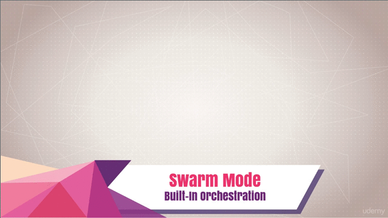

# Swarm and Swarm Cluster

##  Table of Contents

1. [Module Introduction](#module-introduction)
2. [Swarm Mode Built-In Orchestration](#swarm-mode-built-in-orchestration)

 

## Module Introduction
 

One if the big promises of containers is that we can easily deploy our apps like
we were a platform service, you know, like Heroku or something. We can do that
on anyone's hardware, whether it's on our hardware, it's a cloud provider,
whether it's virtual or physical.

With Docker, our apps can run the same whether they're an Amazon, Azure,
DigitalOcean, Linode, Rackspace, Google Cloud or whatever. Without all those
platform features, how do we easily deploy and maintain our dozens, or hundreds,
or even thousands of containers across many servers or instances? Or nodes or
[droplets](#what-is-droplet] or whatever.

That bring to bear (cause) some really new problems that weren't previously
problems for small organizations. We all know about Netflix and big
organizations like that, that scale to thousands and thousands of nodes, and
tens of thousands of nodes, and they've got lots of engineers. But if you just
a couple of people on your team, or if you're just a solo developer, how do you
take your containers and scale them and deal with their entire life cycle? From
deploying, to starting, to recreating, to deleting and updating them and all
that.

We start to ask questions around how exactly does Docker do that or does it even
do that at all? Some of the question we ask ourselves are things like, how do we
scale out? How do we scale up? How do we ensure our containers restart if they
fail? How do we replace those containers when we actually have an update fro
them? Which is something called _blue green deploy_ nowadays, which means that
you have zero downtime and you take servers out of the pool in order to bring
new ones in.

You end up with always something available so that you're not never really down
when you update.  How do we know if we've go dozens of nodes or even just three
nodes where we started those containers? Which node is our container on? How do
we talk across those different nodes or servers with our networking inside the
containers?

When it comes to _security_, how do we be sure that our containers are only
running on the machines that we intended for them to run on?

Now that we're moving things around and deploying them dynamically on the fly,
how do we _store the private information_ we need for our containers, like
secret or password?

let see the next chapter for resolve all the questions above.

**[⬆ back to top](#table-of-contents)**
 
 

## Swarm Mode Built-In Orchestration
 

 

So this brings us to a major evolution in the scope of what Docker tries to
solve. When people talk to me and they think that Docker is just a _container
runtime_, that's when I actually just mention **Swarm mode**, which is a brand
new feature in 2016 that brings together years of understanding the needs of
containers and how to actually run them live in production.

So at its core, Swarm is actually a **server clustering solution** that bring
together different OS or hosts, or nodes, or whatever you want to call them,
into a single manageable unit that you can then orchestrate the lifecycle of
your containers in.

Just to be clear, we're not actually talking about Swarm, which I'm going to
call Swarm Classic, which was and add-on component to Docker before `1.12` came
out. It was really a container that would run inside of Docker, that really just
took your `docker run` commands and repeated them out to multiple servers. It
did solves a few problems, but it wasn't really at the scale that we needed to
truly solve 80% of the cases for how you're going to run your containers.

In the summer of 2016, at DockerConf 2016, actually Docker announced Swarm Kit,
which was a set of libraries a tool kit related around a whole bunch of new
Swarm features. Then they stuck that right in the Docker server. All along in
this course, you've actually had the features available to you in the CLI and on
your server. Now we finally get to dive into them.

In January of 2017, `1.13` came out, and of course because Swarm Mode was new in
2016m they're going to continue to make it better in the years to come. So in
January, they added features called _Stacks and Secrets_ as well as other
bonuses we'll talk about later.

It's important to note that Swarm is not actually enabled out of the box, In
fact on your machine, you couldn't use these commands listed here right now.
That would actually give you an error because Swarm has to be enabled.

That was one of the design goals was that none of the Swarm code would affect
the existing Docker daemon, and that all the tools and systems out there that
were already relying on Docker, or maybe they had own orchestration on top of
Docker, would continue to function and not be interfered with by Swarm now being
a part of Docker.

### Swarm basic concept
 

Some really basic concepts before we start diving in, is that these blue boxes
you see over the top are what we call **Manger Nodes** and they actually have
a database locally on them know as the **[Raft](#what-is-raft-database)
database**. It store their configuration and gives them all the information they
need to have to be the authority inside a Swam.

So what we have here is three different managers that have all been added to the
Swarm, and they all keep the copy of that databases and encrypt their traffic in
order to ensure integrity and guarantee the trust that they're able to manage
this Swarm securely.

Below in the green, we actually have **Workers Notes**. Now you can see in the
concept of Swarm, we have now _managers and workers_. Each one of these would be
a _virtual machine_, or a _physical host_, running some distribution of Linux or
Windows server.

#### Raft consensus database group

This is showing how they're actually all communicating over what we call the
**Control Plane**, which is how orders get sent around the Swarm, partaking
actions. In a little bit more complexity view,
 

 

We have this Raft consensus database I mentioned, that is replicated again
amongst all the nodes. They issue _orders_ down to the workers.

_The managers themselves can also be a workers._ Of course, you can _demote_ and
_promote_ workers and managers into the two different roles. When you think of
a manager, typically think of a **worker with permission to control the Swarm**.
Again the _only requirements for each one of these servers_ is that they're
_running same Docker_ that you're already using now.

With this concepts of Swarm, and these manager, we now have a new concepts of
what container look like.
 

 

So, with `docker run` command, we could only really deploy one container. It
would just create a container. It always on whatever machine the Docker CLI was
talking to. That's usually your local machine, or maybe a server they are logged
into. That`docker run` command _didn't have concepts around how to scale out or
scale up_ So we needed new command to deal with that.

That's where the `docker service` command come from. In a Swarm, it replaces the
`docker run` command, and allow us to add extra features to our container when
we run it, such as replicas to tell us how many of those it wants to run. Those
known as `tasks`. _A single service can have multiple tasks_, and each one of
those tasks will launch a container.

In this example, we've created a service using `docker service create` spin up
an Nginx service using the Nginx image like we've done several times before. But
we've told it that we'd like three replicas. So it will use the _manager node_
to decide where in the Swarm to place those. By default, ti tries to spread them
out. Each node would get its own copy of the Nginx container up to the three
replicas that was told it we needed.
 

 

Above diagram is a quick and basic understanding of how the managers work and
what they're doing in the background. All these features are new. It's not
simply just taking your command and running it on API like we would experience
with a `docker run` command.

There actually totally new Swarm API here that has a bunch of background
services, such as the **scheduler**, **dispatcher*, **allocator**, and
**orchestrator**, that help me make decision around what the workers should be
executing at any given moment.

So the workers are constantly reporting in to the managers and asking for new
work. The mangers are constantly doling (distribute) out new work and evaluating
what you've done to do against what they're actually doing. Then if there's any
reconciliation (adaptation) to happen, they will make those changes, such as
maybe you told it to spin up three more replicate tasks in that service. So the
orchestrator will realize that and then issue orders down to the workers and so
on.
 

 

With this Swarm mode, we actually get a features-packed set of capability out of
the box that allow us to already use the existing Docker skills we have in order
to deploy our containers to the internet in a reliable fashion, and solve a lot
of problems that we would have once we go production.

### Miscellaneous

#### What is Nodes

A node is a basic unit of a data structure, such as a linked list or tree data
structure. Nodes contain data and also may link to other nodes. Links between
nodes are often implemented by pointers. Nodes are often arranged into tree
structures.  [wiki](http://en.wikipedia.org/wiki/Node_(computer_science))

Each file is treated as a module. require() is a function used to import modules
from other files or process is an object referencing to the actual computer
process running a Node program and...
[codecademy](http://www.codecademy.com/articles/what-is-node)

Node: Any system or device connected to a network is also called a node. For
example, if a network connects a file server, five computers, and two printers,
there are eight nodes on the network. Each device on the network has a network
address, such as a MAC address , which uniquely identifies each device. This
helps keep track of where data ...
[source](http://techterms.com/definition/node)

#### What is Droplet

Droplets is a programming environment for creating network-based computing
applications. Competing technologies include Abstract Window Toolkit, Java Web
Start and AJAX. Official site.
[wiki](http://en.wikipedia.org/wiki/Droplets_(programming_environment))

#### What is Raft Database

Raft - The Secret Lives of Data [source](http://thesecretlivesofdata.com/raft/)

Raft Consensus Algorithm. The Secret Lives of Data is a different visualization
of Raft. It's more guided and less interactive, so it may be a gentler starting
point. Publications. This is "the Raft paper", which describes Raft in detail:
In Search of an Understandable Consensus Algorithm (Extended Version) by Diego
Ongaro and John Ousterhout.A slightly shorter version of this paper received
a Best Paper Award at the ...  [source](http://raft.github.io)

Algorithms to build an HTAP database. Since the Raft algorithm is designed to be
easy to understand and implement, we focus on our Raft extension on implementing
a production-ready HTAP database. As illustrated in Figure 1, at a high level,
our ideas are as follows: Data is stored in multi-ple Raft groups using row
format to serve transactional ...
[source](http://www.vldb.org/pvldb/vol13/p3072-huang.pdf)

Raft is a consensus algorithm designed as an alternative to the Paxos family of
algorithms. It was meant to be more understandable than Paxos by means of
separation of logic, but it is also formally proven safe and offers some
additional features. Raft offers a generic way to distribute a state machine
across a cluster of computing systems, ensuring that each node in the cluster
agrees upon ...  [wiki](http://en.wikipedia.org/wiki/Raft_(computer_science))

**[⬆ back to top](#table-of-contents)**
 
 
