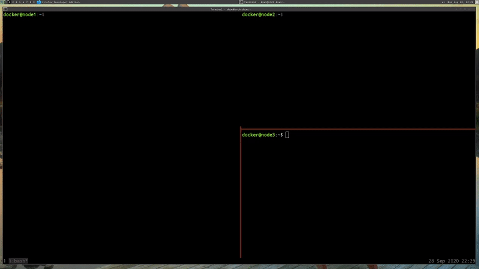
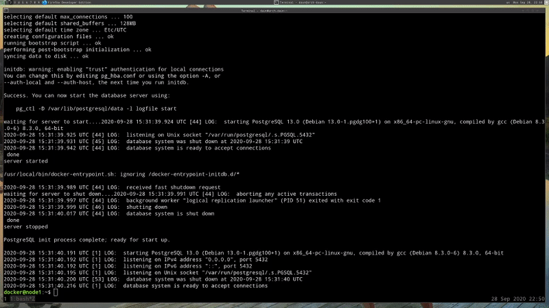
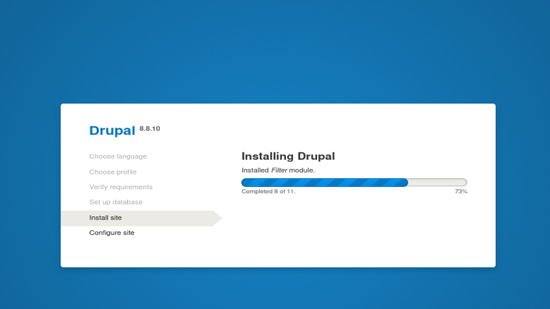
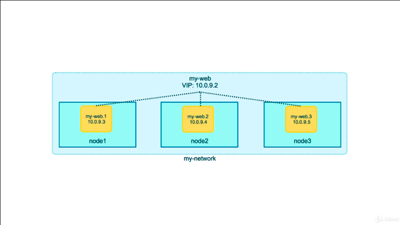
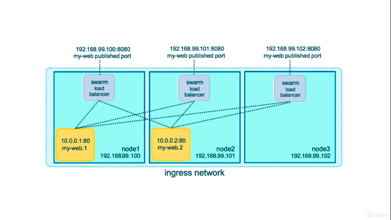
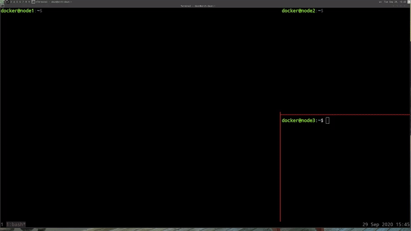
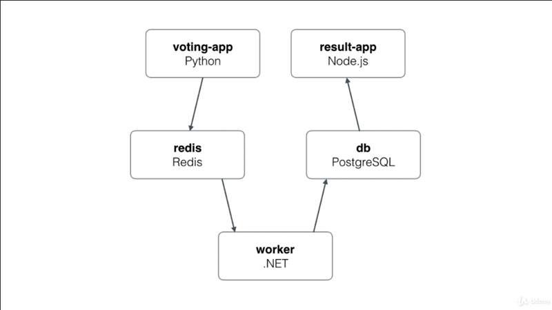
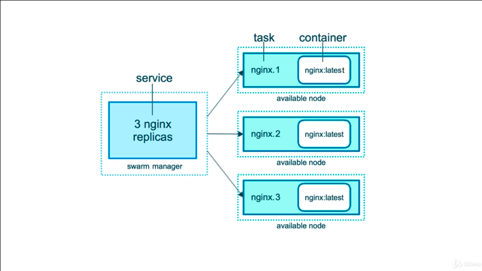
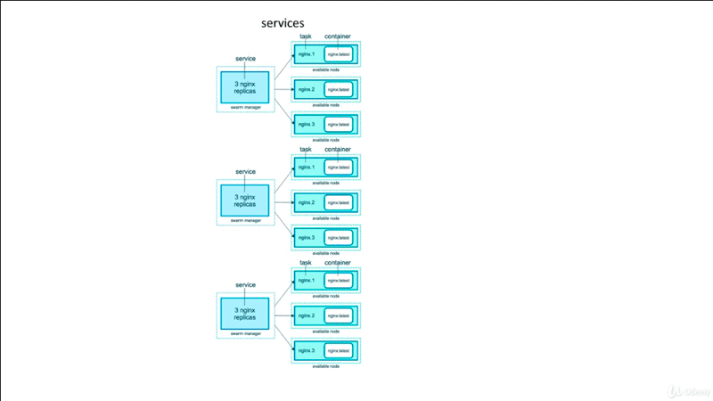
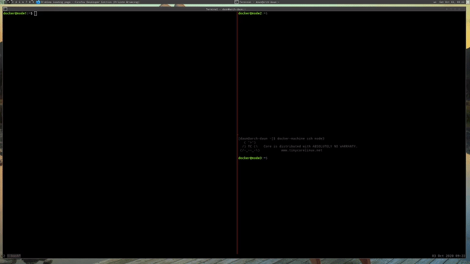

# Swarm Basic Features

## Table of Contents

1. [Scaling Out With Overlay Networking](#scaling-out-with-overlay-networking)
2. [Scaling Out With Routing Mesh](#scaling-out-with-routing-mesh)
3. [Assignment Create Multi-Service App](#assignment-create-multi-service-app)
4. [Swarm Stacks](#swarm-stacks)
5. [Swarm Secret Storage](#swarm-secret-storage)
6. [Using Secret in Swarm Services](#using-secret-in-swarm-services)
7. [Using Secrets with Swarm Stacks](#using-secrets-with-swarm-stacks)

<br/>

## Scaling Out With Overlay Networking
<br/>


<br/>

Before we expand our `services` to tart running across a bunch of node and all
of the services talking to each other, let's go over a couple of new concepts
that Swarm brings to the table.

The first one is new _networking driver_ called **_Overlay_**, and you really
just create a network with `docker network create` command, and you put in an
option `--driver overlay`. What that's is basically creating a _Swarm-wide
bridge_ network where the containers across hosts on the same virtual network
can access each other kind of like they're on a _VLAN_.

The _overlay_ driver doesn't play a _huge amount in traffic coming inside_, as
it's trying to take a wholistic  Swarm view of the network so that's you're not
constantly messing around with networking setting on individual nodes.

You can also enable full network encryption using **_IPSec_** where it'll will
actually set up IPsec tunnels between all the different nodes of your Swarm.
But it's _off_ by default really just for performance reasons.

When you create your services, you can add them to no Overlay networks, or one
or more Overlay networks. It really depends on the design of your application.
You know a lot of traditional design would have the databases on a _backend
network_ and the Web servers on a _frontend network_. Then maybe you would have
an API between the two that would be on both networks, or something like that;
And you can totally do that in Swarm.

### Jump into Command Action

#### Docker create Postgres service
<br/>


<br/>

What I want to do is I want to show you what it would be like if we deployed the
Drupal example from a previous assignment with the Postgres Database, as
services, and then created an Overlay network for them to talk to each other.

First we need to create a network, so `docker network create` and this hasn't
changed for Swarm other the fact that we're going to use a new driver. I'm just
called `mydrupal`

```bash
Usage:  docker network create [OPTIONS] NETWORK

Create a network

Options:
  -d, --driver string        Driver to manage the Network (default "bridge")

docker@node1: docker network create --driver overlay my drupal

docker@node1: docker network ls
NETWORK ID          NAME                DRIVER              SCOPE
d42e0acfbab5        bridge              bridge              local
4c754bfc3f37        docker_gwbridge     bridge              local
ba69be945f69        host                host                local
slgv4i5f2jdc        ingress             overlay             swarm
rnaclan8j849        mydrupal            overlay             swarm
e41facb30fac        none                null                local
```

The `ingress` one is there by default. You'll also see new one `docker_gwbridge`
because a Swarm, which is actually an outgoing network that we won't need to
mess.

Let's create our Postgres service.

> **NOTE**: Specific Host
>
> We can specific the service run on which node by add the options `--hostname`,
> if not specified the host the service will run in random node

```bash
docker@node1: docker service create --name psql --network mydrupal \
                --hostname node1 -e POSTGRES_PASSWORD=mypass  postgres
overall progress: 1 out of 1 tasks
1/1: running   [==================================================>]
verify: Service converged
```

You'll notice here that we don't get the whole image downloading and all that,
because services can't be run in the foreground, because they have to go through
the orchestrator and scheduler. So, we can do `docker service ls`, and we can
see that one of one of them is running.

```bash
docker@node1: docker service ls
ID                  NAME                MODE                REPLICAS            IMAGE               PORTS
nviq6nwu3wfj        psql                replicated          1/1                 postgres:latest
```

If we do a `docker service ps` on `psql` we can see that this

```bash
@docker@node1: docker service ps psql
ID                  NAME                IMAGE               NODE                DESIRED STATE       CURRENT STATE           ERROR               PORTS
tffvhhhw8zzj        psql.1              postgres:latest     node1               Running             Running 23 seconds ago
```

#### Docker create Drupal service
<br/>



```bash
docker@node1: docker service create --name drupal --network mydrupal \
                --hostname node2 \
                -p 80:80 drupal:8:8.10
```

While, the service created on background we can use a trick to `watch` command
line  in Linux to watch.

```bash
docker@node1: watch docker service ls
```

Basically, what it does it's rerunning a command over and over again. It's
installed by default. Now we can  list the task of the services by run command
`ps` in service, and see that Drupal is actually running on  `node2`.

```bash
docker@node1: docker service ps drupalwatch
ID                  NAME                IMAGE               NODE                DESIRED STATE       CURRENT STATE           ERROR               PORTS
tuuhu5zlzgju        drupal.1            drupal:8.8.10       node2               Running             Running 9 minutes ago
```

We have the database running on `node1`, we have the Drupal website running on
`node2`. The question in my head how they know to talk to each other? Well,
using the _service name_.

So we paste one nodes of the IP addresses, it should come up on the Drupal
install; And if I tell it the **_database host_**, just like when we were with
Compose, we made the service name in the Compose file `docker-compose.yml`, here
we're going to use the _service name_ that was created for database server. So,
that was `psql`,
<br/>


<br/>

So above screen is basically telling us that it's able to talk to database
across the `nodes` and  setup the system.

That's the great thing about _Overlay_ is it really just **_acts like everything
on the same subnet_**.

Note, that Drupal and Postgres running smoothly, but I have three nodes, so how
do I know which node it's going to be on and which port I need to make sure that
my DNS points to when I create this website name?

In my case, I have three local IP addresses on my nodes, and I can copy all
three of them and put all three of those IP addresses in the browser. If you
see, it appears like the website is running on all three nodes because I'm
looking at all three IP addresses. But if I do `docker service ps`

```bash
docker@node1: docker service ps drupal
ID                  NAME                IMAGE               NODE                DESIRED STATE       CURRENT STATE            ERROR               PORTS
tuuhu5zlzgju        drupal.1            drupal:8.8.10       node2               Running             Running 33 minutes ago
```
I know It's running on `node2`. I can do a `docker service inspect`, and see
that indeed it's only got one IP address on that overlay network

```bash
docker@node1: docker service inspect drupal
[
    {
        "Endpoint": {
            "Spec": {
                "Mode": "vip",
                "Ports": [
                    {
                        "Protocol": "tcp",
                        "TargetPort": 80,
                        "PublishedPort": 80,
                        "PublishMode": "ingress"
                    }
                ]
            },
            "Ports": [
                {
                    "Protocol": "tcp",
                    "TargetPort": 80,
                    "PublishedPort": 80,
                    "PublishMode": "ingress"
                }
            ],
            "VirtualIPs": [
                {
                    "NetworkID": "slgv4i5f2jdc7y8fqor8bqhwz",
                    "Addr": "10.0.0.7/24"
                },
                {
                    "NetworkID": "koef15cr8saw05y2dirtz2inn",       >> The ID is point to mydrual network ID
                    "Addr": "10.0.2.5/24"
                }
            ]
        }
    }
]

docker@node1: docker network ls | grep overlay
NETWORK ID          NAME                DRIVER              SCOPE
slgv4i5f2jdc        ingress             overlay             swarm
koef15cr8saw        mydrupal            overlay             swarm
```

So, why is it responding on all three hosts? That lead us to next new features.

**[⬆ back to top](#table-of-contents)**
<br/>
<br/>

## Scaling Out With Routing Mesh
<br/>


<br/>

So that little bit of magic wasn't actually magic. It was the **_Routing
Mesh_**. The Routing Mesh is an _incoming or ingress network that distributed
packets for our service to the task for that service_, because we can have more
that one task.

This actually spans (reach out) all the nodes, and it's using Kernel primitives
that have been around a while actually called [IPVS](#what-is-ipvs). So we're
not talking about fancy new service. We're really just talking about the core
features of the Linux Kernel. What it's really doing here is it's _load
balancing_ across all the nodes and _listening on all the nodes traffic_.

There's a couple of ways we can talk about how this works. The **_first
example_** us from _one container to another_. If our backed system, like say
the database, were increased to _two replicas_, the frontends talking to the
backends, wouldn't actually talk directly to their IP address. They would talk
something called a [VIP](#what-is-vip) or a _Virtual IP_, that Swarm puts in
front of all services. This is a private IP inside the virtual networking of
Swarm, and it ensures that the load is distributed among all the task for
a service.

So if you can imagine if you had a worker role in your application, and it had
10 different containers, you don't have to put a [load balancer](#what-is-load-balancer)
in front of that. This does that for you. When you're talking about traffic from
one service inside your virtual network talking to another service inside your
virtual network.

The **_second example_** example of how the Routing Mesh work is external
traffic coming into your Swarm can actually choose to hit any of this nodes in
your swarm. Any other worker nodes are going to have that _published port open_
and listening for that container's traffic, and then it will reroute that
traffic to the proper container based on its load balancing.

What this means is when you're deploying containers in a Swarm, you're not
supposed to have to care about what server it's on because it might move, right?
If a container fails, and the task is recreated by Swarm, it might put that on
a different node; And you certainly don't want to have to change your firewall
around or your DNS settings to make that container work again.

Th Routing Mesh solves a lot of those problems by allowing our Drupal website on
port `80` to be accessible from any node in the Swarm; And in the background,
it's taking those packets from that server and then routing them to the
container. If it's on a different node, in it'll route it over the virtual
networks. If it's on the same node, it'll just reroute it to the port of that
container; And we didn't have to do anything to enable this. This was all out of
the box.

Let see diagram how it might works.

#### Example-1 Routing Mesh: one container to another
<br/>


<br/>

If I created a new Swarm service, and I told it to have three replicas; And it
created three tasks, with three containers, on three nodes. Inside hat Overlay
network, it's actually creating a virtual IP that's mapped to DNS name of the
service, right? And the service, by default, the DNS name, is the name of the
service. In this case, I created a service called `my-web`, and any other
containers I have in my Overlay networks that need to talk to that service
inside the Swarm, they only have to worry about using the _my-web DNS_.  The
virtual IP properly load bounces the traffic amongst all the tasks in that
service.

This isn't DNS Round-Robin. That's actually a slightly different configuration.
We could enable that if we wanted to. There's an options to use DNS Round-Robin.
The benefits of [VIPs](#what-is-vip) over Round-Robin is that a lot of times our
DNS caches inside our apps prevent us from properly distributing the load.
Rather than fight with our DNS clients in DNS configuration, we're just relying
on the VIP, which is kind of like you would have if you bought a dedicated
hardware load balancer.

#### Example-2 Routing-Mesh: Working with external traffic
<br/>


<br/>

In second example, this actually showing what if would be like with external
traffic coming in. This is similar to what we just did with Drupal, where when
I created those yellow boxes, by creating on service, called _my-web_, and it
created two tasks, and applied them to two different nodes, each one of those
nodes has a built-in load balancer on the external IP address. For me, because
I'm using DigitalOcean, that IP address is the one that DigitalOcean gave me.

When I use `-p` and published it on a port, in this example it's using port
`80:80`, any traffic that comes in to any of these three nodes hits that load
balancer on port `80:80`. The load balancer decides which container should get
the traffic and whether or not that traffic on the local node, or it needs to
send the traffic over the network to the different node.

Again, this actually all happens in the background without any special effort on
your part.

### Jump into Command Action
<br/>



All right. Let's see this Routing Mesh in action. We already saw the example
with Drupal and how it listens on all three nodes. But what if we had multiple
tasks that see that load balancer working.

If we do `docker service create`, and we use Elasticsearch container.

```bash
docker@node1: docker service create --name search --replicas 3 -p 9200:9200 elasticsearch:2
```

While the service is creating, I'll just mention that Elasticsearch is actually
a search database that's accessible via a JSON web API. So it's really easy to
hit which `curl` and give us good examples of how this works.

I do a `docker service ps search`

```bash
docker@node1: docker service ps search
ID                  NAME                IMAGE               NODE                DESIRED STATE       CURRENT STATE            ERROR               PORTS
xiw6cpgx9ju5        search.1            elasticsearch:2     node3               Running             Running 56 seconds ago
qsm84uflkp8s        search.2            elasticsearch:2     node2               Running             Running 36 seconds ago
gb597wwvib6a        search.3            elasticsearch:2     node1               Running             Running 43 seconds ago
```

It's smartly created each task on a different node. If I just do a `curl` on my
`localhost`, on `node1` on port `9200` because I published that port

```bash
docker@node1:~$ curl localhost:9200
{
  "name" : "Timeslip",
  "cluster_name" : "elasticsearch",
  "cluster_uuid" : "4zf-MahqS1qYjgkrmeAVFw",
  "version" : {
    "number" : "2.4.6",
    "build_hash" : "5376dca9f70f3abef96a77f4bb22720ace8240fd",
    "build_timestamp" : "2017-07-18T12:17:44Z",
    "build_snapshot" : false,
    "lucene_version" : "5.5.4"
  },
  "tagline" : "You Know, for Search"
}
```

I'll get back the Elasticsearch basic information. Part of that is it will
actually create a random `name` that just a feature out of Elasticsearch. If you
`curl` several times then you can get  a random `name`, and then it'll start
repeating itself  like such. That's actually he virtual IP acting as a load
balancer and distributing my load across the three tasks.

### Note on Routing Mesh

In `17.03`, which is the release that I'm, showing you this on, the Routing Mesh
and the load balancing are currently stateless load balancer. If you've ever
dealt with State inside of maybe Amazon's classic load balancer, or other load
balancer technologies, you know what this is about. This is basically saying
that if you have to use session cookies on your application, or it expects
a consistent container to be talking to a consistent client, then you may need
to add other things to help solve that problem.

Out of the box, every time you hit a service with multiple tasks, it's going to
give you potentially a different result.

Also, if you get into the details of this, it's actually a layer-3 load
balancer, and that actually operates at the IP and port layer. It doesn't
actually operate the DNS layer.

If you've have ever run multiple websites on the same port, on the same server,
this isn't going to do that yet. You're still going to need another piece of the
puzzle on top of that if you're actually wanting to run multiple websites on the
same port, on the same Swarm.

Luckily, that's a pretty common request, and there's several options you can do
to solve both on these problems. One of them to use Nginx or HAProxy, which
there are pretty good examples out there of containers that will sit in front
with your Routing Mesh, and actually act as a stateful load balancer or a layer
for load balancer, that can also do caching and lots of other things. If you
need that,you might want to check of those out in the resources of this section.

I should also mention that if you were o pay for a subscription of Docker
Enterprise edition, with it comes somethings called UCP or Docker Data Center,
which is a web interface. But I should mention that Docker Enterprise edition,
If you get a subscription to that for your Swarm nodes, it actually comes with
a built-in layer for _web-proxy_ that allows you to just throw DNS names in the
_web config_ of our Swarm services and everything just works.

### Miscellaneous

#### What is IPVS

IPVS (IP Virtual Server) implements transport-layer load balancing, usually
called Layer 4 LAN switching, as part of the Linux kernel.It's configured via
the user-space utility tool.. IPVS is incorporated into the Linux Virtual Server
(LVS), where it runs on a host and acts as a load balancer in front of a cluster
of real servers. IPVS can direct requests for TCP- and UDP-based services to the
...  [wiki](http://en.wikipedia.org/wiki/IP_Virtual_Server)

Controls how ipvs will deal with connections that are detected port reuse. It is
a bitmap, with the values being: 0: disable any special handling on port reuse.
The new connection will be delivered to the same real server that was servicing
the previous connection. This will effectively disable expire_nodest_conn...
[kernel.org](http://www.kernel.org/doc/html/latest/networking/ipvs-sysctl.html)

#### What is VIP

Virtual IP address - Wikipedia A virtual IP address (VIP or VIPA) is an IP
address that doesn't correspond to an actual physical network interface. Uses
for VIPs include network address translation (especially, one-to-many NAT)...
[wiki](http://en.wikipedia.org/wiki/Virtual_IP_address)

#### What is load balancer

Load balancing is defined as the methodical and efficient distribution of
network or application traffic across multiple servers in a server farm. Each
load balancer sits between client devices and backend servers, receiving and
then distributing incoming requests to any available server capable of
fulfilling them.  [citrix](http://www.citrix.com/glossary/load-balancing.html)

Load balancing techniques can optimize the response time for each task, avoiding
unevenly overloading compute nodes while other compute nodes are left idle. Load
balancing is the subject of research in the field of parallel computers. Two
main approaches exist: static algorithms, which do not take into account the
state of the different ...
[wiki](http://en.wikipedia.org/wiki/Load_balancing_(computing))

A load balancer is a device that acts as a reverse proxy and distributes network
or application traffic across a number of servers. Load balancers are used to
increase capacity (concurrent users) and reliability of applications.
[source](http://www.f5.com/services/resources/glossary/load-balancer)


**[⬆ back to top](#table-of-contents)**
<br/>
<br/>


## Assignment Create Multi-Service App
<br/>


<br/>

All right, now that we've learned all about _Swarm scaling_ with _Overlay
networking_ and _Routing Mesh_, I want you to actually go through the process of
creating the **_assests_**, or the **_object_**, that you need to deploy in
a Swarm scenario. So we're no longer using the `docker run` command, but the
`networking` and the `volumes` are kind of the same but slightly different.

I want to give you real-world scenario of a _multi-tier app_, and we're going
o use Docker's Distributed Voting App. It's actually called the Example Voting
App. You might have seen it in Docker keynotes, or in other labs or tutorials.
It's pretty common, and I think, a great app, because it's got at least _five
roles_ to it, or different containers that you need to deploy; And they all
server a special function and they're actually doing stuff that actually works,
actually does what it's supposed to do; And so you can play with it and it has
very typical, distributed architecture components like the _web frontend_ and
the _worker backend_, and the _key value in database_. I think it's really
helpful to do.

In this case, you're going to use the directory [swarm-app-1](./swarm-app-1).
In that directory is nothing but [README.md](./swarm-app-1/README.md) and an
image. Form that README, you're going need to create the _volume_ and a couple
of _networks_ and _five services_ that are needed for this app to fully
function.

It may help you to try some of these commands locally, or actually write them in
your text editor and sort of compose them, because they are going to be little
complex, right. When you do that `docker service create`, you're going to have
to connect it to a _specific network_, and open up _ports_, and call it
a _specific name_, and use a _specific image_.

So, i might be easier to edit it locally and then just cut and paste into your
shell, wherever Swarm is at. But that's just me.

Everything is going to use Docker Hub images because in the _production Swarm you
don't want to be building_. That's not a process you want on your production
Swarm, typically. Usually yo want to do your building either through some
automated online service like Docker Hub or Docker Cloud, or somewhere in your
CI/CD pipeline that's net eating resources on your production Swarm.

In this scenario, we can imagine that our images are being built elsewhere and
stored on Docker Hub and we just need to pull those down, whatever the latest
version are, into our Swarm.

I'll just say this, like many things in Computer Science, this is _one-half
science_, _one-half art form_. Your commands could be in totally different
orders, or have totally different option order that mine. You might called your
networks different things. That fine.

At the end result is that the application is works, that they're able to talk to
each other in the proper way, that you've got all the _ports published_ and that
you've got the _data protected in a volume_. Let's take a quick look at what
you're up against.

### App Structure Design
<br/>


<br/>

Imagine you're having to design the commands and the architecture for this. And
this is what the developer would give to you that wrote this app. Well in this
case, it's probably lots of developers that wrote this app, right? Because we've
actually got a _web frontend_ that in Python we've got a _web backend_ that
running in NodeJS. We've got a _worker process_ that running in .NET and then
we've got a _Redis key value store_ and a _PostgreSQL database_.

This is actually something I see more and more often, where different teams are
writing different parts of a solution, and they're able to just pick the
language that they think is best for that scenario; And in the world of
containers, this kind of application really shines. Because our applications are
all segmented, they can still technically run on the same machine but they're
all protected from each other so that you don't end up with NodeJS conflicting
with dependencies on Python or whatever.

You'll also notice here the traffic flow, and the Voting-App doesn't have it,
but it should have a little arrow coming in that, this is where the users would
be coming in on the Voting-App part; And you can see that the Voting-App
actually has to push your votes for this application which, by the way, you're
going to be voting for cats and dogs. It'll be pushing that into Redis and then
the _worker_ will actually be checking the Redis system for anything in the
queue and then be pushing the result into Postgres which will then be shown on
a Websockets backend that's actually live-updating as you're voting.

If we jump into the Directory real  quick I've put some notes in here to help
you along the way because there's a few things that are a little different and
new. But the _services area_ would be kind of written like it was from someone
who knew their application but didn't know actually how to implement this in
Docker; And that's a pretty common scenario.

You can see that in the _services_ I've listed which image you need to deploy,
the actual name that you need to give it, because those are important. These are
images that are, unfortunately, hard coded for what names they are going to look
for on the network. Ideally you'd want applications that you could configure on
the fly for what they need to do for names, but, in this case, Vote is going to
specifically look for a DNS record called Redis.

You can see that there's actually _two networks_ here. We have a _frontend_ and
_backend_ network. That's pretty typical, also of a larger application where you
maybe want to protect your database on a backend network so that the frontend
user app doesn't have direct answer to it; And that's we are showing here and
you'll notice that the _worker actually is connected to two networks_. So when
you use your `create` command, remember you're using `docker service create` not
`docker run`. So when you using your `docker service create` command you're
going to need to specify the `--network` option _twice_, once for the frontend,
and once for the backend.

_Obviously you know yo create your networks first_. So some of hint has
specified at the top of README document; And if you need the image again the
architecture diagram is also in in the folder, just in case that helps
conceptually with how you're doing to deploy this; And, of course, you're going
to have the Docker documentation. You might need to use the `--help` on `service
create` command that will give you all the various options that you might need.
You only are going to need three or four of those.

Again, if you get stuck with the commands themselves, you might want to review
the actual documentation, which I will put into the resources of this section.
But this particular document under Swarm actually goes into creating _services_
and _configuring services_. So it's a little wordy, but it's got a lot of
information in it that might help you if you get stuck in here.

The next video I will actually run through this whole thing myself as if I was
you. Good luck and have some fun.

### Jump into Code
<br/>


If you remember, I have 3-node Swarm over my docker-machine. If I do `docker
node ls` on my active Swarm,

```bash
docker@node1:~$ docker node ls
ID                            HOSTNAME            STATUS              AVAILABILITY        MANAGER STATUS      ENGINE VERSION
mga3wcytmusekjwv5u6pmhmia *   node1               Ready               Active              Leader              19.03.12
q0pelzp2traxthj72qf466e3q     node2               Ready               Active              Reachable           19.03.12
sb3c4n3pugai216rldhvcgruy     node3               Ready               Active              Reachable           19.03.12
```

You'll see that I have three node here. They're all manager node.

```bash
docker@node1:~$ docker container ps -a
CONTAINER ID        IMAGE               COMMAND             CREATED             STATUS              PORTS               NAMES

docker@node1:~$ docker service ls
ID                  NAME                MODE                REPLICAS            IMAGE               PORTS
```

I have no `containers` running, and `services`, obviously.

I'm actually going to type the command in [README.md](./swarm-app-1/README.md)
on the fly, because that seems like a logical place for me to do it; And then
I'll cut and paste them into Swarm terminal.

#### Create network

First thing, I know up at the top, it talks about I need networks, and I need
volume. So probably ca get the networks out of the way and I can probably wing
that.

```bash
docker@node1: docker network create -d overlay backend

docker@node1: docker network create -d overlay frontend
```

There's nothing inherently special about these two networks. We're just to
segment our different services into one the other to help act like a little
firewall that gives separation for protection.

#### Vote-App

On this Vote-app I know I need to do a `docker service create`, and I've got to
_name_ it, so it might well put name `vote`; And then I've got to _pulish_ the
_port_ to `80:80` in the container, and it's got to be on a specific _network_.
So, network `frontend`, I need two `--replicas` with copy and paste the image.

```bash
docker@nod1: docker service create --name vote -p 80:80 --network frontend --replicas 2 bretfisher/examplevotingapp_vote
```
Now, I'm going to go ahead and create all of these before I actually deploy them.

#### Redis

We just copy and paste and change the name and we do not need _two repilcas_.
Just because I need only one replicas I don't actually have to specify replica.

```bash
docker@node1: docker service create --name redis -p 80:80 --network frontend redis:3.2
```

#### Worker

We create a worker, is going to be on _two networks_, I've got to do `--network
frontend` and `--network backend`, and same as Redis I just need one replicas
and I don't specify any _ports_. and copy the image.

```bash
docker@node1: docker service create --name worker --network frontend --network backend bretfisher/examplevotingapp_worker:java
```

#### Postgres Database

Here's the thing about the `volume`. The `-v` command is not compatible with
`docker service`. Because, for various reasons, services are going to be more
complex that maybe your typical `docker run` command; And there were problem and
limitation with the `-v` back in the day.

So Docker has learned from that and improved the format. But it happens to be
a little bit more verbose and maybe a little bit more difficult to remember the
format starting out. It also happens to be not well documented yet in the Docker
Documentation because it's less than a year old as a command since this lecture
was build on top of that command.

```bash
Usage:  docker service create [OPTIONS] IMAGE [COMMAND] [ARG...]

Create a new service

Options:
--mount mount                        Attach a filesystem mount to the service

docker@node1: docker service create --name db --network backend \
        -e POSTGRES_HOST_AUTH_METHOD=trust \
        --mount type=volume,source=db-data,target=/var/lib/postgresql/data \
        postgres:9.4
```

If it doesn't make sense to you, basically, it's this list of values that are
all a part of a single `mount` command  and the minimum are `type=`, `source=`,
`target=`. There's also other things you can add on, but these are only three we
need in this scenario.

You can see my `source=` is just a _named volume_ because I don't have any
slashed `\` in it; And if we had slashes it would have been a _bind mount_ and
we would have to had specified a different type.

#### Result

The last we create Result app,

```bash
docker@node1: docker service create --name result --network backend -p 5001:80 bretfisher/examplevotingapp_result
```

We publish the port to use `5001` to port `80` in the container. I only need to
run one of them. By the way, the only reason we're run one of these is actually
a little known issue on this app, is that this is actually using _WebSockets_,
and Websockets are something that require a _persistent connection_.

So, in the Routing Mesh, doesn't really do a Websockets well yet because it's
going to keep switching you back and forth between containers and that
Websockets needs to be to a specific container persistently. So, with this app
we should have really, is a _proxy_ in front of it but it's not in this app yet,
so probably in a later version they'll update it and fix it so that we have
a proxy. That way it can be redundant.

#### Run the app on the browser
<br/>


<br/>

```bash
docker@node1:~$ docker service ps worker
ID                  NAME                IMAGE                                     NODE                DESIRED STATE       CURRENT STATE                ERROR                       PORTS
19ye38axxlsy        worker.1            bretfisher/examplevotingapp_worker:java   node3               Running             Running about a minute ago
j6h3uprk6pdg         \_ worker.1        bretfisher/examplevotingapp_worker:java   node3               Shutdown            Failed about a minute ago    "task: non-zero exit (1)"

docker@node1:~$ docker service logs worker
worker.1.j6h3uprk6pdg@node3    | Connected to redis
worker.1.j6h3uprk6pdg@node3    | Connected to db
worker.1.j6h3uprk6pdg@node3    | Watching vote queue
worker.1.j6h3uprk6pdg@node3    | Processing vote for 'a' by '843df81e9620dc68'
worker.1.j6h3uprk6pdg@node3    | org.postgresql.util.PSQLException: This connection has been closed.
worker.1.j6h3uprk6pdg@node3    |        at org.postgresql.jdbc2.AbstractJdbc2Connection.checkClosed(AbstractJdbc2Connection.java:820)
worker.1.j6h3uprk6pdg@node3    |        at org.postgresql.jdbc3.AbstractJdbc3Connection.prepareStatement(AbstractJdbc3Connection.java:275)
worker.1.j6h3uprk6pdg@node3    |        at org.postgresql.jdbc2.AbstractJdbc2Connection.prepareStatement(AbstractJdbc2Connection.java:293)
worker.1.j6h3uprk6pdg@node3    |        at worker.Worker.updateVote(Worker.java:40)
worker.1.j6h3uprk6pdg@node3    |        at worker.Worker.main(Worker.java:23)
worker.1.19ye38axxlsy@node3    | Connected to redis
worker.1.19ye38axxlsy@node3    | Connected to db
worker.1.19ye38axxlsy@node3    | Watching vote queue
worker.1.19ye38axxlsy@node3    | Processing vote for 'b' by '843df81e9620dc68'
worker.1.19ye38axxlsy@node3    | Processing vote for 'a' by '843df81e9620dc68'
worker.1.19ye38axxlsy@node3    | Processing vote for 'a' by '843df81e9620dc68'
```

You might be seeing the error on `worker` service and you're thinking, I don't
know why is that happening?  So we look at that log. There's two different
`workerID`: `j6h3uprk6pdg@node3` and `19ye38axxlsy@node3`.

It says "task: non-zero exit (1)". So what this basically means is, I created
a service that was not exist because I hadn't created the other service yet; And
it did the thing it's supposed to do in Dockerland, which is when it has an
error, the app should crash because Docker can actually _restart and redeploy
_ properly until the apps_ don't crash; And soon as I get all my services
launched, everything stopped crashing and everything now works.

**[⬆ back to top](#table-of-contents)**
<br/>
<br/>

## Swarm Stacks

Now that you understand the basics of creating a multi-node Swarm and creating
Overlay networks and Docker services. We're going to cover the next really cool
thing about Swarm, which is **_stacks_**. Not stacks of pancakes, but **_stacks
of services_**.

### Production Grade Compose
<br/>


<br/>


In `1.13` Docker added this really great feature that adds another layer of
abstraction on to of stacks. Basically it's _Compose file for production of
Swarm_. Now stacks accepts Compose files.

Inside Compose file is what we call a _declarative definition_. Where we're
stating (declare) this is what I want the end result to be; And it's Swarm's
job to figure all that out. Now it's not just _services_; it's _network_ and
_volumes_ as well.

A little sneak peak, It's actually going to include **_secret_**, which we'll
talk about in the next few lectures.

We get to use a new command, which is `docker stack deploy` to import this
Compose file and run the command that we put in it.

The stack manages all of this. It doesn't need us to go and first create
networks, or first create volumes, but we can totally do that. We can use
something called **_External_** in our Compose file to say 'hey, these are
already things that exist in my Swarm. Go ahead and use those, don't bother
creating them'. But usually you end up having your stacks just doing it all for
you because it's easier that way.

We're going to get some new features in our Compose file, so we're going to
start with the ones that look very similar to what we had before. But we're
going to get this new _deploy key_ in there. or _dictionary_, that allows us to
specify the things that are specific to Swarm. How many replicas do we want?
What we want to do when we failover? How do we want to do rolling updates, and
all those sorts of things that we wouldn't care about on our local development
machine.

But that comes at a prices, which is, that we can't do the `build` command yet.
That may be something that will never happen in Swarm because the mindset here
is _that building shouldn't happen on your production Swarm_. Building is
something that your CI system should do. Maybe
[Jenkins](https://www.jenkins.io/) or something else like
[Codeship](https://codeship.com/). Once you built our images and put them in
your repository, this stack will actually be the one to pull down those images
and deploy them with the `deploy` options.

The good news there, though, is that they actually get along. On your local
machine, Compose will actually ignore when you run the `docker-compose` command.
It will actually ignore any of the _deploy information_. It will actually say
'hey, you've got deploy information in here. I can't really use it, so I'm going
to ignore it.'

Likewise, when you're on Swarm and you're deploying a new stack or an update to
a stack, it'll actually say 'hey you've got build commands in here. I don't do
builds so I'm going to ignore them and keep going.'

The nice thing is you don't have to change your file. We'll see later how we can
actually have a single Compose file that does everything that we need it to do
on the development side and on the production deployment side. It's pretty cool.

Finally, you don't actually need the Docker Compose CLI, the binary. That
doesn't need to be in your Swarm. Because again compose, the actual command, is
not a production tool. It wasn't designed to be production. It was designed to
be a developer and sysadmin helper tool. It's really best for local work on our
machines.

The Swarm, which is basically the Docker Engine. The Docker Engine now can accept
Compose files using that `stack` command. It reads the Compose file without
needing Docker Compose anywhere on the server.

#### Service architecture
<br/>


<br/>

Let's review real quick when we look back at our services. This what our
services would look like. We will create our services let's  say it's Nginx; And
let's say we specified _three replicas_ of it. So it would then go and create
_three tasks_ in the orchestrator, and those _tasks would find certain servers_,
or nodes, to put them on and they would create containers.
<br/>


<br/>

In the new stacks, we're talking about _multiple services_, one or more, right.
You can have dozens of services in there. In that single YAML file. They act
just like the services that we had before, only we get to do _volumes_ and
_Overlay networks_ in that Compose file; And that results what we call
a **_stack_**. A stack controls all those things; And actually will put its
_name property_ on all the objects so that you can easily tell which ones are
related to which stack. It'll actually put _labels_ in there as well, which
we'll cover later, which is more metadata for you to be able to determine what
stack this particular thing came from.

So this is really  great. we now get to use a YAML file to actually do all those
things we didn't want to type in the `service` commands. Because the `service`
commands were already kind of getting unwieldy (hard to use) and long; And then
we ended up making Bash script in order to run those commands, and then it just
get tedious (tiresome), right.

So, now that we've had Swarm around for eight months, we now get this stack
feature that manages those services. Notice that the stacks is only for _one
Swarm_. Right? _It can't do many Swarm_. It's only going to be running on _one
Swarm_ so that it can all the nodes and deploy all these services, networks and
volumes. I should say this diagram can actually have one more thing in it, which
is _secrets_, because the stack can control those as well. We'll use that in
a later lecture in this section.

### Jump into code

Let's look at the stacks and how they work. I'm back in my 3-node Swarm that we
built earlier. I'm going to play around in `node1` so I maximize the `node1`
window.

We're going to use the Voting App example we did in previous lectures for this
section. If you remember our Voting App design, it was _five different
services_, and they all had dependencies on each other; And it ultimately gave
us two different websites. You went through and I'm sure you crafted the best
services list with all the values and options that it needed and it was perfect,
right?.

I'm here to tell you that now, that is no longer needed. It was really important
for us to use them and not everything is going to need a stack file. Let's just
take peak on
[example-voting-app.yaml](./swarm-stack-1/example-voting-app-stack.yml) file
real quick because you'll notice that it look very much like a Compose file
because it is. The only real key thing you have to change as it has to be at
least `version: 3` or higher. The latest version right now is version `3.1` as
I'm record this lecture, as `2020` the latest version `3.8`, and ti will change
as it continues to change and mature. But you need version `3` in order to use
stacks.

You'll notice that we have our `redis`, `db`, `vote`, and all these things that
are probably very similar to you from your own work. You're probably very
familiar with those and the images they need, and the _ports they need open_ and
all that.

But in this case, you'll notice `deploy`. Deploy here is a new option. You'll
see here that I was specifying how many replicas I want, which is how many
copies of that images that need to run at a time; And what happens when I do an
update. So when  I do an actual _stack update_ `update_config`, which will then
do `service update`. How do I want to roll out? Right? Do I want to all go down
at the same time? Do I only want one at a time? How much delay between them?
There's all sort of options here.

We're just kind of scratching the surface, but you can see like I have
`restart_policy`, that if the containers fails, automatically restart it. Also
you can see under the _database_, I've actually had `constraints: [node.role ==
manager]` put in to make sure that it's on a specific node. We haven't talked
really a lot about _constraints_ yet, but here are ways for us to label objects,
that is containers or images or really anything that we can create or destroy in
Swarm or in Docker itself. We can actually assign labels to any of those,
including nodes, and a node that is manager gets its own labels. This is very
easy for us to do to just say, 'hey, this container has to run on a node that
has this particular role'.

As we scroll down we've got some `parallelism:2` options which we've seen before,
the `delay:10s` option is pretty cool. If you have sort of a warm up time when you
have containers that spin up. Maybe they've started but they don't actually go
live for maybe `60` second or something. You can add in `delay` there.  We'll
actually look at those later during _production blue-green deployment_.

For now, you can see those are pretty standard. We've actually got even more
options down here. You can actually see that I assign this specific `labels:
[APP=VOTING]`. I have a `window: 120s` and `max_attempts: 3` for
`restart_policy`. So if it tries to restart, and it continues to fail it's not
going to try more than three times.
<br/>


<br/>

#### Docker `stack deploy` command

All I've got to do is do `docker stack deploy` with `-c` for Compose. So I'm
going to use a Compose file.

> **NOTE**: Transfer the file with `scp` command
>
> Transfer your example-voting-app-stack.yml into `docker@node1` by use `scp`

```bash
# Transfer yaml file into running Swarm virtual machine
arch@arch-daun: scp ./swarm-stack-1/example-voting-app-stack.yml docker@192.168.99.101:/home/docker/srv/swarm-stack-1/

docker@node1:~/srv/swarm-stack-1$ docker stack deploy -c example-voting-app-stack.yml voteapp
Creating network voteapp_frontend
Creating network voteapp_backend
Creating network voteapp_default
Creating service voteapp_redis
Creating service voteapp_db
Creating service voteapp_vote
Creating service voteapp_result
Creating service voteapp_worker
Creating service voteapp_visualizer

docker@node1:~/srv/swarm-stack-1$ docker service ls
ID                  NAME                 MODE                REPLICAS            IMAGE                                       PORTS
vhgu4t1k331z        voteapp_db           replicated          1/1                 postgres:9.4
j3xtbxabs0jo        voteapp_redis        replicated          1/1                 redis:alpine                                *:30001->6379/tcp
q1hz3hbh01kp        voteapp_result       replicated          1/1                 bretfisher/examplevotingapp_result:latest   *:5002->80/tcp
i2iinyaopuqg        voteapp_visualizer   replicated          1/1                 dockersamples/visualizer:latest             *:8080->8080/tcp
w5c1g0h7bi8c        voteapp_vote         replicated          2/2                 bretfisher/examplevotingapp_vote:latest     *:5000->80/tcp
3p1ilwtk1xvv        voteapp_worker       replicated          1/1                 bretfisher/examplevotingapp_worker:java
```
It didn't actually create everything and spin it up that fast. All it did was
create those objects in the _scheduler_, which will then go through the process
of creating the services, which create the tasks, which then create the
containers.

 It also has to create the _networks_ as you'll see here.

```bash
docker@node1:~/srv/swarm-stack-1$ docker network ls | grep voteapp
NETWORK ID          NAME                DRIVER              SCOPE
32xb3m0gr0d3        voteapp_backend     overlay             swarm       << New specific network
ff8k7my4syrg        voteapp_default     overlay             swarm       << New specific network
u7r6ythv7nj6        voteapp_frontend    overlay             swarm       << New specific network
```

Remember we had the **_frontend_** and the **_backend_** so it created those, as
well as a **_default_** network, which that particular stack file that I had was
using a default network.

Then you'll see the option for _visualizer_ `Creating service
voteapp_visualizer`, which is a new one we did not use before. We'll see that in
a minute.

#### Docker `stack` command review

So let's take a look at `docker stack` command a little more,

```bash
Usage:  docker stack [OPTIONS] COMMAND

Manage Docker stacks

Options:
      --orchestrator string   Orchestrator to use (swarm|kubernetes|all)

Commands:
  deploy      Deploy a new stack or update an existing stack
  ls          List stacks
  ps          List the tasks in the stack
  rm          Remove one or more stacks
  services    List the services in the stack

Run 'docker stack COMMAND --help' for more information on a command.
```

You'll see that we can `deploy`. We've done that already. Then there `ls`, `ps`,
`rm`, and `services`. So this command doesn't have a whole a lot of features to
it. It's pretty simple because all of the functionality is really the Compose
file and really in the objects it's creating.

Since we've done all that already, we can do things like `ls`, which show us
all of our stacks.

```bash
Usage:  docker stack ls [OPTIONS]
List stacks

Aliases:
  ls, list

Options:
      --format string         Pretty-print stacks using a Go template
      --orchestrator string   Orchestrator to use (swarm|kubernetes|all)

docker@node1:~/srv/swarm-stack-1$ docker stack ls
NAME                SERVICES            ORCHESTRATOR
voteapp             6                   Swarm
```

It's pretty basic command. We only have one. Then if I do a `ps` command, it
actually shows,

```bash
docker@node1:~/srv/swarm-stack-1$ docker stack ps voteapp
ID                  NAME                   IMAGE                                       NODE                DESIRED STATE       CURRENT STATE            ERROR               PORTS
in8pbknfyga9        voteapp_visualizer.1   dockersamples/visualizer:latest             node1               Running             Running 19 minutes ago
ly3zgejk8ux5        voteapp_worker.1       bretfisher/examplevotingapp_worker:java     node3               Running             Running 21 minutes ago
fdi9h1m38p5i        voteapp_result.1       bretfisher/examplevotingapp_result:latest   node2               Running             Running 21 minutes ago
s7kb1ro4hgi6        voteapp_vote.1         bretfisher/examplevotingapp_vote:latest     node1               Running             Running 21 minutes ago
st3bqe41pxpf        voteapp_db.1           postgres:9.4                                node1               Running             Running 20 minutes ago
4mny2xirsc79        voteapp_redis.1        redis:alpine                                node3               Running             Running 21 minutes ago
hmu2ef1mfk1i        voteapp_vote.2         bretfisher/examplevotingapp_vote:latest     node2               Running             Running 21 minutes ago
```

These are the actual **_tasks_**. Then you can see which node they're running
on. It's not actually the containers. It's actually the task we're seeing here.
Because if it was the actual container, we would see a big, long name. Because
if you remember, the services we created earlier, they had these really long
names if we actually went and did it `docker ps`, Right? If I did a `docker
container ls` or a `docker ps`, you get these really long names.

```bash
docker@node1:~/srv/swarm-stack-1$ docker ps
CONTAINER ID        IMAGE                                     COMMAND                  CREATED             STATUS                    PORTS               NAMES
a8b71c13b5af        dockersamples/visualizer:latest           "npm start"              25 minutes ago      Up 25 minutes (healthy)   8080/tcp            voteapp_visualizer.1.in8pbknfyga9om4yidh5wr8pi
2f363c74322a        postgres:9.4                              "docker-entrypoint.s…"   26 minutes ago      Up 25 minutes             5432/tcp            voteapp_db.1.st3bqe41pxpfpc7uel6lxhdhj
f91397cd7edd        bretfisher/examplevotingapp_vote:latest   "gunicorn app:app -b…"   27 minutes ago      Up 27 minutes             80/tcp              voteapp_vote.1.s7kb1ro4hgi63pkyac33owybz

docker@node1:~/srv/swarm-stack-1$ docker container ls
CONTAINER ID        IMAGE                                     COMMAND                  CREATED             STATUS                    PORTS               NAMES
a8b71c13b5af        dockersamples/visualizer:latest           "npm start"              25 minutes ago      Up 25 minutes (healthy)   8080/tcp            voteapp_visualizer.1.in8pbknfyga9om4yidh5wr8pi
2f363c74322a        postgres:9.4                              "docker-entrypoint.s…"   26 minutes ago      Up 26 minutes             5432/tcp            voteapp_db.1.st3bqe41pxpfpc7uel6lxhdhj
f91397cd7edd        bretfisher/examplevotingapp_vote:latest   "gunicorn app:app -b…"   27 minutes ago      Up 27 minutes             80/tcp              voteapp_vote.1.s7kb1ro4hgi63pkyac33owybz

docker@node1:~/srv/swarm-stack-1$ docker container ls -a
CONTAINER ID        IMAGE                                     COMMAND                  CREATED             STATUS                    PORTS               NAMES
a8b71c13b5af        dockersamples/visualizer:latest           "npm start"              25 minutes ago      Up 25 minutes (healthy)   8080/tcp            voteapp_visualizer.1.in8pbknfyga9om4yidh5wr8pi
2f363c74322a        postgres:9.4                              "docker-entrypoint.s…"   26 minutes ago      Up 26 minutes             5432/tcp            voteapp_db.1.st3bqe41pxpfpc7uel6lxhdhj
f91397cd7edd        bretfisher/examplevotingapp_vote:latest   "gunicorn app:app -b…"   27 minutes ago      Up 27 minutes             80/tcp              voteapp_vote.1.s7kb1ro4hgi63pkyac33owybz
```

That's because they all get a [GUID](#what-is-guid), because every container's got
to be uniquely named. So that's how they guarantee that they're always unique
and never collide.

Then the last one here is `docker stack services`, I like this one the best,
actually,

```bash
docker@node1:~/srv/swarm-stack-1$ docker stack services voteapp
ID                  NAME                 MODE                REPLICAS            IMAGE                                       PORTS
3p1ilwtk1xvv        voteapp_worker       replicated          1/1                 bretfisher/examplevotingapp_worker:java
i2iinyaopuqg        voteapp_visualizer   replicated          1/1                 dockersamples/visualizer:latest             *:8080->8080/tcp
j3xtbxabs0jo        voteapp_redis        replicated          1/1                 redis:alpine                                *:30001->6379/tcp
q1hz3hbh01kp        voteapp_result       replicated          1/1                 bretfisher/examplevotingapp_result:latest   *:5002->80/tcp
vhgu4t1k331z        voteapp_db           replicated          1/1                 postgres:9.4
w5c1g0h7bi8c        voteapp_vote         replicated          2/2                 bretfisher/examplevotingapp_vote:latest     *:5000->80/tcp
```

Because it shows me my _replicas_. It's kind of doing a `service ls`. It shows
me how many replicas I have started so I know whether I've got the proper number
of containers already started.

Then if I want to dive deeper, then I could do a `docker stack ps`,

```bash
docker@node1:~/srv/swarm-stack-1$ docker stack ps voteapp
ID                  NAME                   IMAGE                                       NODE                DESIRED STATE       CURRENT STATE            ERROR               PORTS
in8pbknfyga9        voteapp_visualizer.1   dockersamples/visualizer:latest             node1               Running             Running 34 minutes ago
ly3zgejk8ux5        voteapp_worker.1       bretfisher/examplevotingapp_worker:java     node3               Running             Running 35 minutes ago
fdi9h1m38p5i        voteapp_result.1       bretfisher/examplevotingapp_result:latest   node2               Running             Running 35 minutes ago
s7kb1ro4hgi6        voteapp_vote.1         bretfisher/examplevotingapp_vote:latest     node1               Running             Running 36 minutes ago
st3bqe41pxpf        voteapp_db.1           postgres:9.4                                node1               Running             Running 35 minutes ago
4mny2xirsc79        voteapp_redis.1        redis:alpine                                node3               Running             Running 36 minutes ago
hmu2ef1mfk1i        voteapp_vote.2         bretfisher/examplevotingapp_vote:latest     node2               Running             Running 36 minutes ago
```

We actually get the _task names_ here and we can see what nodes they're running
on. These two together  `docker stack service` and `docker stack ps`, actually
give you a complete picture of how this entire application is running.

If I wanted to dive into the networking, I could do a `docker network ls`, is
just like we normally would do. Notice that the app name `voteapp_` is always at
the beginning. The stack always precedes the name of the service. So each stack
will make sure that it's name is at the front.

#### Docker `voteapp_visualizer`.

The Visualizer is actually a pretty neat tool for demonstration purposes. That
actually made by Docker, by the way, and these are all an open source repo that
you can see on the resources of this section. So we've got different colors for
each service. It's pretty great to kind of show what happens as ting move around
the Swarm.

### Update the Stack services
<br>


<br/>

If I actually went into my
[example-voting-app-stack.yml](./swarm-stack-1/example-voting-app-stack.yml) and
did a change, Let's go to the `vote` service and let's say we want to change the
`replicas` to _five_. We could go and update the service. But that's kind of an
**_AntiPattern_**. If we go in and type manually, command into the service, like
`docker service update`, That would mean that the next time I reapply this YAML
file, it's going to overwrite those changes.

If you've ever done a cloud formation in AWS or any other configuration
management, you know that once you're using a _config file_ like this to manage
your infrastructure, you really want to always use this file _because it's going
to be the source of truth_. So it probably, in production, would be some sort of
file that you keep in a Git Repository that you have version control on, and you
control changes, and that way you can roll back changes.

In this case, I'm just going to change that file real quick, and we're going to
run the same command, `docker stack deploy`. Notice we don't have an update.
Because we're going to deploy same stack and it's going to recognize that it's
existing, and that we're going to update it based on these changes.

So it's _voteapp_; and then notice that it's saying updating services, but
recognizes that if needs to change them. Then if we go over to our _Visualizer_,
you can see that we've already got it. We're not able to keep up with the Swarm.
We've got now _five of those voting app_ already running. If they took a while
to run and launch, we would actually see their states change as they came
online. But it's a simple web app, so it's going to start up pretty quickly.

Now let's add on the secret to our stacks.

### Miscellaneous

#### what is GUID

A GUID is an acronyom that stands for Globally Unique Identifier, they are also
referred to as UUIDs or Universaly Unique Identifiers - there is no real
difference between the two.  [source](http://guid.one/guid)

A GUID (globally unique identifier) is a bigger, badder version of this type of
ID number. You may see the term UUID tossed about (universally unique
identifier), a nitpicky word for those whose numbers...
[source](http://new-guid.com)

A universally unique identifier (UUID) is a 128-bit number used to identify
information in computer systems. The term globally unique identifier (GUID) is
also used...  [wiki](http://en.wikipedia.org/wiki/Universally_unique_identifier)

**[⬆ back to top](#table-of-contents)**
<br/>
<br/>

## Swarm Secret Storage

So a new features in `1.13.1` was full supports for secrets. If I had to create
a tag line of what this is, it's basically the 'easiest secure solution for
storing secret in Swarm'.

### Secret Storage
<br/>


<br>

I say it's because the easiest built into Swarm, it comes out of the box, and
there's nothing you need to do to use it. As long as you've initialized your
Swarm and your on version `1.13` or newer, you've got _secret_.  I say it's
secure because it was designed from he ground up to be encrypted on _disk_ to be
encrypted in _transit_, and to only be available to the places it need to be;
And that's really what we need.

So what is a secret? A secret, in this case, is _classifying anything that you
don't want on the front page of a newspaper_. If it got on the front page and
you had to go to change it, that's a secret. I'ts a _username_ or _password_,
it's _TLS certificate_ or _TLS keys_. It's an _SSH key_, It's Twitter _API key_,
it's _Amazon key_, it's anything that you need to allow connectivity between
stuff is probably a secret and you should be protecting it.

Until now we haven't had a lot of great options for Swarm. There's definitely
lots of options out there like [Vault](#what-is-vault) and other great tools for
storing secret, but they weren't built in and they required a separate
infrastructure set-up just so that you could even start using them.

So, we can store in here anything that's a string or a binary up to `.5MB` in
size; And the coolest part about this is it doesn't actually require your app to
be rewritten in order to use it.

You don't have to have your app talk, to a web service somewhere else in order
to get these. So let's see how it works.

### Secret Storage Container
<br/>


<br/>

As of `1.13.0` the Swarm Raft database is encrypted on disk by default. If you
install Docker and do a `swarm init` like we've done before, that's an encrypted
database; and when it shuts down the service, it's encrypted with the keys
stored securely.

It's only _stored on the disk of the manager nodes_ and they're only ones that
have the keys to unlock it or decrypt it.

This is already existing in Swarm, but basically the way that the keys get down
to the container is through the control plane or the encrypted TLS network
communications between the Manager and the Workers; And, that connection was
already secure it already used TLS and mutual PKI authentication, so it was
a great way to use that existing channel for bringing these secrets down to our
containers.

The way we get them around is we actually first put them into the Swarm database
using `docker secret` command.

```bash
$ docker secret --help

Usage:  docker secret COMMAND

Manage Docker secrets

Commands:
  create      Create a secret from a file or STDIN as content
  inspect     Display detailed information on one or more secrets
  ls          List secrets
  rm          Remove one or more secrets

Run 'docker secret COMMAND --help' for more information on a command.
```

Then we assign them to the service whether we use the `docker service` commands
themselves or a stack file to tell Swarm who's allowed to use this secret.

The key here is that just because there's a container on host or on a node and
you've assigned the key to that service, doesn't mean other containers can get
access to it. Since this i built in to the Docker Engine, the Docker Worker
_keeps that key secure in memory only_ and  only gets down to the container on
that node that needs them.

Now, how they're presented in the file system to the container, is it looks like
a file on the hard drive to your apps inside the container. But it's not
actually  that. They're not actually running on disk. They're in memory only
using a `ramfs` file system, and you'll get to them underneath the
`/run/secrets/<secret_name>` directory where it'll, by default, be the name you
gave the secret as a file. Then when you just access that file you'll see the
one secret that's in it.

If you think of this like a _key value store_, the _key_ is the _name of the
file_ and the _value_ is _what's in it_. We can also set up _aliases_ so we can
multiple names for the same key and we'll see how that comes into play later.

For local development, if you're using a stack file that has secret assignments
in it, it will actually work in Docker Compose on your local machine. Now again
**_`docker-compose`, the command line, should never be used in production on
a production server_**.

In this case in particular, it's actually faking security. So what's happening
is we really the Docker developer or the Docker user on their machine to be able
to use the _stack files_ as much as possible. So containers that you run on your
local machine, will actually see the secrets just like they wold in Swarm. But
we don't have Swarm on our local machine unless we initialize it there, which
most people aren't going to do;

The way we store the secrets is in the _Swarm database_. So this maybe kind of
obvious to your but secrets depends on Swarm. It's a Swarm-only thing. If you
don't have Swarm you can't use secrets. However, `docker-compose` command has
a workaround where it actually mounts the secrets in a clear text file into
a local container. Now, that's not secure, but it does allow us to use secrets
locally on our machine. It's just not something that you would want to use in
production, which is why we have the secure store for Swarm.

### Miscellaneous

#### What is Vault

Vault secures, stores, and tightly controls access to tokens, passwords,
certificates, API keys, and other secrets in modern computing. Vault handles
leasing, key revocation, key rolling, auditing, and provides secrets as
a service through a unified API.  [source](http://www.vaultproject.io)

Since the Vault storage layer doesn't support relative access (such as ../),
this makes it impossible for an enabled secrets engine to access other data.
This is an important security feature in Vault - even a malicious engine cannot
access the data from any other engine.
[source](http://www.vaultproject.io/docs/secrets)

**[⬆ back to top](#table-of-contents)**
<br/>
<br/>

## Using Secret in Swarm Services
<br/>


<br/>

So, what I have here is, I've got our 3-node Swarm set up like before. I'm in
a [secret-sample-1](./secrets-sample-1) directory; And, all I've got in there is
one text file just simple [username](./secrets-sample-1/psql_user.txt)
`psql_user.txt`, not even actually a password.

There's two ways we can actually create a secret inside of Swarm. One of them is
to _give it a file_, and another one is to _pass a value at the command line_.

So, let's use the _file_ first. Using `docker create secret` command; And then
I need to give _name_ a secret as `psql_user`. It doesn't have to be the same
name as the file, obviously. But I'm just going to call it that.

```bash
Usage:  docker secret create [OPTIONS] SECRET [file|-]
Create a secret from a file or STDIN as content

Options:
  -d, --driver string            Secret driver
  -l, --label list               Secret labels
      --template-driver string   Template driver

docker@node1:~/secret-sample-1$ docker secret create psql_user psql_user.txt
cjqot8l4o32qt30cl51n7aah9
```

It spits back the ID, like it does for other objects; And let create another
one. Let's actually put a password in. In this time we're actually going to
`echo` it from the command line.

```bash
docker@node1:~/secret-sample-1$ echo "myDBpassWORD" | docker secret create psql_pass -
w422113rc8iatj27nlw401tzq
```

If you see what I'm doing, I'm actually typing out a password in the command
line with `echo` and echoing it in into the `creation` command; And notice `-`
on the end, because that's telling the command to read form the standard input.
Which is what we're giving it with the `echo` command.

Now, I should say that both of these have drawbacks. The first one, you're
actually storing the password on the **_hard drive_** of the server on the
host; And we really wouldn't want to do that.

So, maybe you would be using the remote API from that local machine; And then
pass in the files that way; And the second one, it's actually going into
history of our Bash file for our `docker@node1` user. So then technically, if
someone were able to get into root, they could actually get this password out.

When you dealing with your own production systems, you'll need to look at various
ways to get around these two potential security concerns.

So, what we have here is, If I do a `docker secret ls` you can see that I have
both of them in there.

```bash
docker@node1: docker secret ls
ID                          NAME                DRIVER              CREATED             UPDATED
w422113rc8iatj27nlw401tzq   psql_pass                               9 minutes ago       9 minutes ago
cjqot8l4o32qt30cl51n7aah9   psql_user                               10 minutes ago      10 minutes ago
```

Now, I can actually inspect them, but I'm not going to ever see the password or
the actual secret. So I run `docker inspect`,

```bash
docker@node1$ docker secret inspect psql_user
[
    {
        "ID": "cjqot8l4o32qt30cl51n7aah9",
        "Version": {
            "Index": 646
        },
        "CreatedAt": "2020-10-01T09:55:47.544950227Z",
        "UpdatedAt": "2020-10-01T09:55:47.544950227Z",
        "Spec": {
            "Name": "psql_user",
            "Labels": {}
        }
    }
]

docker@node1$ docker secret inspect psql_pass
[
    {
        "ID": "w422113rc8iatj27nlw401tzq",
        "Version": {
            "Index": 647
        },
        "CreatedAt": "2020-10-01T09:56:23.527740313Z",
        "UpdatedAt": "2020-10-01T09:56:23.527740313Z",
        "Spec": {
            "Name": "psql_pass",
            "Labels": {}
        }
    }
]
```

It's not going to give use the information, right. Because if it was this easy
to get the information it wouldn't really be that secret.

The goal here, is that once you put the secret in the system, it's stored in the
database; And the only thing that's going to have access to the decrypted secret
are going to be _containers_ and _services_ we assign it to.

So, let's do that right now. I'm going to create a `service` manually.

#### Connect `docker secret` with `docker service`
<br/>


<br/>

> **NOTE**: Create a docker service run on specific node
>
> use `--constraint node.hostname=<node-name>`


```bash
docker@node1: docker service create --name psql --replicas-1 \
        --secret psql_user --secret psql_pass \
        --constraint node.hostname==node1 \
        -e POSTGRES_PASSWORD_FILE=/run/secrets/psql_pass \
        -e POSTGRES_USER_FILE=/run/secrets/psql_user \
        postgres
```

I call it `psql`; And we're going to map the secret to it. Basically, we're
telling this `create` command take this `--secret` called this particular name
`psql_user & psql_pass`, I can also use the ID of the secret and assign it to
the service, so that all containers in this service will see this secret.

So this map the secrets to the service, so that they show up as files inside the
container. But doesn't tell the Postgres database that we're creating from this
image how to use those secrets.

So, usually, we need to do something with the configuration of the image; And
this case, the official images from Docker Hub have settled on a standard where
you use `-e` environment variables. But, instead of passing in maybe something
like `POSTGRES_PASSWORD`, that would be hard to use with a file. We'd have to
actually, like, cat out the file into environment variable and that's a little
bit of a pain.

So, they have the standard, where, if you specify a _file_
`POSTGRES_PASSWORD_FILE` and this would be the path, so it would be
`/run/secrets/<name-secret>` in here is `psql_pass`, the name of the secret. If
I do that, that's actually in the startup of the image that will look for this
environment variable being filled out; And if it is, it will then pull that file
in, and store it in the environment variable. The actual contents of that file.

This is a really easy way to consume these secrets that are in the files. But it
does mean that the images you use need to have this standard in place. We can
also use this for the Postgres User. Hopefully, this makes sense to you.

When I create the service it's going to do the typical thing it does when it
issues a scheduling request for a new container. It's going to create one
Postgres database and it's going to pass it the environment variables for the
locations of those two secrets; And then it's going to map, in a `tempfs`, it's
actually going to map in what look like files. But again, it's really just a RAM
file `ramfs` system or a `tmpfs`.

Let's go see what we can see in there.

So, I do `docker service ps sql`,

```bash
docker@node1$ docker service ps psql
ID                  NAME                IMAGE               NODE                DESIRED STATE       CURRENT STATE                    ERROR               PORTS
h7fptq674fhn        psql.1              postgres:latest     node1               Running             Running less than a second ago
```

That tell us what node it's running on. Okay, it's running on `node1`. Let's do
an `exec` command to see what we can see inside the container,

```bash
docker@node1: docker container exec -ti psql.1.h7fptq674fhn0gs1k99qxirw1 bash

root@6ae3f0250aac: ls /run/secrets/
psql_pass  psql_user

```

Okay, now we should be able to do an `ls` on `/run/secrets`, and you will see we
get the two files there.

If, I do a `cat` on `psql_user` and `psql_pass`,

```bash
root@6ae3f0250aac: cat /run/secrets/psql_user
mypsqluser
root@6ae3f0250aac: cat /run/secrets/psql_pass
myDBpassWORD
```

We see the value. It worked; And if we look at the logs of that `psql`, we
actually know it works. Because if didn't have those file, the actual database
would keep recreating itself, and not be able to work because it didn't have
a `password` and `username` to create the database.

```bash
docker@node1: docker logs psql.1.h7fptq674fhn0gs1k99qxirw1

...
...

PostgreSQL init process complete; ready for start up.

2020-10-01 10:43:00.310 UTC [1] LOG:  starting PostgreSQL 13.0 (Debian 13.0-1.pgdg100+1) on x86_64-pc-linux-gnu, compiled by gcc (Debian 8.3.0-6) 8.3.0, 64-bit
2020-10-01 10:43:00.311 UTC [1] LOG:  listening on IPv4 address "0.0.0.0", port 5432
2020-10-01 10:43:00.311 UTC [1] LOG:  listening on IPv6 address "::", port 5432
2020-10-01 10:43:00.312 UTC [1] LOG:  listening on Unix socket "/var/run/postgresql/.s.PGSQL.5432"
2020-10-01 10:43:00.317 UTC [65] LOG:  database system was shut down at 2020-10-01 10:43:00 UTC
2020-10-01 10:43:00.325 UTC [1] LOG:  database system is ready to accept connections
```

If you did `docker service ps` again, what you would see if wasn't working
correctly in a database scenario, is the database would actually be failing; And
it would keep restarting;

````bash
docker@node1: docker service ps psql
ID                  NAME                IMAGE               NODE                DESIRED STATE       CURRENT STATE         ERROR               PORTS
h7fptq674fhn        psql.1              postgres:latest     node1               Running             Running 2 hours ago
````

And you would see new container being created here.

### Remove `secret` from Swarm Service

So now that we've actually assigned it to there, we can actually use `docker
service update` to _remove_ the secret by use `--secret-rm` options. There's
also `--secret-add`. But if I removed one of these secret what would actually
happen is, it would redeploy the container. Because _secrets are a part of the
immutable design of services_. If anything in the container has to change for
the service, the service will not go in and change something inside the
container. It will actually stop the container and redeploy a new one.

Obviously that's not ideal for databases. So we're going to have to come up with
a different _plan for how we would update database passwords_; And that's
something we can talk about later.

For now, I just want you to know that you can _remove them_ and add additional
ones to an existing service. It's just going to recreate the container when you
do it.

**[⬆ back to top](#table-of-contents)**
<br/>
<br/>

## Using Secrets with Swarm Stacks

Now that we've seen secrets with services, let's look at **_screen with
stacks_**. In this [secret-sample-2](./secrets-sample-2) directory, I have
a Compose file `docker-compose.yml` and then two secret stored in text files. So
it's the similar _password_ and _username_ that we had in the previous lecture,
but now we've defined all this in a Compose file.

We have several things different here.

```yaml
version: "3.1"

services:
  psql:
    image: postgres
    secrets:
      - psql_user
      - psql_password
    environment:
      POSTGRES_PASSWORD_FILE: /run/secrets/psql_password
      POSTGRES_USER_FILE: /run/secrets/psql_user

secrets:
  psql_user:
    file: ./psql_user.txt
  psql_password:
    file: ./psql_password.txt
```

The first thing is the version of the Compose file now has to be `3.1`. In order
to have secrets, we have to be at `.1` release of `3`. So we need to have `3` in
order to use stacks, but to use stacks with secrets we need it to be `3.1` or
newer.

The second thing we'll notice is that down here at the bottom we have this root
`secets` key now, and it's where we define our secrets.

The two way you can do in a Compose file are either using a **_file for each
secret_**, or have the **_secrets pre-create_**.

Here we actually using file, but what we could do is create those secrets on our
own in some other method either through the CLI, like you've seen in last
lecture, or maybe _through the API directly_. Then we would just instead of the
`file:_` underneath it, it would just say `external:` and it would be the name
of the secret inside the secrets lists.

We need to tell the Compose file about our secrets and where they are, and then
we actually assign them the services `psql` that need them. That's key because
we're really saying here is that only the container what that wants our secret
get our secrets.

If this was a complicated compose file where we had multiple services, we may
have different secrets for different services. We would first define all of them
down the bottom and then we would assign them specifically at each service.

I will say that this is actually considered the short form or the easy way to do
the secret under a service. There's actually a log form that allows you to
define things like the _permissions_ and the _users_ that are allowed to access
that using _standard Linux Mode and userID syntaxes_.

So if you were running applications as a non-root user, you'd want to target
these secret to only that user being able to access them. But for simplicity
sake in this first example, we're just using the short form.

### Docker `stack deploy` secret
<br/>


<br/>

All I need to do is use
[docker-compose.yml](./secrets-sample-2/docker-compose.yml) file in a standard
`stack deploy` command. We call this `mydb`.

```bash
docker@node1:~/secret-sample-2$ docker stack deploy -c docker-compose.yml mydb
Creating network mydb_default
Creating secret mydb_psql_user
Creating secret mydb_psql_password
Creating service mydb_psql
```

You'll see, just like before it actually created the network first. In this
case, it actually created the _secrets_ first and then created the _service_.

If I went and did a `docker secret` look-up,

```bash
docker@node1:~/secret-sample-2$ docker service ls
ID                  NAME                MODE                REPLICAS            IMAGE               PORTS
43jdyhvfao28        mydb_psql           replicated          1/1                 postgres:latest
02i6fro65lgy        psql                replicated          1/1                 postgres:latest
```

Just like in previous lecture, if I jumped on the SQL server and actually looked
for those files, they would be there just like they were before; only now,
they're managed inside our stack file.

Then you'll see that the two are there and it follow the same naming convention
as all other stack components, where it's always the stack name and then the
name of the object.

The nice thing here if I _remove my stack_, it also cleans up the secrets and get
rid of them.

```bash
docker@node1:~/secret-sample-2$ docker stack rm mydb
Removing service mydb_psql
Removing secret mydb_psql_password
Removing secret mydb_psql_user
Removing network mydb_default
```

In the previous example if you wanted to remove our secrets, we
would have had to do a `docker secret rm` to actually remove each one.

Just a last reminder, in these examples we've been using text files on this
server, and that we're talking about 3-node Swarm here. But if you're in
production environment or really anything that's not on your local machine, you
_should not be keeping the secrets in files, or the bash history file or any
place that could possibly be on that host_. That's kind of defeating he purpose
of having the secrets in the first place.

Whatever your process is for getting secrets into the Swarm, just know that you
may need cleanup once you're done there so that you don't leave residual secrets
around that are easy for people to get.


**[⬆ back to top](#table-of-contents)**
<br/>
<br/>

