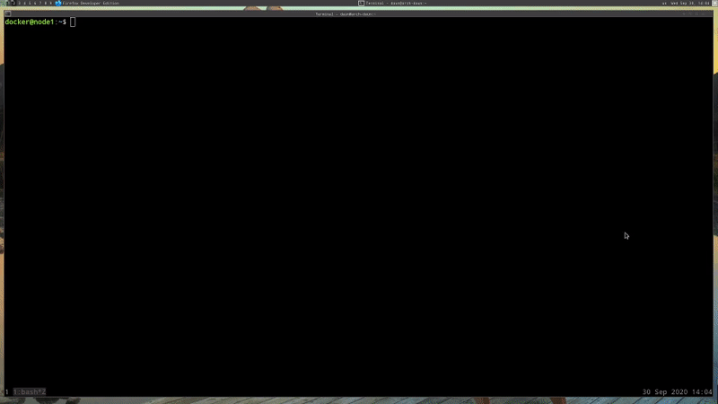

# Swarm Basic Features

## Table of Contents

1. [Scaling Out With Overlay Networking](#scaling-out-with-overlay-networking)
2. [Scaling Out With Routing Mesh](#scaling-out-with-routing-mesh)
3. [Assignment Create Multi-Service App](#assignment-create-multi-service-app)

<br/>

## Scaling Out With Overlay Networking
<br/>


<br/>

Before we expand our `services` to tart running across a bunch of node and all
of the services talking to each other, let's go over a couple of new concepts
that Swarm brings to the table.

The first one is new _networking driver_ called **_Overlay_**, and you really
just create a network with `docker network create` command, and you put in an
option `--driver overlay`. What that's is basically creating a _Swarm-wide
bridge_ network where the containers across hosts on the same virtual network
can access each other kind of like they're on a _VLAN_.

The _overlay_ driver doesn't play a _huge amount in traffic coming inside_, as
it's trying to take a wholistic  Swarm view of the network so that's you're not
constantly messing around with networking setting on individual nodes.

You can also enable full network encryption using **_IPSec_** where it'll will
actually set up IPsec tunnels between all the different nodes of your Swarm.
But it's _off_ by default really just for performance reasons.

When you create your services, you can add them to no Overlay networks, or one
or more Overlay networks. It really depends on the design of your application.
You know a lot of traditional design would have the databases on a _backend
network_ and the Web servers on a _frontend network_. Then maybe you would have
an API between the two that would be on both networks, or something like that;
And you can totally do that in Swarm.

### Jump into Command Action

#### Docker create Postgres service
<br/>


<br/>

What I want to do is I want to show you what it would be like if we deployed the
Drupal example from a previous assignment with the Postgres Database, as
services, and then created an Overlay network for them to talk to each other.

First we need to create a network, so `docker network create` and this hasn't
changed for Swarm other the fact that we're going to use a new driver. I'm just
called `mydrupal`

```bash
Usage:  docker network create [OPTIONS] NETWORK

Create a network

Options:
  -d, --driver string        Driver to manage the Network (default "bridge")

docker@node1: docker network create --driver overlay my drupal

docker@node1: docker network ls
NETWORK ID          NAME                DRIVER              SCOPE
d42e0acfbab5        bridge              bridge              local
4c754bfc3f37        docker_gwbridge     bridge              local
ba69be945f69        host                host                local
slgv4i5f2jdc        ingress             overlay             swarm
rnaclan8j849        mydrupal            overlay             swarm
e41facb30fac        none                null                local
```

The `ingress` one is there by default. You'll also see new one `docker_gwbridge`
because a Swarm, which is actually an outgoing network that we won't need to
mess.

Let's create our Postgres service.

> **NOTE**: Specific Host
>
> We can specific the service run on which node by add the options `--hostname`,
> if not specified the host the service will run in random node

```bash
docker@node1: docker service create --name psql --network mydrupal \
                --hostname node1 -e POSTGRES_PASSWORD=mypass  postgres
overall progress: 1 out of 1 tasks
1/1: running   [==================================================>]
verify: Service converged
```

You'll notice here that we don't get the whole image downloading and all that,
because services can't be run in the foreground, because they have to go through
the orchestrator and scheduler. So, we can do `docker service ls`, and we can
see that one of one of them is running.

```bash
docker@node1: docker service ls
ID                  NAME                MODE                REPLICAS            IMAGE               PORTS
nviq6nwu3wfj        psql                replicated          1/1                 postgres:latest
```

If we do a `docker service ps` on `psql` we can see that this

```bash
@docker@node1: docker service ps psql
ID                  NAME                IMAGE               NODE                DESIRED STATE       CURRENT STATE           ERROR               PORTS
tffvhhhw8zzj        psql.1              postgres:latest     node1               Running             Running 23 seconds ago
```

#### Docker create Drupal service
<br/>


```bash
docker@node1: docker service create --name drupal --network mydrupal \
                --hostname node2 \
                -p 80:80 drupal:8:8.10
```

While, the service created on background we can use a trick to `watch` command
line  in Linux to watch.

```bash
docker@node1: watch docker service ls
```

Basically, what it does it's rerunning a command over and over again. It's
installed by default. Now we can  list the task of the services by run command
`ps` in service, and see that Drupal is actually running on  `node2`.

```bash
docker@node1: docker service ps drupalwatch
ID                  NAME                IMAGE               NODE                DESIRED STATE       CURRENT STATE           ERROR               PORTS
tuuhu5zlzgju        drupal.1            drupal:8.8.10       node2               Running             Running 9 minutes ago
```

We have the database running on `node1`, we have the Drupal website running on
`node2`. The question in my head how they know to talk to each other? Well,
using the _service name_.

So we paste one nodes of the IP addresses, it should come up on the Drupal
install; And if I tell it the **_database host_**, just like when we were with
Compose, we made the service name in the Compose file `docker-compose.yml`, here
we're going to use the _service name_ that was created for database server. So,
that was `psql`,
<br/>


<br/>

So above screen is basically telling us that it's able to talk to database
across the `nodes` and  setup the system.

That's the great thing about _Overlay_ is it really just **_acts like everything
on the same subnet_**.

Note, that Drupal and Postgres running smoothly, but I have three nodes, so how
do I know which node it's going to be on and which port I need to make sure that
my DNS points to when I create this website name?

In my case, I have three local IP addresses on my nodes, and I can copy all
three of them and put all three of those IP addresses in the browser. If you
see, it appears like the website is running on all three nodes because I'm
looking at all three IP addresses. But if I do `docker service ps`

```bash
docker@node1: docker service ps drupal
ID                  NAME                IMAGE               NODE                DESIRED STATE       CURRENT STATE            ERROR               PORTS
tuuhu5zlzgju        drupal.1            drupal:8.8.10       node2               Running             Running 33 minutes ago
```
I know It's running on `node2`. I can do a `docker service inspect`, and see
that indeed it's only got one IP address on that overlay network

```bash
docker@node1: docker service inspect drupal
[
    {
        "Endpoint": {
            "Spec": {
                "Mode": "vip",
                "Ports": [
                    {
                        "Protocol": "tcp",
                        "TargetPort": 80,
                        "PublishedPort": 80,
                        "PublishMode": "ingress"
                    }
                ]
            },
            "Ports": [
                {
                    "Protocol": "tcp",
                    "TargetPort": 80,
                    "PublishedPort": 80,
                    "PublishMode": "ingress"
                }
            ],
            "VirtualIPs": [
                {
                    "NetworkID": "slgv4i5f2jdc7y8fqor8bqhwz",
                    "Addr": "10.0.0.7/24"
                },
                {
                    "NetworkID": "koef15cr8saw05y2dirtz2inn",       >> The ID is point to mydrual network ID
                    "Addr": "10.0.2.5/24"
                }
            ]
        }
    }
]

docker@node1: docker network ls | grep overlay
NETWORK ID          NAME                DRIVER              SCOPE
slgv4i5f2jdc        ingress             overlay             swarm
koef15cr8saw        mydrupal            overlay             swarm
```

So, why is it responding on all three hosts? That lead us to next new features.

**[⬆ back to top](#table-of-contents)**
<br/>
<br/>

## Scaling Out With Routing Mesh
<br/>


<br/>

So that little bit of magic wasn't actually magic. It was the **_Routing
Mesh_**. The Routing Mesh is an _incoming or ingress network that distributed
packets for our service to the task for that service_, because we can have more
that one task.

This actually spans (reach out) all the nodes, and it's using Kernel primitives
that have been around a while actually called [IPVS](#what-is-ipvs). So we're
not talking about fancy new service. We're really just talking about the core
features of the Linux Kernel. What it's really doing here is it's _load
balancing_ across all the nodes and _listening on all the nodes traffic_.

There's a couple of ways we can talk about how this works. The **_first
example_** us from _one container to another_. If our backed system, like say
the database, were increased to _two replicas_, the frontends talking to the
backends, wouldn't actually talk directly to their IP address. They would talk
something called a [VIP](#what-is-vip) or a _Virtual IP_, that Swarm puts in
front of all services. This is a private IP inside the virtual networking of
Swarm, and it ensures that the load is distributed among all the task for
a service.

So if you can imagine if you had a worker role in your application, and it had
10 different containers, you don't have to put a [load balancer](#what-is-load-balancer)
in front of that. This does that for you. When you're talking about traffic from
one service inside your virtual network talking to another service inside your
virtual network.

The **_second example_** example of how the Routing Mesh work is external
traffic coming into your Swarm can actually choose to hit any of this nodes in
your swarm. Any other worker nodes are going to have that _published port open_
and listening for that container's traffic, and then it will reroute that
traffic to the proper container based on its load balancing.

What this means is when you're deploying containers in a Swarm, you're not
supposed to have to care about what server it's on because it might move, right?
If a container fails, and the task is recreated by Swarm, it might put that on
a different node; And you certainly don't want to have to change your firewall
around or your DNS settings to make that container work again.

Th Routing Mesh solves a lot of those problems by allowing our Drupal website on
port `80` to be accessible from any node in the Swarm; And in the background,
it's taking those packets from that server and then routing them to the
container. If it's on a different node, in it'll route it over the virtual
networks. If it's on the same node, it'll just reroute it to the port of that
container; And we didn't have to do anything to enable this. This was all out of
the box.

Let see diagram how it might works.

#### Example-1 Routing Mesh: one container to another
<br/>


<br/>

If I created a new Swarm service, and I told it to have three replicas; And it
created three tasks, with three containers, on three nodes. Inside hat Overlay
network, it's actually creating a virtual IP that's mapped to DNS name of the
service, right? And the service, by default, the DNS name, is the name of the
service. In this case, I created a service called `my-web`, and any other
containers I have in my Overlay networks that need to talk to that service
inside the Swarm, they only have to worry about using the _my-web DNS_.  The
virtual IP properly load bounces the traffic amongst all the tasks in that
service.

This isn't DNS Round-Robin. That's actually a slightly different configuration.
We could enable that if we wanted to. There's an options to use DNS Round-Robin.
The benefits of [VIPs](#what-is-vip) over Round-Robin is that a lot of times our
DNS caches inside our apps prevent us from properly distributing the load.
Rather than fight with our DNS clients in DNS configuration, we're just relying
on the VIP, which is kind of like you would have if you bought a dedicated
hardware load balancer.

#### Example-2 Routing-Mesh: Working with external traffic
<br/>


<br/>

In second example, this actually showing what if would be like with external
traffic coming in. This is similar to what we just did with Drupal, where when
I created those yellow boxes, by creating on service, called _my-web_, and it
created two tasks, and applied them to two different nodes, each one of those
nodes has a built-in load balancer on the external IP address. For me, because
I'm using DigitalOcean, that IP address is the one that DigitalOcean gave me.

When I use `-p` and published it on a port, in this example it's using port
`80:80`, any traffic that comes in to any of these three nodes hits that load
balancer on port `80:80`. The load balancer decides which container should get
the traffic and whether or not that traffic on the local node, or it needs to
send the traffic over the network to the different node.

Again, this actually all happens in the background without any special effort on
your part.

### Jump into Command Action
<br/>


All right. Let's see this Routing Mesh in action. We already saw the example
with Drupal and how it listens on all three nodes. But what if we had multiple
tasks that see that load balancer working.

If we do `docker service create`, and we use Elasticsearch container.

```bash
docker@node1: docker service create --name search --replicas 3 -p 9200:9200 elasticsearch:2
```

While the service is creating, I'll just mention that Elasticsearch is actually
a search database that's accessible via a JSON web API. So it's really easy to
hit which `curl` and give us good examples of how this works.

I do a `docker service ps search`

```bash
docker@node1: docker service ps search
ID                  NAME                IMAGE               NODE                DESIRED STATE       CURRENT STATE            ERROR               PORTS
xiw6cpgx9ju5        search.1            elasticsearch:2     node3               Running             Running 56 seconds ago
qsm84uflkp8s        search.2            elasticsearch:2     node2               Running             Running 36 seconds ago
gb597wwvib6a        search.3            elasticsearch:2     node1               Running             Running 43 seconds ago
```

It's smartly created each task on a different node. If I just do a `curl` on my
`localhost`, on `node1` on port `9200` because I published that port

```bash
docker@node1:~$ curl localhost:9200
{
  "name" : "Timeslip",
  "cluster_name" : "elasticsearch",
  "cluster_uuid" : "4zf-MahqS1qYjgkrmeAVFw",
  "version" : {
    "number" : "2.4.6",
    "build_hash" : "5376dca9f70f3abef96a77f4bb22720ace8240fd",
    "build_timestamp" : "2017-07-18T12:17:44Z",
    "build_snapshot" : false,
    "lucene_version" : "5.5.4"
  },
  "tagline" : "You Know, for Search"
}
```

I'll get back the Elasticsearch basic information. Part of that is it will
actually create a random `name` that just a feature out of Elasticsearch. If you
`curl` several times then you can get  a random `name`, and then it'll start
repeating itself  like such. That's actually he virtual IP acting as a load
balancer and distributing my load across the three tasks.

### Note on Routing Mesh

In `17.03`, which is the release that I'm, showing you this on, the Routing Mesh
and the load balancing are currently stateless load balancer. If you've ever
dealt with State inside of maybe Amazon's classic load balancer, or other load
balancer technologies, you know what this is about. This is basically saying
that if you have to use session cookies on your application, or it expects
a consistent container to be talking to a consistent client, then you may need
to add other things to help solve that problem.

Out of the box, every time you hit a service with multiple tasks, it's going to
give you potentially a different result.

Also, if you get into the details of this, it's actually a layer-3 load
balancer, and that actually operates at the IP and port layer. It doesn't
actually operate the DNS layer.

If you've have ever run multiple websites on the same port, on the same server,
this isn't going to do that yet. You're still going to need another piece of the
puzzle on top of that if you're actually wanting to run multiple websites on the
same port, on the same Swarm.

Luckily, that's a pretty common request, and there's several options you can do
to solve both on these problems. One of them to use Nginx or HAProxy, which
there are pretty good examples out there of containers that will sit in front
with your Routing Mesh, and actually act as a stateful load balancer or a layer
for load balancer, that can also do caching and lots of other things. If you
need that,you might want to check of those out in the resources of this section.

I should also mention that if you were o pay for a subscription of Docker
Enterprise edition, with it comes somethings called UCP or Docker Data Center,
which is a web interface. But I should mention that Docker Enterprise edition,
If you get a subscription to that for your Swarm nodes, it actually comes with
a built-in layer for _web-proxy_ that allows you to just throw DNS names in the
_web config_ of our Swarm services and everything just works.

### Miscellaneous

#### What is IPVS

IPVS (IP Virtual Server) implements transport-layer load balancing, usually
called Layer 4 LAN switching, as part of the Linux kernel.It's configured via
the user-space utility tool.. IPVS is incorporated into the Linux Virtual Server
(LVS), where it runs on a host and acts as a load balancer in front of a cluster
of real servers. IPVS can direct requests for TCP- and UDP-based services to the
...  [wiki](http://en.wikipedia.org/wiki/IP_Virtual_Server)

Controls how ipvs will deal with connections that are detected port reuse. It is
a bitmap, with the values being: 0: disable any special handling on port reuse.
The new connection will be delivered to the same real server that was servicing
the previous connection. This will effectively disable expire_nodest_conn...
[kernel.org](http://www.kernel.org/doc/html/latest/networking/ipvs-sysctl.html)

#### What is VIP

Virtual IP address - Wikipedia A virtual IP address (VIP or VIPA) is an IP
address that doesn't correspond to an actual physical network interface. Uses
for VIPs include network address translation (especially, one-to-many NAT)...
[wiki](http://en.wikipedia.org/wiki/Virtual_IP_address)

#### What is load balancer

Load balancing is defined as the methodical and efficient distribution of
network or application traffic across multiple servers in a server farm. Each
load balancer sits between client devices and backend servers, receiving and
then distributing incoming requests to any available server capable of
fulfilling them.  [citrix](http://www.citrix.com/glossary/load-balancing.html)

Load balancing techniques can optimize the response time for each task, avoiding
unevenly overloading compute nodes while other compute nodes are left idle. Load
balancing is the subject of research in the field of parallel computers. Two
main approaches exist: static algorithms, which do not take into account the
state of the different ...
[wiki](http://en.wikipedia.org/wiki/Load_balancing_(computing))

A load balancer is a device that acts as a reverse proxy and distributes network
or application traffic across a number of servers. Load balancers are used to
increase capacity (concurrent users) and reliability of applications.
[source](http://www.f5.com/services/resources/glossary/load-balancer)


**[⬆ back to top](#table-of-contents)**
<br/>
<br/>


## Assignment Create Multi-Service App
<br/>


<br/>

All right, now that we've learned all about _Swarm scaling_ with _Overlay
networking_ and _Routing Mesh_, I want you to actually go through the process of
creating the **_assests_**, or the **_object_**, that you need to deploy in
a Swarm scenario. So we're no longer using the `docker run` command, but the
`networking` and the `volumes` are kind of the same but slightly different.

I want to give you real-world scenario of a _multi-tier app_, and we're going
o use Docker's Distributed Voting App. It's actually called the Example Voting
App. You might have seen it in Docker keynotes, or in other labs or tutorials.
It's pretty common, and I think, a great app, because it's got at least _five
roles_ to it, or different containers that you need to deploy; And they all
server a special function and they're actually doing stuff that actually works,
actually does what it's supposed to do; And so you can play with it and it has
very typical, distributed architecture components like the _web frontend_ and
the _worker backend_, and the _key value in database_. I think it's really
helpful to do.

In this case, you're going to use the directory [swarm-app-1](./swarm-app-1).
In that directory is nothing but [README.md](./swarm-app-1/README.md) and an
image. Form that README, you're going need to create the _volume_ and a couple
of _networks_ and _five services_ that are needed for this app to fully
function.

It may help you to try some of these commands locally, or actually write them in
your text editor and sort of compose them, because they are going to be little
complex, right. When you do that `docker service create`, you're going to have
to connect it to a _specific network_, and open up _ports_, and call it
a _specific name_, and use a _specific image_.

So, i might be easier to edit it locally and then just cut and paste into your
shell, wherever Swarm is at. But that's just me.

Everything is going to use Docker Hub images because in the _production Swarm you
don't want to be building_. That's not a process you want on your production
Swarm, typically. Usually yo want to do your building either through some
automated online service like Docker Hub or Docker Cloud, or somewhere in your
CI/CD pipeline that's net eating resources on your production Swarm.

In this scenario, we can imagine that our images are being built elsewhere and
stored on Docker Hub and we just need to pull those down, whatever the latest
version are, into our Swarm.

I'll just say this, like many things in Computer Science, this is _one-half
science_, _one-half art form_. Your commands could be in totally different
orders, or have totally different option order that mine. You might called your
networks different things. That fine.

At the end result is that the application is works, that they're able to talk to
each other in the proper way, that you've got all the _ports published_ and that
you've got the _data protected in a volume_. Let's take a quick look at what
you're up against.

### App Structure Design
<br/>


<br/>

Imagine you're having to design the commands and the architecture for this. And
this is what the developer would give to you that wrote this app. Well in this
case, it's probably lots of developers that wrote this app, right? Because we've
actually got a _web fronted_ that in Python we've got a _web backend_ that
running in NodeJS. We've got a _worker process_ that running in .NET and then
we've got a _Redis key value store_ and a _PostgreSQL database_.

This is actually something I see more and more often, where different teams are
writing different parts of a solution, and they're able to just pick the
language that they think is best for that scenario; And in the world of
containers, this kind of application really shines. Because our applications are
all segmented, they can still technically run on the same machine but they're
all protected from each other so that you don't end up with NodeJS conflicting
with dependencies on Python or whatever.

You'll also notice here the traffic flow, and the Voting-App doesn't have it,
but it should have a little arrow coming in that, this is where the users would
be coming in on the Voting-App part; And you can see that the Voting-App
actually has to push your votes for this application which, by the way, you're
going to be voting for cats and dogs. It'll be pushing that into Redis and then
the _worker_ will actually be checking the Redis system for anything in the
queue and then be pushing the result into Postgres which will then be shown on
a Websockets backend that's actually live-updating as you're voting.

If we jump into the Directory real  quick I've put some notes in here to help
you along the way because there's a few things that are a little different and
new. But the _services area_ would be kind of written like it was from someone
who knew their application but didn't know actually how to implement this in
Docker; And that's a pretty common scenario.

You can see that in the _services_ I've listed which image you need to deploy,
the actual name that you need to give it, because those are important. These are
images that are, unfortunately, hard coded for what names they are going to look
for on the network. Ideally you'd want applications that you could configure on
the fly for what they need to do for names, but, in this case, Vote is going to
specifically look for a DNS record called Redis.

You can see that there's actually _two networks_ here. We have a _frontend_ and
_backend_ network. That's pretty typical, also of a larger application where you
maybe want to protect your database on a backend network so that the frontend
user app doesn't have direct answer to it; And that's we are showing here and
you'll notice that the _worker actually is connected to two networks_. So when
you use your `create` command, remember you're using `docker service create` not
`docker run`. So when you using your `docker service create` command you're
going to need to specify the `--network` option _twice_, once for the frontend,
and once for the backend.

_Obviously you know yo create your networks first_. So some of hint has
specified at the top of README document; And if you need the image again the
architecture diagram is also in in the folder, just in case that helps
conceptually with how you're doing to deploy this; And, of course, you're going
to have the Docker documentation. You might need to use the `--help` on `service
create` command that will give you all the various options that you might need.
You only are going to need three or four of those.

Again, if you get stuck with the commands themselves, you might want to review
the actual documentation, which I will put into the resources of this section.
But this particular document under Swarm actually goes into creating _services_
and _configuring services_. So it's a little wordy, but it's got a lot of
information in it that might help you if you get stuck in here.

The next video I will actually run through this whole thing myself as if I was
you. Good luck and have some fun.

### Jump into Code
<br/>


If you remember, I have 3-node Swarm over my docker-machine. If I do `docker
node ls` on my active Swarm,

```bash
docker@node1:~$ docker node ls
ID                            HOSTNAME            STATUS              AVAILABILITY        MANAGER STATUS      ENGINE VERSION
mga3wcytmusekjwv5u6pmhmia *   node1               Ready               Active              Leader              19.03.12
q0pelzp2traxthj72qf466e3q     node2               Ready               Active              Reachable           19.03.12
sb3c4n3pugai216rldhvcgruy     node3               Ready               Active              Reachable           19.03.12
```

You'll see that I have three node here. They're all manager node.

```bash
docker@node1:~$ docker container ps -a
CONTAINER ID        IMAGE               COMMAND             CREATED             STATUS              PORTS               NAMES

docker@node1:~$ docker service ls
ID                  NAME                MODE                REPLICAS            IMAGE               PORTS
```

I have no `containers` running, and `services`, obviously.

I'm actually going to type the command in [README.md](./swarm-app-1/README.md)
on the fly, because that seems like a logical place for me to do it; And then
I'll cut and paste them into Swarm terminal.

#### Create network

First thing, I know up at the top, it talks about I need networks, and I need
volume. So probably ca get the networks out of the way and I can probably wing
that.

```bash
docker@node1: docker network create -d overlay backend

docker@node1: docker network create -d overlay frontend
```

There's nothing inherently special about these two networks. We're just to
segment our different services into one the other to help act like a little
firewall that gives separation for protection.

#### Vote-App

On this Vote-app I know I need to do a `docker service create`, and I've got to
_name_ it, so it might well put name `vote`; And then I've got to _pulish_ the
_port_ to `80:80` in the container, and it's got to be on a specific _network_.
So, network `frontend`, I need two `--replicas` with copy and paste the image.

```bash
docker@nod1: docker service create --name vote -p 80:80 --network frontend --replicas 2 bretfisher/examplevotingapp_vote
```
Now, I'm going to go ahead and create all of these before I actually deploy them.

#### Redis

We just copy and paste and change the name and we do not need _two repilcas_.
Just because I need only one replicas I don't actually have to specify replica.

```bash
docker@node1: docker service create --name redis -p 80:80 --network frontend redis:3.2
```

#### Worker

We create a worker, is going to be on _two networks_, I've got to do `--network
frontend` and `--network backend`, and same as Redis I just need one replicas
and I don't specify any _ports_. and copy the image.

```bash
docker@node1: docker service create --name worker --network frontend --network backend bretfisher/examplevotingapp_worker:java
```

#### Postgres Database

Here's the thing about the `volume`. The `-v` command is not compatible with
`docker service`. Because, for various reasons, services are going to be more
complex that maybe your typical `docker run` command; And there were problem and
limitation with the `-v` back in the day.

So Docker has learned from that and improved the format. But it happens to be
a little bit more verbose and maybe a little bit more difficult to remember the
format starting out. It also happens to be not well documented yet in the Docker
Documentation because it's less than a year old as a command since this lecture
was build on top of that command.

```bash
Usage:  docker service create [OPTIONS] IMAGE [COMMAND] [ARG...]

Create a new service

Options:
--mount mount                        Attach a filesystem mount to the service

docker@node1: docker service create --name db --network backend \
        -e POSTGRES_HOST_AUTH_METHOD=trust \
        --mount type=volume,source=db-data,target=/var/lib/postgresql/data \
        postgres:9.4
```

If it doesn't make sense to you, basically, it's this list of values that are
all a part of a single `mount` command  and the minimum are `type=`, `source=`,
`target=`. There's also other things you can add on, but these are only three we
need in this scenario.

You can see my `source=` is just a _named volume_ because I don't have any
slashed `\` in it; And if we had slashes it would have been a _bind mount_ and
we would have to had specified a different type.

#### Result

The last we create Result app,

```bash
docker@node1: docker service create --name result --network backend -p 5001:80 bretfisher/examplevotingapp_result
```

We publish the port to use `5001` to port `80` in the container. I only need to
run one of them. By the way, the only reason we're run one of these is actually
a little known issue on this app, is that this is actually using _WebSockets_,
and Websockets are something that require a _persistent connection_.

So, in the Routing Mesh, doesn't really do a Websockets well yet because it's
going to keep switching you back and forth between containers and that
Websockets needs to be to a specific container persistently. So, with this app
we should have really, is a _proxy_ in front of it but it's not in this app yet,
so probably in a later version they'll update it and fix it so that we have
a proxy. That way it can be redundant.

#### Run the app on the browser
<br/>


<br/>

```bash
docker@node1:~$ docker service ps worker
ID                  NAME                IMAGE                                     NODE                DESIRED STATE       CURRENT STATE                ERROR                       PORTS
19ye38axxlsy        worker.1            bretfisher/examplevotingapp_worker:java   node3               Running             Running about a minute ago
j6h3uprk6pdg         \_ worker.1        bretfisher/examplevotingapp_worker:java   node3               Shutdown            Failed about a minute ago    "task: non-zero exit (1)"

docker@node1:~$ docker service logs worker
worker.1.j6h3uprk6pdg@node3    | Connected to redis
worker.1.j6h3uprk6pdg@node3    | Connected to db
worker.1.j6h3uprk6pdg@node3    | Watching vote queue
worker.1.j6h3uprk6pdg@node3    | Processing vote for 'a' by '843df81e9620dc68'
worker.1.j6h3uprk6pdg@node3    | org.postgresql.util.PSQLException: This connection has been closed.
worker.1.j6h3uprk6pdg@node3    |        at org.postgresql.jdbc2.AbstractJdbc2Connection.checkClosed(AbstractJdbc2Connection.java:820)
worker.1.j6h3uprk6pdg@node3    |        at org.postgresql.jdbc3.AbstractJdbc3Connection.prepareStatement(AbstractJdbc3Connection.java:275)
worker.1.j6h3uprk6pdg@node3    |        at org.postgresql.jdbc2.AbstractJdbc2Connection.prepareStatement(AbstractJdbc2Connection.java:293)
worker.1.j6h3uprk6pdg@node3    |        at worker.Worker.updateVote(Worker.java:40)
worker.1.j6h3uprk6pdg@node3    |        at worker.Worker.main(Worker.java:23)
worker.1.19ye38axxlsy@node3    | Connected to redis
worker.1.19ye38axxlsy@node3    | Connected to db
worker.1.19ye38axxlsy@node3    | Watching vote queue
worker.1.19ye38axxlsy@node3    | Processing vote for 'b' by '843df81e9620dc68'
worker.1.19ye38axxlsy@node3    | Processing vote for 'a' by '843df81e9620dc68'
worker.1.19ye38axxlsy@node3    | Processing vote for 'a' by '843df81e9620dc68'
```

You might be seeing the error on `worker` service and you're thinking, I don't
know why is that happening?  So we look at that log. There's two different
workerID. `j6h3uprk6pdg@node3` and `19ye38axxlsy@node3`. It says "task: non-zero
exit (1)". So what this basically means is, I created a service that was not
exist because I hadn't created the other service yet; And it did the thing it's
supposed to do in Dockerland, which is when it has an error, the app should
crash because Docker can actually _restart and redeploy _ properly untill the
apps_ don't crash; And soon as I get all my services launched, everything
stopped crashing and everything now works.

**[⬆ back to top](#table-of-contents)**
<br/>
<br/>

