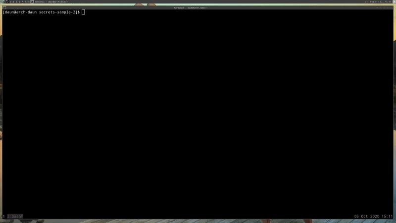
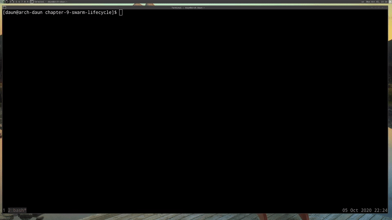
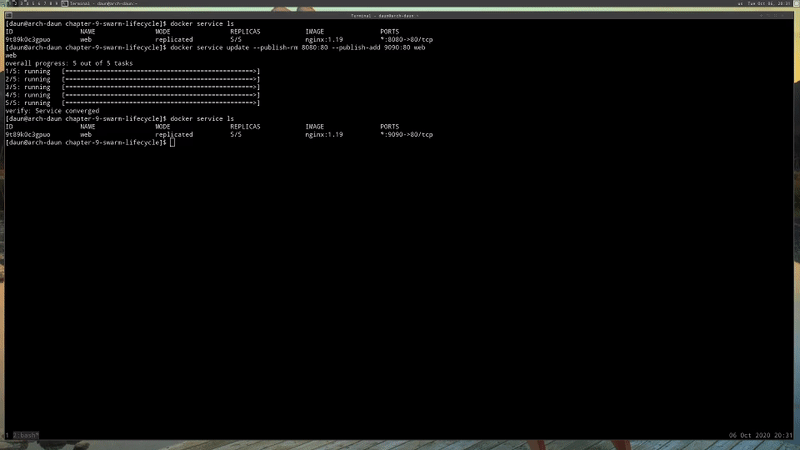

# Swarm Lifecycle

## Table of Contents
1. [Using Secrets with Local Docker Compose](#using-secrets-with-local-docker-compose)
2. [Full App Lifecycle with Compose](#full-app-lifecycle-with-compose)
3. [Service Update Change Swarm app Lifecycle](#service-update-change-swarm-app-lifecycle)

<br/>

## Using Secrets with Local Docker Compose

What about secrets for local development using the Docker Compose command line.
We've been talking about Swarm up until now. But I'm back on my machine, and
I've got Docker Compose installed which I did not have in my Swarm, right?
Because again, **_Compose is not a production tools_**. It's designed for
development.

I'm in the [secrets-sample-2](./secrets-sample-2), You can see that I have two
password files, and the Docker Compose file that had in the Swarm. Just to prove
that I'm not in a Swarm,

```bash
$: docker node ls
Error response from daemon: This node is not a swarm manager.
 Use "docker swarm init" or "docker swarm join" to connect this node to swarm and try again.
```

So I don't have access to the Swarm database or the ability to put secret in it.
So, how do we deal with this in local development? Ideally, we can still use the
same Compose file. We can use the same objects like the environment variables
for Postgres. Docker had to come up with a way to make this work in test and
dev.
<br/>


<br/>

If we do, `docker-compose up -d` , and then we did `docker-compose exec pqsl`.
then did a `cat` on `/run/secrets/psql_user`

```bash
$;docker-compose up -d

$ docker-compose exc psql cat /run/secrets/psql_user
```

How did our secret get in there, right? Because we don't have the database.
Well, it turns out there's a little bit of magic here.

Well it's not magic. It's just hiding behind the scenes, that what's actually
happening with Compose is **_not secure_**, but it does work. It basically bind
mounts at runtime that actual file on my hard drive into the container. It's
really just doing `-v` with that particular file in the background.

**_Again, this is totally not secure and it's not supposed to be_**. It's just
a way to get around this problem and allow us to develop with the same process
and the same environment variable secret information that we would have in
production, only now we can do it locally to.

Which is great because now that means now that means we can develop using the
same _launch script_ and the same way we get environment variables into our
container just like we would in Swarm; And that just what we really want. We
want to match our production environment as much as we possibly can locally.

You need the latest Docker Compose to do this. I believe it only works in Docker
Compose `11`.

I hope you think that's pretty cool because I thought that was a good compromise
for them to make in order to let us use the Secrets commands.

Now I will point out this works only with **_file-based secrets_**. It will not
work with the external that we talked about.

If we look at the Compose file real quick,

```yaml
version: "3.1"

services:
  psql:
    image: postgres
    secrets:
      - psql_user
      - psql_password
    environment:
      POSTGRES_PASSWORD_FILE: /run/secrets/psql_password
      POSTGRES_USER_FILE: /run/secrets/psql_user

secrets:
  psql_user:
    file: ./psql_user.txt
  psql_password:
    file: ./psql_password.txt
```

I would have to use _file-based_ ones for my local development. Maybe if you're
using external in your production you just might have to have a different
Compose file for development that would have the _file_ attribute and specify
_sample_, dummy file in the same directory or somewhere else you might store
them, that are just using simple password for development.

**[⬆ back to top](#table-of-contents)**
<br/>
<br/>

## Full App Lifecycle with Compose
<br/>


<br/>

In this section, we've covered a lot about Swarm. Swarm, Stacks, and Secrets are
kind of like a trilogy of awesome features that can really make things much
easier in production for us. I want to show you what it might be like if you
actually took your Compose file, organize them in a couple of ways, and this is
what I basically call living the dream.

It turns out you can actually use a single file to do a lo of things, but
sometimes your complexity grows and you're going to need multiple Compose file.

I want just run through real quick. You don't actually have to do this yourself
if you don't want to. I'm just going to show you an example of how these Compose
files might work together to build up your environment as you go.

In this scenario, we're going to use `docker-compose up` for our local
development environment.

We're going to use a `docker-compose up` config and file for our CI environment
to do integration testing.

Then when we're in production, we're going to use those file for `docker stack
deploy` to actually deploy the production environment with a stack.

So, I'm on my local machine and we're going to be using the
[swarm-stack-3](./swarm-stack-3) example before of the Drupal scenario, with
a database server, and web frontend. We have the Dockerfile we have used in our
previous assignments. We're rebuilding a custom, yet simple, Drupal config with
a template.

### Multiple Compose File

We're going to have this default Compose file
[docker-compose](./swarm-stack-3/docker-compose.yml)

```yaml
version: '3.1'

services:

  drupal:
    image: custom-drupal:latest

  postgres:
    image: postgres:12.1
```

This is called _override_, what we're about to do.  An override is where I have
the standard Docker Compose file `docker-compose.yml`, and it sets the defaults
that are the same across all my environments.

> **_By defaults_**, Compose _read two files_, a `docker-compose.yml` and am
> optional `docker-compose.override.yml` File **_by convention_**. the
> `docker-compose.yml` contains your base configuration. The `override.yml`
> file, as its name implies, can contain configuration overrides for existing
> services or entirely new services.
> [source](https://raw.githubusercontent.com/docker/compose/1.27.4/contrib/completion/bash/docker-compose)

Then I have this override files `override.yml` named by default, Docker Compose,
if it's named this exact name,
[docker-compose.override.yml](./swarm-stack-3/docker-compose.override.yml), it
will automatically bring this in whenever I do a `docker-compose up`

```yaml
version: '3.1'

services:

  drupal:           # No image name
    build: .
    ports:
      - "8080:80"
    volumes:
      - drupal-modules:/var/www/html/modules
      - drupal-profiles:/var/www/html/profiles
      - drupal-sites:/var/www/html/sites
      - ./themes:/var/www/html/themes

  postgres:         # No image name
    environment:
      - POSTGRES_PASSWORD_FILE=/run/secrets/psql-pw
    secrets:
      - psql-pw
    volumes:
      - drupal-data:/var/lib/postgresql/data

volumes:
  drupal-data:
  drupal-modules:
  drupal-profiles:
  drupal-sites:
  drupal-themes:

secrets:
  psql-pw:
    file: psql-fake-password.txt
```

You'll see that in this scenario, we're assuming _local development_ because we
really want the hand-typed command we're going to type to be easiest locally.
Normally in your CI environment, it's all automated so we don't really care if
those commands are a little bit longer.  But we really want locally, is the easy
`docker-compose up`.

The cool thing is Docker Compose will read this file automatically and it will
apply this over _top_, or _override_, any settings in the Docker Compose YAML
file.

So here notice I don't have the _image name_, because that's already specified
over [docker-compose.yml](./swarm-stack-3/docker-compose.yml); And this override
file, I override by saying 'I want to build (`build: .`) the image locally using
the Dockerfile in this current directory'. I want to create a port on `8080` for
local development; And I'm setting up some `volumes`, and you'll even notice
I gave you an example here of a **_bind mount_**,

```yaml
volumes:
    - ./themes:/var/www/html/themes
```

Where I might be doing a custom theme; And I want to mount my theme on my host
into the container like we did in previous sections, so that I can change it
locally and then see it right away on the server.

By the way, for this example, I don't actually know how to develop themes in
Drupal. I'm not exactly sure that if I change a file in there, it will
automatically be reflected. I just want to show an example of how when you're
doing development in web, typically this is the way you would do it without
having to stop and start the Compose every time.

Down here, under Postgres, we have the `environment` variable and the `secrets`
setting like before. We have the defined `volumes`, and you'll see at the bottom
I actually have the _file-based_ secrets because when we're doing local
development, _we have to use the file-based secrets_.

Things get a little interesting when I look at
[docker-compose.prod.yml](./swarm-stack-3/docker-compose.prod.yml), or
[docker-compose.test.yml](./swarm-stack-3/docker-compose.test.yml). The way this
is going to work is, remember that the `.override.yaml` automatically gets
picked up by the Docker Compose command line. In prod or test, I'm going to
specify them manually.

So for the test we're going to use `-f` command. If you remember from earlier
sections, the `-f` is when we do a `docker-compose` that we want to specify
a custom file. I'll show you that in a minute.

Then in production, since we're not going to actually have the Docker Compose
command line on a production server, what we're going to do here is we're
actually going to use a `docker compose` config command. The config command is
actually going to do an output by squishing together, or combining, the output
of multiple config files. So that will be really cool.

Real quick, the
[docker-compose.test.yml](./swarm-stack-3/docker-compose.test.yml) file just has
the Drupal and the Postgres. Imagine if this was your Jenkins CI or Codeship CI
solution, where I want it to build the image every time I commit my code, and
I want to call it this file, and I want to be on this port `80:80` for testing
purposes. Then I'm going to use
a [psql-fake-password.txt](./swarm-stack-3/psql-fake-password.txt) . But I don't
need to define of the volumes because I'm not going to actually try to keep
named volume data because again, it's just a CI platform. As soon as it passes
test or fails tests, it'll get rid of everything.

Then in this scenario, you might see that I've actually got this sample data
scenario
```yaml
postgres:
    volumes:
        - ./sample/data:/var/lib/posrgresql/data
```
Where maybe in your CI solution, you have simply database sitting there that
come from either a custom Git repository or maybe they're an FTP download; Or
something happens during the initialization of your CI where it actually
download a database file; And instead of us having to create our database every
single time we do CI testing, we would just mount this directory of sample data
into where our Postgres data is suppose to be; And that way, we could guarantee
we had the same sample data every single time we do a CI test.

I'm not going to go into any further. I just wanted to show hat might be how
this file for CI would be different.

Then in production
[docker-compose.prod.yml](./swarm-stack-3/docker-compose.prod.yml), we have all
of our normal production concerns.

```yaml
version: '3.1'

services:

  drupal:
    ports:
      - "80:80"
    volumes:
      - drupal-modules:/var/www/html/modules
      - drupal-profiles:/var/www/html/profiles
      - drupal-sites:/var/www/html/sites
      - drupal-themes:/var/www/html/themes

  postgres:
    environment:
      - POSTGRES_PASSWORD_FILE=/run/secrets/psql-pw
    secrets:
      - psql-pw
    volumes:
      - drupal-data:/var/lib/postgresql/data

volumes:
  drupal-data:
  drupal-modules:
  drupal-profiles:
  drupal-sites:
  drupal-themes:

secrets:
  psql-pw:
    external: true
```

We're specifying `volumes` for our specific data. We're specifying our `secret`;
And notice down at the bottom, we have the `external secret`. Because we're
going to have put the secret in already via the command line like we did
earlier assignment.

The point here is all three of these configs are different on some way, but they
all relate to the core config, or base config, which just defines the two
services and their images (docker-compose.yaml).

### Jump into command

#### Default Compose and Override YAML file
<br/>


<br/>

If you're in the [swarm-stack-3](./swarm-stack-3) directory, you'll see that
I have the base file, and then the three override files. Again remember, that
the `override.yml` is the default.

If I do a `docker compose up`, what it will actually do here is use the
_docker-compose.yml_ first, and then it will overlay the
_docker-compose.override.yml_ one on top. I want to put `-d` in so we can take
a quick look after is started.

```bash
swarm-stack-3$: docker-compose up -d

Creating network "swarm-stack-3_default" with the default driver
Creating volume "swarm-stack-3_drupal-data" with default driver
Creating volume "swarm-stack-3_drupal-modules" with default driver
Creating volume "swarm-stack-3_drupal-profiles" with default driver
Creating volume "swarm-stack-3_drupal-sites" with default driver
Creating volume "swarm-stack-3_drupal-themes" with default driver
Creating swarm-stack-3_postgres_1 ... done
Creating swarm-stack-3_drupal_1   ... done
```

I'm going to do a `docker inpsect` on the Drupal image,

```bash
$: docker inpsect swarmstack3_drupal_1
...
...

        "Mounts": [
            {
                "Type": "volume",
                "Name": "swarm-stack-3_drupal-profiles",
                "Source": "/var/lib/docker/volumes/swarm-stack-3_drupal-profiles/_data",
                "Destination": "/var/www/html/profiles",
                "Driver": "local",
                "Mode": "rw",
                "RW": true,
                "Propagation": ""
            },
            {
                "Type": "bind",
                "Source": "/home/daun/Project/docker/docker-mastery-the-complete-toolset/chapter-9-swarm-lifecycle/swarm-stack-3/themes",
                "Destination": "/var/www/html/themes",
                "Mode": "rw",
                "RW": true,
                "Propagation": "rprivate"
            },
            {
                "Type": "volume",
                "Name": "swarm-stack-3_drupal-sites",
                "Source": "/var/lib/docker/volumes/swarm-stack-3_drupal-sites/_data",
                "Destination": "/var/www/html/sites",
                "Driver": "local",
                "Mode": "rw",
                "RW": true,
                "Propagation": ""
            },
            {
                "Type": "volume",
                "Name": "swarm-stack-3_drupal-modules",
                "Source": "/var/lib/docker/volumes/swarm-stack-3_drupal-modules/_data",
                "Destination": "/var/www/html/modules",
                "Driver": "local",
                "Mode": "rw",
                "RW": true,
                "Propagation": ""
            }
        ],
...
...
```

What I want to show you was in here, it's got all the `Mounts` listed. So we
know that **_it took the override file_** because the override file was where
defined all of these `Mounts`. So we know that it picked that up.

Obviously, if it didn't pick up the base one, it wouldn't even know what images
to use so it would actually be complaining to us and saying that the _Compose
file was incomplete_.

#### Working with CI solution
<br/>


<br/>

If we were going to actually do the command we needed for our CI solution, what
we would have to do on our CI solution was to make sure that Docker Compose was
there, and installed, and available so that we could do `docker-compose`
command. Then we specify `-f` and the order of the `-f` is the **_base file always
needs to be first_**.

```bash
$: docker-compose -f docker-compose.yml -f docker-compose.test.yml up -d
Creating network "swarm-stack-3_default" with the default driver
Creating swarm-stack-3_drupal_1   ... done
Creating swarm-stack-3_postgres_1 ... done
```

Then I went and inspected that same Drupal, you will notice that there's no
**_bind `Mounts`_**

```bash
...
...
    "Mounts": [],
....
....
```

They're completely missing because in the test file, we didn't specify those. We
didn't actually need Drupal to save information because it was going to be
thrown away at the end of our CI run.

#### Working with Production Compose file
<br/>


<br/>

The third, we have the production config. The production config is going to be
a little bit different. I run the command,

```bash
$: docker-compose config --help
Validate and view the Compose file.

Usage: config [options]

Options:
    --resolve-image-digests  Pin image tags to digests.
    --no-interpolate         Don't interpolate environment variables.
    -q, --quiet              Only validate the configuration, don't print
                             anything.
    --services               Print the service names, one per line.
    --volumes                Print the volume names, one per line.
    --hash="*"               Print the service config hash, one per line.
                             Set "service1,service2" for a list of specified services
                             or use the wildcard symbol to display all services.
```

Instead I'm use `up` command, what I want to do here is `config`. If you just
look at the help real fast for `config` options command, it has several options.
What we want just do is just run `config` by itself.

```bash
$: docker-compose -f docker-compose.yml -f docker-compose.test.yml config
secrets:
  psql-pw:
    external: true
    name: psql-pw
services:
  drupal:
    image: custom-drupal:latest
    ports:
    - 80:80/tcp
    volumes:
    - drupal-modules:/var/www/html/modules:rw
    - drupal-profiles:/var/www/html/profiles:rw
    - drupal-sites:/var/www/html/sites:rw
    - drupal-themes:/var/www/html/themes:rw
  postgres:
    environment:
      POSTGRES_PASSWORD_FILE: /run/secrets/psql-pw
    image: postgres:12.1
    secrets:
    - source: psql-pw
    volumes:
    - drupal-data:/var/lib/postgresql/data:rw
version: '3.1'
volumes:
  drupal-data: {}
  drupal-modules: {}
  drupal-profiles: {}
  drupal-sites: {}
  drupal-themes: {}
```

What it's going to actually do is look at both files and push them together into
a single Compose file equivalent.

So what we could do here is just run this command somewhere in our CI solution.
Then have it output a file, maybe with you know, something like
`output-ci-prod.yml`. That  output file would be use officially in production to
create or update our stack.

```bash
$: docker-compose -f docker-compose.yml -f docker-compose.test.yml config > output-ci-prod.yml
```

### Caveats

However, I want to throw in a little caveat here. This is all relatively new
stuff. We know the Secrets and Swarm Stack are relatively new. They're only
a couple of months old as this videos I'm recording.

So there's a couple of rough edges. We just ran that `config` command, and
you'll actually notice that the `secrets` weren't listed in there. That's a bug
currently. I'm actually working with the Docker team to see if we can't squash
that bug. So by the time you read this, it may have already been fixed. Make
sure you inspect that output of the config line before you go deploying in
production.

Secondly, the Compose `extends` option, which I did not discuss here, is another
way to override these Compose file where you actually use the override file and
you actually define an extends section in there. It's a little bit more
declarative, so it's easier to understand. I'll provide a link in the
references for this section. Just know that `extends` options doesn't yet work
in Swarms Stacks.

I didn't mention it here because it doesn't really give you the full app
lifecycle that were hoping for, but I do expect them at some point to do
something about that. Like either add it into Swarm or create a better workflow.
Because that's really the idea we're trying to get to with all of these tools,
is to have a complete and easy lifecycle from development all the way through
test, into production, with the same set of configuration, in the same images.

I hoe this got you thinking about how you might make your apps this way, and how
you might extend your own Compose files for complex scenario.

#### References

- [Use Compose In Production](https://docs.docker.com/compose/production/)
- [Use Multiple compose Files](https://docs.docker.com/compose/extends/#multiple-compose-files)

**[⬆ back to top](#table-of-contents)**
<br/>
<br/>

## Service Update Change Swarm app Lifecycle

Service updates. You've probably assumed all long that there's some way to
update your service even though we haven't been focusing on that yet. Let's talk
about it because updates has a whole lot of stuff going on under the covers.

Swarm's update functionality is centered around a rolling update pattern for
your replicas. Which means if you have a service with more than one replica, and
hopefully yo do, it;s going to roll through them by default, one at a time,
updating each container by replacing it with the new settings that you're
putting in the `update` command.

A lot of people will say that orchestrators prevent downtime in updates, but I'm
not going to say that this prevents downtime, I'm going to say it limits
downtime. Because preventing downtime in any system is the job of testing. You
really need to start testing how you do your updates and determining, does it
impact my users? Does updating a database impact my web application? It probably
does.

Each application that you have a _service_ for is going to update and impact the
other things around it differently. That's not the job of an orchestrator,
orchestrator can't determine that this one is a database protocol, and this one
is REST application protocol that's easy.

So those, are going to be different, complicated things that you need to deal
with. In the case of _service updates_, if it;s just a REST API or a web
frontend that's not doing anything fancy like _Web Sockets_ or long polling, if
it's something very simple like that or a static website, you'll probably have
an easy update and it won't be a problem. But other services like database or
persistent storage or anything that requires a persistent connection, those are
always going top be a challenge no matter what you're trying to update. _So test
early and test often_.

Like I said before, this will definitely replace containers in most updates.
Unless you're updating a label or some other metadata with the service, it's
going to roll through and change out each container with a totally new one. Just
be prepared for that.

It has many options. In fact, the last I counted, there was at least 77 options
for the update command. But just above everything you want to do can be tweaked.

A lot of the options in the `update` command are actually create options that
just have a `-rm` and `-add` on the end of them. Because if it's an option that
can be used for multiple values, let's say a port to publish or an environment
variable, those you can  use many of them. Right? So, you need to be able to
tell the update command which ones you're adding and which one you're removing.
We'll see those in a minute.

This also includes `rollback` and `health check` options. You should look at the
options for those and see if their default values and aren't ideal for your
application and test different settings to see if it makes an update easier for
you and your system.

You also will see that we have `scale` and `rollback` options in here that are
their own commands now. They used to be options that you had to specify with the
`--rollback` or `--scale`, but so many people have been using those so
frequently that Docker is now making them sort of first class citizens in the
command line. They might be adding more of those in the future.

Lastly, before we get to some examples, if you're doing stacks, a `stack deploy`
to the same stack is an update. In fact, there is no separate option for stack
updates. You just do a stack deploy with the same file that's been edited. Then,
it will work with the `service` command and the `networks`, and every other
things it does. It will work with them to make sure if any changes are
necessary, that they get applied.

Let's look at some quick examples and then we'll get to the command line.

### Swarm update Example

#### Update the image used to a newer version

```bash
$: docker service update --image myapp:1.2.1 <servicename>
```
This one is probably the most common example that you'll be using, which is to
change the image of a service. Every time you update your app and you build
a new image, you're going to have to do a `servic update` command, with the
_image name_, and then the _service name_. So in this case maybe I had my
application with a tag of `1:2.0`. and this case I'm now applying a `1.2.1`
image, and the service will determine, ah yes, that's a different image than
I have running in my service, and we'll go and update them.

#### Adding an environment variable and remove a port

```bash
$: dockr service update --env-add NODE_ENV=production --publish-rm 8080
```
On this next one, we're going to showing how you can do multiple things at once
inside a single update command. You can add an environment variable withe the
`--env-add`, and then you can remove a port with the `--publish-rm`.

We could also be adding and removing environment variables and publish ports in
the same update command as much as we want.

#### Change number of replicas of two services

```bash
$: docker service sclae web=8 api=6
```
On this last one, this is showing how we can use these how _scale_ and
_rollback_ commands on multiple services at the same time. Which is one o the
advantages of using them over the `update` commands is that they can apply to
multiple services.

In this case, I'm actually going to be changing the number of replicas of the
web and API services at the same time. Like I said while ago, in the Swarm
updates, you don't have a different deploy command. It's just the same `docker
stack deploy`, with the file you've edited, and it's job is to work with all of
the other parts of the API to determine if there's any changes needed, and then
roll those out with a `service update`.

### Jump Into Examples

#### Update the image used to a newer version
<br/>


<br/>

Let's start by actually creating a service so that we can manipulate it with
some service so that we can manipulate some `update` commands.

```bash
$: docker swarm init --advertise-addr 192.168.0.102
Swarm initialized: current node (rr8sira8ve87201i4assb5wwd) is now a manager.

$: docker service create -p 8080:80 --name web nginx:1.18
0rsyhug5oix1bt6e6yyik
overall progress: 1 out of 1 tasks
1/1: running   [==================================================>]
verify: Service converged
```

We use Nginx, and we're going to specify a version like we always in production.
The detach option with our `service create` and `service update` commands, we
can actually see this happen synchronously in real time.

So this will be good for update commands to see how updates actually roll out
via the command line.

Now, if we do `docker service ls`,

```bash
$: docker service ls
ID                  NAME                MODE                REPLICAS            IMAGE               PORTS
0rsyhug5oix7        web                 replicated          1/1                 nginx:1.18          *:8080->90/tcp
```

We see that our service is running and that it's got `1/1` replicas, so it's
good to go.

Now lets **_scale our service up_** so we can have some _more replicas_ to work
with. `docker service scale web=5`;

```bash
$: docker service scale web=5
web scaled to 5
overall progress: 5 out of 5 tasks
1/5: running   [==================================================>]
2/5: running   [==================================================>]
3/5: running   [==================================================>]
4/5: running   [==================================================>]
5/5: running   [==================================================>]
verify: Service converged
```

And you just saw that one of those was already running, and the other 4 had to
start. It went pretty quickly on mine because I already had the image
downloaded, but yours may take a few minute while they're in pending state as
the image downloads on the other nodes.

Let's do a rolling update by changing the image of that Nginx, with command
`docker service update --image`

```bash
$: docker service update --image nginx:1.19 web
web
overall progress: 5 out of 5 tasks
1/5: running   [==================================================>]
2/5: running   [==================================================>]
3/5: running   [==================================================>]
4/5: running   [==================================================>]
5/5: running   [==================================================>]
verify: Service converged

$: docker service ls
ID                  NAME                MODE                REPLICAS            IMAGE               PORTS
0rsyhug5oix7        web                 replicated          4/5                 nginx:1.19          *:8080->90/tcp
```

Docker doesn't care about what the image actually is, it could be a completely
different application for all it cares. It just knows that in this service I'm
changing t to a different image.

Remember, by default, it's going to go through here one at a time. It will first
remove it, create a new one, and then when that one's good to go, and it's look
healthy, it'll start in the next one.

#### Adding an environment variable and remove a port
<br/>


<br/>

In this example, we're going to change the published port. But you can't change
a port. You **_actually have to add and remove them at the same time_**.

So in this case, because we first published it with an `8080`, we need to do
a `docker service update`

```bash
docker service updae --publish-rm 8080:80 --publish-add 9090:80 web
web
overall progress: 5 out of 5 tasks
1/5: running   [==================================================>]
2/5: running   [==================================================>]
3/5: running   [==================================================>]
4/5: running   [==================================================>]
5/5: running   [==================================================>]
verify: Service converged

$: docker service ls
ID                  NAME                MODE                REPLICAS            IMAGE               PORTS
9t89k0c3gpuo        web                 replicated          5/5                 nginx:1.19          *:9090->80/tcp
```
#### Rebalancing Nodes of Swarm
<br/>


<br/>

The last example I want to talk about is kind of a tip. Because you'll often
have a challenge with something called **_rebalancing_**. Or if you change the
number of nodes or if you move a lot of things around, if you have a lot of
containers in your Swarm, you may find that they're not really evened (equalize)
out. You've got maybe some nodes that are pretty light in how many containers
are running and other ones that have a lot.  If you have a lot of things
changing, Swarm will not move things around to keep everything balanced in terms
of the number of resources used.

But, what you ca do is you can force an update of a service even without
changing anything in that service. Then, it will reissue tasks, and in that
case, it will pick the least used nodes, which is a form of rebalancing.

A lot of times in a smaller Swarm when I move something big, or add a bunch of
nodes, I suddenly have a bunch of empty servers doing nothing and I need to get
work on them. So what I'll do is take one or two of my services, and I will do
a `docker service update --force <service-name>`, and in this case it's going to
roll through and completely replace the tasks.

```bash
$: docker service update --force web
web
overall progress: 5 out of 5 tasks
1/5: running   [==================================================>]
2/5: running   [==================================================>]
3/5: running   [==================================================>]
4/5: running   [==================================================>]
5/5: running   [==================================================>]
verify: Service converged
```

Of course it will use the schedule's default of looking for nodes with the least
number of containers and the least number of resources used.

That's kind of a trick to get around an uneven (odd) amount of work on your
nodes.

**_Remember to clean up by removing the service that we created in this
lecture_** with `service rm` command.

```bash
$: docker service rm web
```

**[⬆ back to top](#table-of-contents)**
<br/>
<br/>
