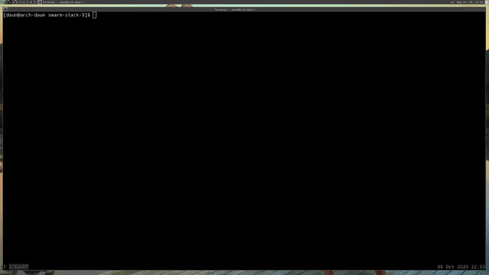

# Swarm Lifecycle

## Table of Contents
1. [Using Secrets with Local Docker Compose](#using-secrets-with-local-docker-compose)
2. [Full App Lifecycle with Compose](#full-app-lifecycle-with-compose)

<br/>

## Using Secrets with Local Docker Compose

What about secrets for local development using the Docker Compose command line.
We've been talking about Swarm up until now. But I'm back on my machine, and
I've got Docker Compose installed which I did not have in my Swarm, right?
Because again, **_Compose is not a production tools_**. It's designed for
development.

I'm in the [secrets-sample-2](./secrets-sample-2), You can see that I have two
password files, and the Docker Compose file that had in the Swarm. Just to prove
that I'm not in a Swarm,

```bash
$: docker node ls
Error response from daemon: This node is not a swarm manager.
 Use "docker swarm init" or "docker swarm join" to connect this node to swarm and try again.
```

So I don't have access to the Swarm database or the ability to put secret in it.
So, how do we deal with this in local development? Ideally, we can still use the
same Compose file. We can use the same objects like the environment variables
for Postgres. Docker had to come up with a way to make this work in test and
dev.
<br/>


<br/>

If we do, `docker-compose up -d` , and then we did `docker-compose exec pqsl`.
then did a `cat` on `/run/secrets/psql_user`

```bash
$;docker-compose up -d

$ docker-compose exc psql cat /run/secrets/psql_user
```

How did our secret get in there, right? Because we don't have the database.
Well, it turns out there's a little bit of magic here.

Well it's not magic. It's just hiding behind the scenes, that what's actually
happening with Compose is **_not secure_**, but it does work. It basically bind
mounts at runtime that actual file on my hard drive into the container. It's
really just doing `-v` with that particular file in the background.

**_Again, this is totally not secure and it's not supposed to be_**. It's just
a way to get around this problem and allow us to develop with the same process
and the same environment variable secret information that we would have in
production, only now we can do it locally to.

Which is great because now that means now that means we can develop using the
same _launch script_ and the same way we get environment variables into our
container just like we would in Swarm; And that just what we really want. We
want to match our production environment as much as we possibly can locally.

You need the latest Docker Compose to do this. I believe it only works in Docker
Compose `11`.

I hope you think that's pretty cool because I thought that was a good compromise
for them to make in order to let us use the Secrets commands.

Now I will point out this works only with **_file-based secrets_**. It will not
work with the external that we talked about.

If we look at the Compose file real quick,

```yaml
version: "3.1"

services:
  psql:
    image: postgres
    secrets:
      - psql_user
      - psql_password
    environment:
      POSTGRES_PASSWORD_FILE: /run/secrets/psql_password
      POSTGRES_USER_FILE: /run/secrets/psql_user

secrets:
  psql_user:
    file: ./psql_user.txt
  psql_password:
    file: ./psql_password.txt
```

I would have to use _file-based_ ones for my local development. Maybe if you're
using external in your production you just might have to have a different
Compose file for development that would have the _file_ attribute and specify
_sample_, dummy file in the same directory or somewhere else you might store
them, that are just using simple password for development.

**[⬆ back to top](#table-of-contents)**
<br/>
<br/>

## Full App Lifecycle with Compose
<br/>


<br/>

In this section, we've covered a lot about Swarm. Swarm, Stacks, and Secrets are
kind of like a trilogy of awesome features that can really make things much
easier in production for us. I want to show you what it might be like if you
actually took your Compose file, organize them in a couple of ways, and this is
what I basically call living the dream.

It turns out you can actually use a single file to do a lo of things, but
sometimes your complexity grows and you're going to need multiple Compose file.

I want just run through real quick. You don't actually have to do this yourself
if you don't want to. I'm just going to show you an example of how these Compose
files might work together to build up your environment as you go.

In this scenario, we're going to use `docker-compose up` for our local
development environment.

We're going to use a `docker-compose up` config and file for our CI environment
to do integration testing.

Then when we're in production, we're going to use those file for `docker stack
deploy` to actually deploy the production environment with a stack.

So, I'm on my local machine and we're going to be using the
[swarm-stack-3](./swarm-stack-3) example before of the Drupal scenario, with
a database server, and web frontend. We have the Dockerfile we have used in our
previous assignments. We're rebuilding a custom, yet simple, Drupal config with
a template.

### Multiple Compose File

We're going to have this default Compose file
[docker-compose](./swarm-stack-3/docker-compose.yml)

```yaml
version: '3.1'

services:

  drupal:
    image: custom-drupal:latest

  postgres:
    image: postgres:12.1
```

This is called _override_, what we're about to do.  An override is where I have
the standard Docker Compose file `docker-compose.yml`, and it sets the defaults
that are the same across all my environments.

> **_By defaults_**, Compose _read two files_, a `docker-compose.yml` and am
> optional `docker-compose.override.yml` File **_by convention_**. the
> `docker-compose.yml` contains your base configuration. The `override.yml`
> file, as its name implies, can contain configuration overrides for existing
> services or entirely new services.
> [source](https://raw.githubusercontent.com/docker/compose/1.27.4/contrib/completion/bash/docker-compose)

Then I have this override files `override.yml` named by default, Docker Compose,
if it's named this exact name,
[docker-compose.override.yml](./swarm-stack-3/docker-compose.override.yml), it
will automatically bring this in whenever I do a `docker-compose up`

```yaml
version: '3.1'

services:

  drupal:           # No image name
    build: .
    ports:
      - "8080:80"
    volumes:
      - drupal-modules:/var/www/html/modules
      - drupal-profiles:/var/www/html/profiles
      - drupal-sites:/var/www/html/sites
      - ./themes:/var/www/html/themes

  postgres:         # No image name
    environment:
      - POSTGRES_PASSWORD_FILE=/run/secrets/psql-pw
    secrets:
      - psql-pw
    volumes:
      - drupal-data:/var/lib/postgresql/data

volumes:
  drupal-data:
  drupal-modules:
  drupal-profiles:
  drupal-sites:
  drupal-themes:

secrets:
  psql-pw:
    file: psql-fake-password.txt
```

You'll see that in this scenario, we're assuming _local development_ because we
really want the hand-typed command we're going to type to be easiest locally.
Normally in your CI environment, it's all automated so we don't really care if
those commands are a little bit longer.  But we really want locally, is the easy
`docker-compose up`.

The cool thing is Docker Compose will read this file automatically and it will
apply this over _top_, or _override_, any settings in the Docker Compose YAML
file.

So here notice I don't have the _image name_, because that's already specified
over [docker-compose.yml](./swarm-stack-3/docker-compose.yml); And this override
file, I override by saying 'I want to build (`build: .`) the image locally using
the Dockerfile in this current directory'. I want to create a port on `8080` for
local development; And I'm setting up some `volumes`, and you'll even notice
I gave you an example here of a **_bind mount_**,

```yaml
volumes:
    - ./themes:/var/www/html/themes
```

Where I might be doing a custom theme; And I want to mount my theme on my host
into the container like we did in previous sections, so that I can change it
locally and then see it right away on the server.

By the way, for this example, I don't actually know how to develop themes in
Drupal. I'm not exactly sure that if I change a file in there, it will
automatically be reflected. I just want to show an example of how when you're
doing development in web, typically this is the way you would do it without
having to stop and start the Compose every time.

Down here, under Postgres, we have the `environment` variable and the `secrets`
setting like before. We have the defined `volumes`, and you'll see at the bottom
I actually have the _file-based_ secrets because when we're doing local
development, _we have to use the file-based secrets_.

Things get a little interesting when I look at
[docker-compose.prod.yml](./swarm-stack-3/docker-compose.prod.yml), or
[docker-compose.test.yml](./swarm-stack-3/docker-compose.test.yml). The way this
is going to work is, remember that the `.override.yaml` automatically gets
picked up by the Docker Compose command line. In prod or test, I'm going to
specify them manually.

So for the test we're going to use `-f` command. If you remember from earlier
sections, the `-f` is when we do a `docker-compose` that we want to specify
a custom file. I'll show you that in a minute.

Then in production, since we're not going to actually have the Docker Compose
command line on a production server, what we're going to do here is we're
actually going to use a `docker compose` config command. The config command is
actually going to do an output by squishing together, or combining, the output
of multiple config files. So that will be really cool.

Real quick, the
[docker-compose.test.yml](./swarm-stack-3/docker-compose.test.yml) file just has
the Drupal and the Postgres. Imagine if this was your Jenkins CI or Codeship CI
solution, where I want it to build the image every time I commit my code, and
I want to call it this file, and I want to be on this port `80:80` for testing
purposes. Then I'm going to use
a [psql-fake-password.txt](./swarm-stack-3/psql-fake-password.txt) . But I don't
need to define of the volumes because I'm not going to actually try to keep
named volume data because again, it's just a CI platform. As soon as it passes
test or fails tests, it'll get rid of everything.

Then in this scenario, you might see that I've actually got this sample data
scenario
```yaml
postgres:
    volumes:
        - ./sample/data:/var/lib/posrgresql/data
```
Where maybe in your CI solution, you have simply database sitting there that
come from either a custom Git repository or maybe they're an FTP download; Or
something happens during the initialization of your CI where it actually
download a database file; And instead of us having to create our database every
single time we do CI testing, we would just mount this directory of sample data
into where our Postgres data is suppose to be; And that way, we could guarantee
we had the same sample data every single time we do a CI test.

I'm not going to go into any further. I just wanted to show hat might be how
this file for CI would be different.

Then in production
[docker-compose.prod.yml](./swarm-stack-3/docker-compose.prod.yml), we have all
of our normal production concerns.

```yaml
version: '3.1'

services:

  drupal:
    ports:
      - "80:80"
    volumes:
      - drupal-modules:/var/www/html/modules
      - drupal-profiles:/var/www/html/profiles
      - drupal-sites:/var/www/html/sites
      - drupal-themes:/var/www/html/themes

  postgres:
    environment:
      - POSTGRES_PASSWORD_FILE=/run/secrets/psql-pw
    secrets:
      - psql-pw
    volumes:
      - drupal-data:/var/lib/postgresql/data

volumes:
  drupal-data:
  drupal-modules:
  drupal-profiles:
  drupal-sites:
  drupal-themes:

secrets:
  psql-pw:
    external: true
```

We're specifying `volumes` for our specific data. We're specifying our `secret`;
And notice down at the bottom, we have the `external secret`. Because we're
going to have put the secret in already via the command line like we did
earlier assignment.

The point here is all three of these configs are different on some way, but they
all relate to the core config, or base config, which just defines the two
services and their images (docker-compose.yaml).

### Jump into command

#### Default Compose and Override YAML file
<br/>


<br/>

If you're in the [swarm-stack-3](./swarm-stack-3) directory, you'll see that
I have the base file, and then the three override files. Again remember, that
the `override.yml` is the default.

If I do a `docker compose up`, what it will actually do here is use the
_docker-compose.yml_ first, and then it will overlay the
_docker-compose.override.yml_ one on top. I want to put `-d` in so we can take
a quick look after is started.

```bash
swarm-stack-3$: docker-compose up -d

Creating network "swarm-stack-3_default" with the default driver
Creating volume "swarm-stack-3_drupal-data" with default driver
Creating volume "swarm-stack-3_drupal-modules" with default driver
Creating volume "swarm-stack-3_drupal-profiles" with default driver
Creating volume "swarm-stack-3_drupal-sites" with default driver
Creating volume "swarm-stack-3_drupal-themes" with default driver
Creating swarm-stack-3_postgres_1 ... done
Creating swarm-stack-3_drupal_1   ... done
```

I'm going to do a `docker inpsect` on the Drupal image,

```bash
$: docker inpsect swarmstack3_drupal_1
...
...

        "Mounts": [
            {
                "Type": "volume",
                "Name": "swarm-stack-3_drupal-profiles",
                "Source": "/var/lib/docker/volumes/swarm-stack-3_drupal-profiles/_data",
                "Destination": "/var/www/html/profiles",
                "Driver": "local",
                "Mode": "rw",
                "RW": true,
                "Propagation": ""
            },
            {
                "Type": "bind",
                "Source": "/home/daun/Project/docker/docker-mastery-the-complete-toolset/chapter-9-swarm-lifecycle/swarm-stack-3/themes",
                "Destination": "/var/www/html/themes",
                "Mode": "rw",
                "RW": true,
                "Propagation": "rprivate"
            },
            {
                "Type": "volume",
                "Name": "swarm-stack-3_drupal-sites",
                "Source": "/var/lib/docker/volumes/swarm-stack-3_drupal-sites/_data",
                "Destination": "/var/www/html/sites",
                "Driver": "local",
                "Mode": "rw",
                "RW": true,
                "Propagation": ""
            },
            {
                "Type": "volume",
                "Name": "swarm-stack-3_drupal-modules",
                "Source": "/var/lib/docker/volumes/swarm-stack-3_drupal-modules/_data",
                "Destination": "/var/www/html/modules",
                "Driver": "local",
                "Mode": "rw",
                "RW": true,
                "Propagation": ""
            }
        ],
...
...
```

What I want to show you was in here, it's got all the `Mounts` listed. So we
know that **_it took the override file_** because the override file was where
defined all of these `Mounts`. So we know that it picked that up.

Obviously, if it didn't pick up the base one, it wouldn't even know what images
to use so it would actually be complaining to us and saying that the _Compose
file was incomplete_.

#### Working with CI solution
<br/>


<br/>

If we were going to actually do the command we needed for our CI solution, what
we would have to do on our CI solution was to make sure that Docker Compose was
there, and installed, and available so that we could do `docker-compose`
command. Then we specify `-f` and the order of the `-f` is the **_base file always
needs to be first_**.

```bash
$: docker-compose -f docker-compose.yml -f docker-compose.test.yml up -d
Creating network "swarm-stack-3_default" with the default driver
Creating swarm-stack-3_drupal_1   ... done
Creating swarm-stack-3_postgres_1 ... done
```

Then I went and inspected that same Drupal, you will notice that there's no
**_bind `Mounts`_**

```bash
...
...
    "Mounts": [],
....
....
```

They're completely missing because in the test file, we didn't specify those. We
didn't actually need Drupal to save information because it was going to be
thrown away at the end of our CI run.

#### Working with Production Compose file
<br/>


<br/>

The third, we have the production config. The production config is going to be
a little bit different. I run the command,

```bash
$: docker-compose config --help
Validate and view the Compose file.

Usage: config [options]

Options:
    --resolve-image-digests  Pin image tags to digests.
    --no-interpolate         Don't interpolate environment variables.
    -q, --quiet              Only validate the configuration, don't print
                             anything.
    --services               Print the service names, one per line.
    --volumes                Print the volume names, one per line.
    --hash="*"               Print the service config hash, one per line.
                             Set "service1,service2" for a list of specified services
                             or use the wildcard symbol to display all services.
```

Instead I'm use `up` command, what I want to do here is `config`. If you just
look at the help real fast for `config` options command, it has several options.
What we want just do is just run `config` by itself.

```bash
$: docker-compose -f docker-compose.yml -f docker-compose.test.yml config
secrets:
  psql-pw:
    external: true
    name: psql-pw
services:
  drupal:
    image: custom-drupal:latest
    ports:
    - 80:80/tcp
    volumes:
    - drupal-modules:/var/www/html/modules:rw
    - drupal-profiles:/var/www/html/profiles:rw
    - drupal-sites:/var/www/html/sites:rw
    - drupal-themes:/var/www/html/themes:rw
  postgres:
    environment:
      POSTGRES_PASSWORD_FILE: /run/secrets/psql-pw
    image: postgres:12.1
    secrets:
    - source: psql-pw
    volumes:
    - drupal-data:/var/lib/postgresql/data:rw
version: '3.1'
volumes:
  drupal-data: {}
  drupal-modules: {}
  drupal-profiles: {}
  drupal-sites: {}
  drupal-themes: {}
```

What it's going to actually do is look at both files and push them together into
a single Compose file equivalent.

So what we could do here is just run this command somewhere in our CI solution.
Then have it output a file, maybe with you know, something like
`output-ci-prod.yml`. That  output file would be use officially in production to
create or update our stack.

```bash
$: docker-compose -f docker-compose.yml -f docker-compose.test.yml config > output-ci-prod.yml
```

### Caveats

However, I want to throw in a little caveat here. This is all relatively new
stuff. We know the Secrets and Swarm Stack are relatively new. They're only
a couple of months old as this videos I'm recording.

So there's a couple of rough edges. We just ran that `config` command, and
you'll actually notice that the `secrets` weren't listed in there. That's a bug
currently. I'm actually working with the Docker team to see if we can't squash
that bug. So by the time you read this, it may have already been fixed. Make
sure you inspect that output of the config line before you go deploying in
production.

Secondly, the Compose `extends` option, which I did not discuss here, is another
way to override these Compose file where you actually use the override file and
you actually define an extends section in there. It's a little bit more
declarative, so it's easier to understand. I'll provide a link in the
references for this section. Just know that `extends` options doesn't yet work
in Swarms Stacks.

I didn't mention it here because it doesn't really give you the full app
lifecycle that were hoping for, but I do expect them at some point to do
something about that. Like either add it into Swarm or create a better workflow.
Because that's really the idea we're trying to get to with all of these tools,
is to have a complete and easy lifecycle from development all the way through
test, into production, with the same set of configuration, in the same images.

I hoe this got you thinking about how you might make your apps this way, and how
you might extend your own Compose files for complex scenario.

#### References

- [Use Compose In Production](https://docs.docker.com/compose/production/)
- [Use Multiple compose Files](https://docs.docker.com/compose/extends/#multiple-compose-files)

**[⬆ back to top](#table-of-contents)**
<br/>
<br/>
